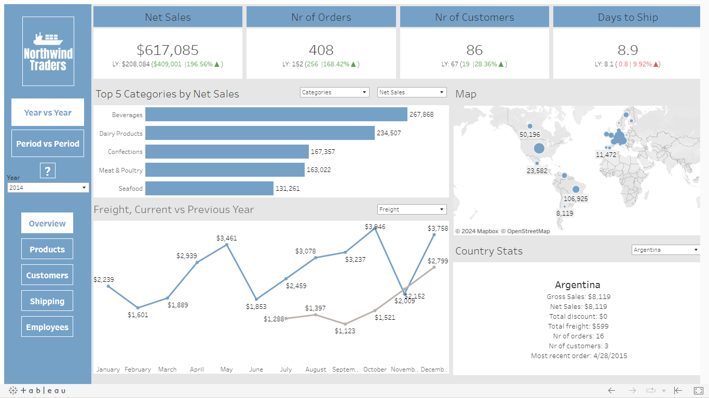
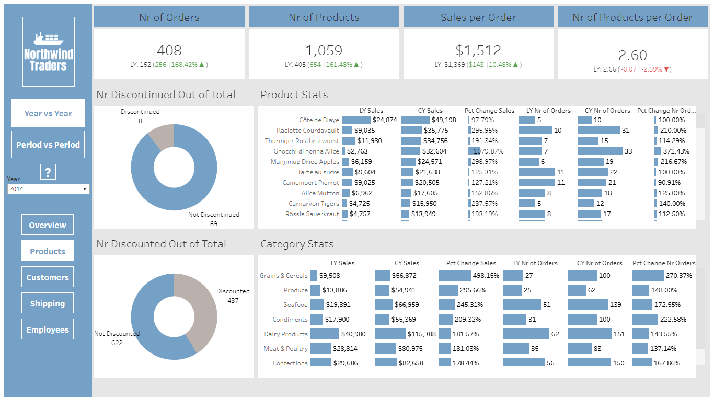
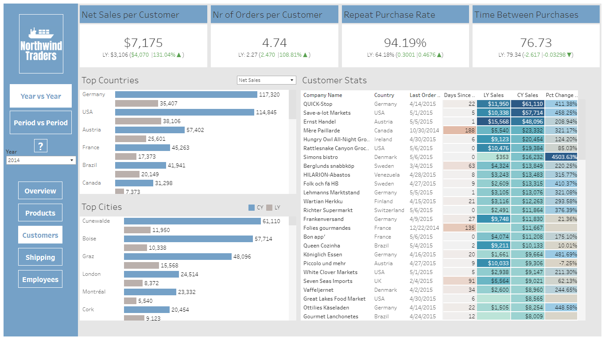
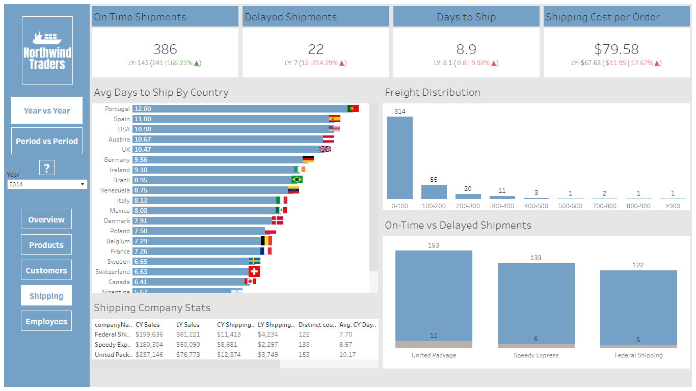
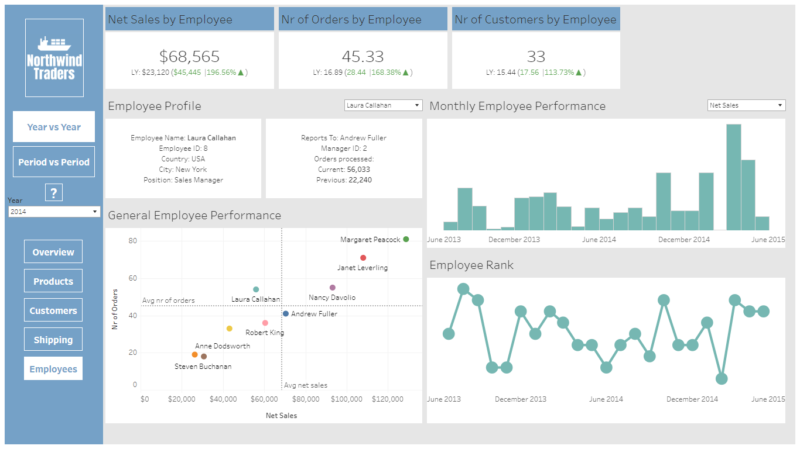

# Northwind Traders Analysis


**Data analysis project for the Northwind Traders dataset (Maven Analytics)**

## 📚  Table of Contents
- [📄  Importing The Datasets (SQL)](https://github.com/mihaivlasceanu/)
- [🧹 Creating Additional Tables (SQL)](https://github.com/mihaivlasceanu/)
- [📈 Sales Overview (SQL)](https://github.com/mihaivlasceanu/)
- [👨‍💼 Customer Analysis (SQL)](https://github.com/mihaivlasceanu/)
- [📊 Product Analysis (SQL)](https://github.com/mihaivlasceanu/)
- [🛳️ Shipping Analysis (SQL)](https://github.com/mihaivlasceanu/)
- [👥Employee Analysis (SQL)]
- [🎨 Data Visualization (Tableau)](https://github.com/mihaivlasceanu/)

## Importing The Datasets
**Source:** https://mavenanalytics.io/data-playground?page=3&pageSize=5

```sql
CREATE TABLE categories (
	category_id TEXT,
	category_name TEXT,
	description TEXT
)

-- \COPY categories FROM 'C:\Users\User\Desktop\Northwind\originals\categories.csv' WITH CSV HEADER DELIMITER ','

SELECT * FROM categories
```
| category_id | category_name    | description                                                |
|-------------|------------------|------------------------------------------------------------|
| 1           | Beverages        | Soft drinks, coffees, teas, beers, and ales                |
| 2           | Condiments       | Sweet and savory sauces, relishes, spreads, and seasonings |
| 3           | Confections      | Desserts, candies, and sweet breads                        |
| 4           | Dairy Products   | Cheeses                                                    |
| 5           | Grains & Cereals | Breads, crackers, pasta, and cereal                        |
| 6           | Meat & Poultry   | Prepared meats                                             |
| 7           | Produce          | Dried fruit and bean curd                                  |
| 8           | Seafood          | Seaweed and fish                                           |
```sql
CREATE TABLE customers (
	customer_id TEXT,
	company_name TEXT,
	contact_name TEXT,
	contact_title TEXT,
	city TEXT,
	country TEXT
)

-- \COPY customers FROM 'C:\Users\User\Desktop\Northwind\originals\customers.csv' WITH CSV HEADER DELIMITER ','

SELECT * FROM customers
LIMIT 5
```
| customer_id | company_name                       | contact_name       | contact_title        | city        | country |
|-------------|------------------------------------|--------------------|----------------------|-------------|---------|
| ALFKI       | Alfreds Futterkiste                | Maria Anders       | Sales Representative | Berlin      | Germany |
| ANATR       | Ana Trujillo Emparedados y helados | Ana Trujillo       | Owner                | Mexico City | Mexico  |
| ANTON       | Antonio Moreno Taquería            | Antonio Moreno     | Owner                | Mexico City | Mexico  |
| AROUT       | Around the Horn                    | Thomas Hardy       | Sales Representative | London      | UK      |
| BERGS       | Berglunds snabbköp                 | Christina Berglund | Order Administrator  | Luleå       | Sweden  |
```sql
CREATE TABLE employees (
	employee_id TEXT,
	employee_name TEXT,
	title TEXT,
	city TEXT,
	country TEXT,
	reports_to TEXT
)

-- \COPY employees FROM 'C:\Users\User\Desktop\Northwind\originals\employees.csv' WITH CSV HEADER DELIMITER ','

SELECT * FROM employees
```
| employee_id | employee_name    | title                | city     | country | reports_to |
|-------------|------------------|----------------------|----------|---------|------------|
| 1           | Nancy Davolio    | Sales Representative | New York | USA     | 8          |
| 2           | Andrew Fuller    | Vice President Sales | New York | USA     |            |
| 3           | Janet Leverling  | Sales Representative | New York | USA     | 8          |
| 4           | Margaret Peacock | Sales Representative | New York | USA     | 8          |
| 5           | Steven Buchanan  | Sales Manager        | London   | UK      | 2          |
| 6           | Michael Suyama   | Sales Representative | London   | UK      | 5          |
| 7           | Robert King      | Sales Representative | London   | UK      | 5          |
| 8           | Laura Callahan   | Sales Manager        | New York | USA     | 2          |
| 9           | Anne Dodsworth   | Sales Representative | London   | UK      | 5          |

```sql
CREATE TABLE order_details (
	order_id TEXT,
	product_id TEXT,
	unit_price NUMERIC,
	quantity NUMERIC,
	discount NUMERIC
)

-- \COPY order_details FROM 'C:\Users\User\Desktop\Northwind\originals\order_details.csv' WITH CSV HEADER DELIMITER ','

SELECT * FROM order_details
LIMIT 5
```
| order_id | product_id | unit_price | quantity | discount |
|----------|------------|------------|----------|----------|
| 10248    | 11         | 14         | 12       | 0        |
| 10248    | 42         | 9.8        | 10       | 0        |
| 10248    | 72         | 34.8       | 5        | 0        |
| 10249    | 14         | 18.6       | 9        | 0        |
| 10249    | 51         | 42.4       | 40       | 0        |
```sql
CREATE TABLE orders (
	order_id TEXT,
	customer_id TEXT,
	employee_id TEXT,
	order_date DATE,
	required_date DATE,
	shipped_date DATE,
	shipper_id TEXT,
	freight NUMERIC
)

-- \COPY orders FROM 'C:\Users\User\Desktop\Northwind\originals\orders.csv' WITH CSV HEADER DELIMITER ','

SELECT * FROM orders
LIMIT 5
```
| order_id | customer_id | employee_id | order_date | required_date | shipped_date | shipper_id | freight |
|----------|-------------|-------------|------------|---------------|--------------|------------|---------|
| 10248    | VINET       | 5           | 2013-07-04 | 2013-08-01    | 2013-07-16   | 3          | 32.38   |
| 10249    | TOMSP       | 6           | 2013-07-05 | 2013-08-16    | 2013-07-10   | 1          | 11.61   |
| 10250    | HANAR       | 4           | 2013-07-08 | 2013-08-05    | 2013-07-12   | 2          | 65.83   |
| 10251    | VICTE       | 3           | 2013-07-08 | 2013-08-05    | 2013-07-15   | 1          | 41.34   |
| 10252    | SUPRD       | 4           | 2013-07-09 | 2013-08-06    | 2013-07-11   | 2          | 51.3    |

```sql
CREATE TABLE products (
	product_id TEXT,
	product_name TEXT,
	qty_per_unit TEXT,
	unit_price NUMERIC,
	discontinued BOOLEAN,
	category_id  TEXT
)

-- \COPY products FROM 'C:\Users\User\Desktop\Northwind\originals\products.csv' WITH CSV HEADER DELIMITER ','

SELECT * FROM products
LIMIT 5
```
| product_id | product_name                 | qty_per_unit        | unit_price | discontinued | category_id |
|------------|------------------------------|---------------------|------------|--------------|-------------|
| 1          | Chai                         | 10 boxes x 20 bags  | 18         | false        | 1           |
| 2          | Chang                        | 24 - 12 oz bottles  | 19         | false        | 1           |
| 3          | Aniseed Syrup                | 12 - 550 ml bottles | 10         | false        | 2           |
| 4          | Chef Anton's Cajun Seasoning | 48 - 6 oz jars      | 22         | false        | 2           |
| 5          | Chef Anton's Gumbo Mix       | 36 boxes            | 21.35      | true         | 2           |

```sql
CREATE TABLE shippers (
	shipper_id TEXT,
	company_name TEXT
)

-- \COPY shippers FROM 'C:\Users\User\Desktop\Northwind\originals\shippers.csv' WITH CSV HEADER DELIMITER ','

SELECT * FROM shippers
```
| shipper_id | company_name     |
|------------|------------------|
| 1          | Speedy Express   |
| 2          | United Package   |
| 3          | Federal Shipping |

## Creating Additional Tables

Further down the line (subsection "Sales Overview", question 7), we will be needing a special date dimension table that will allow us to identify the dates on which there were 0 orders/sales for each country and city.
```sql
SELECT
GENERATE_SERIES('2013-07-01', '2015-05-01', INTERVAL '1 month')::DATE AS date,
DATE_PART('year', GENERATE_SERIES('2013-07-01', '2015-05-01', INTERVAL '1 month')::DATE) AS year,
DATE_PART('month', GENERATE_SERIES('2013-07-01', '2015-05-01', INTERVAL '1 month')::DATE) AS month
INTO monthly_date_dimension

SELECT * FROM monthly_date_dimension
```
| date       | year | month |
|------------|------|-------|
| 2013-07-01 | 2013 | 7     |
| 2013-08-01 | 2013 | 8     |
| 2013-09-01 | 2013 | 9     |
| 2013-10-01 | 2013 | 10    |
| 2013-11-01 | 2013 | 11    |
| 2013-12-01 | 2013 | 12    |
| 2014-01-01 | 2014 | 1     |
| 2014-02-01 | 2014 | 2     |
| 2014-03-01 | 2014 | 3     |
| 2014-04-01 | 2014 | 4     |
| 2014-05-01 | 2014 | 5     |
| 2014-06-01 | 2014 | 6     |
| 2014-07-01 | 2014 | 7     |
| 2014-08-01 | 2014 | 8     |
| 2014-09-01 | 2014 | 9     |
| 2014-10-01 | 2014 | 10    |
| 2014-11-01 | 2014 | 11    |
| 2014-12-01 | 2014 | 12    |
| 2015-01-01 | 2015 | 1     |
| 2015-02-01 | 2015 | 2     |
| 2015-03-01 | 2015 | 3     |
| 2015-04-01 | 2015 | 4     |
| 2015-05-01 | 2015 | 5     |

```sql
SELECT 
DISTINCT country,
city
INTO countries_only
FROM customers

SELECT * FROM countries_only
LIMIT 5
```
| country | city      |
|---------|-----------|
| Germany | Leipzig   |
| Denmark | Århus     |
| Canada  | Vancouver |
| Sweden  | Luleå     |
| USA     | Kirkland  |
```sql
CREATE TABLE date_and_country AS
SELECT * FROM countries_only
CROSS JOIN monthly_date_dimension
ORDER BY 1,2,3

SELECT * FROM date_and_country
LIMIT 5
```
| country   | city         | date       | year | month |
|-----------|--------------|------------|------|-------|
| Argentina | Buenos Aires | 2013-07-01 | 2013 | 7     |
| Argentina | Buenos Aires | 2013-08-01 | 2013 | 8     |
| Argentina | Buenos Aires | 2013-09-01 | 2013 | 9     |
| Argentina | Buenos Aires | 2013-10-01 | 2013 | 10    |
| Argentina | Buenos Aires | 2013-11-01 | 2013 | 11    |

## Sales Overview
**1. Net sales by year + year-over-year change**

**Note:** the comparison to the previous year is not exactly relevant as we are comparing the entirety of 2014 to a few months of 2013 (July-December, inclusive ) and similarly, a few months of 2015 (January-May, inclusive)
```sql
WITH yearly_sales_cte AS (
SELECT
DATE_PART('year', order_date) AS year,
ROUND(SUM(quantity*unit_price*(1-discount)),2) AS net_sales
FROM order_details
INNER JOIN orders ON order_details.order_id=orders.order_id
GROUP BY DATE_PART('year', order_date)
ORDER BY DATE_PART('year', order_date)
)

SELECT
year,
net_sales,
ROUND(LAG(net_sales) OVER (ORDER BY year),2) AS prev_year_sales,
net_sales - LAG(net_sales) OVER (ORDER BY year) AS abs_change,
ROUND(100.0 * (net_sales - LAG(net_sales) OVER (ORDER BY year))/LAG(net_sales) OVER (ORDER BY year),2) AS pct_change
FROM yearly_sales_cte
ORDER BY 1
```
| year | net_sales | prev_year_sales | abs_change | pct_change |
|------|-----------|-----------------|------------|------------|
| 2013 | 208083.97 |                 |            |            |
| 2014 | 617085.20 | 208083.97       | 409001.23  | 196.56     |
| 2015 | 440623.87 | 617085.20       | -176461.33 | -28.60     |

**2. Net sales by period + period-over-period change**

As we do not have data for the same months for 2013 and 2015, we will have to split our analysis into two periods:

**2.1 July-December 2014 vs July-December 2013**

```sql
WITH sales_by_month_cte AS (
SELECT
o.order_id,
o.order_date,
DATE_PART('year', order_date) AS year,
DATE_PART('month', order_date) AS month,
quantity,
unit_price,
discount
FROM order_details od
INNER JOIN orders o ON od.order_id=o.order_id
WHERE DATE_PART('month', order_date) BETWEEN 7 AND 12
)

, period_sales_cte AS (
SELECT
year,
ROUND(SUM(quantity*unit_price*(1-discount)),2) AS net_sales
FROM sales_by_month_cte
GROUP BY year
ORDER BY year
) 

SELECT
year,
net_sales,
ROUND(LAG(net_sales) OVER (ORDER BY year),2) AS same_period_prev_year_sales,
net_sales - LAG(net_sales) OVER (ORDER BY year) AS abs_change,
ROUND(100.0 * (net_sales - LAG(net_sales) OVER (ORDER BY year))/LAG(net_sales) OVER (ORDER BY year),2) AS pct_change
FROM period_sales_cte
ORDER BY 1
```
| year | net_sales | same_period_prev_year_sales | abs_change | pct_change |
|------|-----------|-----------------------------|------------|------------|
| 2013 | 208083.97 |                             |            |            |
| 2014 | 335619.23 | 208083.97                   | 127535.26  | 61.29      |

**2.2 January-May 2015 vs January-May 2014**

```sql
WITH sales_by_month_cte AS (
SELECT
o.order_id,
o.order_date,
DATE_PART('year', order_date) AS year,
DATE_PART('month', order_date) AS month,
quantity,
unit_price,
discount
FROM order_details od
INNER JOIN orders o ON od.order_id=o.order_id
WHERE DATE_PART('month', order_date) BETWEEN 1 AND 5
)

, period_sales_cte AS (
SELECT
year,
ROUND(SUM(quantity*unit_price*(1-discount)),2) AS net_sales
FROM sales_by_month_cte
GROUP BY year
ORDER BY year
) 

SELECT
year,
net_sales,
ROUND(LAG(net_sales) OVER (ORDER BY year),2) AS same_period_prev_year_sales,
net_sales - LAG(net_sales) OVER (ORDER BY year) AS abs_change,
ROUND(100.0 * (net_sales - LAG(net_sales) OVER (ORDER BY year))/LAG(net_sales) OVER (ORDER BY year),2) AS pct_change
FROM period_sales_cte
ORDER BY 1
```
| year | net_sales | same_period_prev_year_sales | abs_change | pct_change |
|------|-----------|-----------------------------|------------|------------|
| 2014 | 245103.17 |                             |            |            |
| 2015 | 440623.87 | 245103.17                   | 195520.70  | 79.77      |

**3. Net sales by month + month-over-month change**

```sql
WITH monthly_sales_cte AS (
SELECT
DATE_TRUNC('month', order_date)::DATE AS month,
ROUND(SUM(quantity*unit_price*(1-discount)),2) AS net_sales
FROM order_details
INNER JOIN orders ON order_details.order_id=orders.order_id
GROUP BY DATE_TRUNC('month', order_date)
ORDER BY DATE_TRUNC('month', order_date)
)

SELECT
month,
net_sales,
ROUND(LAG(net_sales) OVER (ORDER BY month),2) AS prev_month_sales,
net_sales - LAG(net_sales) OVER (ORDER BY month) AS abs_change,
ROUND(100.0 * (net_sales - LAG(net_sales) OVER (ORDER BY month))/LAG(net_sales) OVER (ORDER BY month),2) AS pct_change
FROM monthly_sales_cte
ORDER BY 1
LIMIT 10
```
| month      | net_sales | prev_month_sales | abs_change | pct_change |
|------------|-----------|------------------|------------|------------|
| 2013-07-01 | 27861.90  |                  |            |            |
| 2013-08-01 | 25485.28  | 27861.90         | -2376.62   | -8.53      |
| 2013-09-01 | 26381.40  | 25485.28         | 896.12     | 3.52       |
| 2013-10-01 | 37515.73  | 26381.40         | 11134.33   | 42.21      |
| 2013-11-01 | 45600.05  | 37515.73         | 8084.32    | 21.55      |
| 2013-12-01 | 45239.63  | 45600.05         | -360.42    | -0.79      |
| 2014-01-01 | 61258.07  | 45239.63         | 16018.44   | 35.41      |
| 2014-02-01 | 38483.64  | 61258.07         | -22774.43  | -37.18     |
| 2014-03-01 | 38547.22  | 38483.64         | 63.58      | 0.17       |
| 2014-04-01 | 53032.95  | 38547.22         | 14485.73   | 37.58      |

**4. Net sales by month vs same month of previous year**

```sql
WITH sales_by_month_cte AS (
SELECT
o.order_id,
o.order_date,
DATE_PART('year', order_date) AS year,
DATE_PART('month', order_date) AS month,
quantity,
unit_price,
discount
FROM order_details od
INNER JOIN orders o ON od.order_id=o.order_id
)

, monthly_sales_cte AS (
SELECT
year,
month,
ROUND(SUM(quantity*unit_price*(1-discount)),2) AS net_sales
FROM sales_by_month_cte
GROUP BY year, month
ORDER BY year, month
)

SELECT
year,
month,
net_sales,
ROUND(LAG(net_sales) OVER (PARTITION BY month ORDER BY year),2) AS same_month_prev_year_sales,
net_sales - LAG(net_sales) OVER (PARTITION BY month ORDER BY year) AS abs_change,
ROUND(100.0 * (net_sales - LAG(net_sales) OVER (PARTITION BY month ORDER BY year))/LAG(net_sales) OVER (PARTITION BY month ORDER BY year),2) AS pct_change
FROM monthly_sales_cte
ORDER BY year, month
LIMIT 15
```
| year | month | net_sales | same_month_prev_year_sales | abs_change | pct_change |
|------|-------|-----------|----------------------------|------------|------------|
| 2013 | 7     | 27861.90  |                            |            |            |
| 2013 | 8     | 25485.28  |                            |            |            |
| 2013 | 9     | 26381.40  |                            |            |            |
| 2013 | 10    | 37515.73  |                            |            |            |
| 2013 | 11    | 45600.05  |                            |            |            |
| 2013 | 12    | 45239.63  |                            |            |            |
| 2014 | 1     | 61258.07  |                            |            |            |
| 2014 | 2     | 38483.64  |                            |            |            |
| 2014 | 3     | 38547.22  |                            |            |            |
| 2014 | 4     | 53032.95  |                            |            |            |
| 2014 | 5     | 53781.29  |                            |            |            |
| 2014 | 6     | 36362.80  |                            |            |            |
| 2014 | 7     | 51020.86  | 27861.90                   | 23158.96   | 83.12      |
| 2014 | 8     | 47287.67  | 25485.28                   | 21802.39   | 85.55      |
| 2014 | 9     | 55629.24  | 26381.40                   | 29247.84   | 110.87     |

**5. Net sales by country and year + year-over-year change**

**Note:**  Similar to question 1, it is not exactly relevant as we are not comparing the same periods (rather, a full year vs a few months)

```sql
WITH yearly_sales_cte AS (
SELECT
DATE_PART('year', order_date) AS year,
country,
ROUND(SUM(quantity*unit_price*(1-discount)),2) AS net_sales
FROM order_details
INNER JOIN orders ON order_details.order_id=orders.order_id
INNER JOIN customers ON orders.customer_id=customers.customer_id
GROUP BY DATE_PART('year', order_date), country
ORDER BY DATE_PART('year', order_date), country
)

SELECT
year,
country,
net_sales,
ROUND(LAG(net_sales) OVER (PARTITION BY country ORDER BY year),2) AS prev_year_sales,
net_sales - LAG(net_sales) OVER (PARTITION BY country ORDER BY year) AS abs_change,
ROUND(100.0 * (net_sales - LAG(net_sales) OVER (PARTITION BY country ORDER BY year))/LAG(net_sales) OVER (PARTITION BY country ORDER BY year),2) AS pct_change
FROM yearly_sales_cte
ORDER BY 1,2
LIMIT 30
```
| year | country     | net_sales | prev_year_sales | abs_change | pct_change |
|------|-------------|-----------|-----------------|------------|------------|
| 2013 | Austria     | 25601.35  |                 |            |            |
| 2013 | Belgium     | 6306.70   |                 |            |            |
| 2013 | Brazil      | 20148.82  |                 |            |            |
| 2013 | Canada      | 7372.68   |                 |            |            |
| 2013 | Denmark     | 2952.40   |                 |            |            |
| 2013 | Finland     | 3115.76   |                 |            |            |
| 2013 | France      | 17372.76  |                 |            |            |
| 2013 | Germany     | 35407.15  |                 |            |            |
| 2013 | Ireland     | 9123.38   |                 |            |            |
| 2013 | Italy       | 979.94    |                 |            |            |
| 2013 | Mexico      | 4687.90   |                 |            |            |
| 2013 | Norway      | 1058.40   |                 |            |            |
| 2013 | Poland      | 459.00    |                 |            |            |
| 2013 | Portugal    | 2306.14   |                 |            |            |
| 2013 | Spain       | 2976.20   |                 |            |            |
| 2013 | Sweden      | 6933.23   |                 |            |            |
| 2013 | Switzerland | 4164.72   |                 |            |            |
| 2013 | UK          | 9273.68   |                 |            |            |
| 2013 | USA         | 38105.68  |                 |            |            |
| 2013 | Venezuela   | 9738.10   |                 |            |            |
| 2014 | Argentina   | 1816.60   |                 |            |            |
| 2014 | Austria     | 57401.84  | 25601.35        | 31800.49   | 124.21     |
| 2014 | Belgium     | 11434.48  | 6306.70         | 5127.78    | 81.31      |
| 2014 | Brazil      | 41941.19  | 20148.82        | 21792.37   | 108.16     |
| 2014 | Canada      | 31298.06  | 7372.68         | 23925.38   | 324.51     |
| 2014 | Denmark     | 25192.54  | 2952.40         | 22240.14   | 753.29     |
| 2014 | Finland     | 13437.29  | 3115.76         | 10321.53   | 331.27     |
| 2014 | France      | 45263.38  | 17372.76        | 27890.62   | 160.54     |
| 2014 | Germany     | 117320.16 | 35407.15        | 81913.01   | 231.35     |
| 2014 | Ireland     | 20454.41  | 9123.38         | 11331.03   | 124.20     |

**6. Net sales by country and period + period-over-period change**
(solution to previous question's issue)

**6.1 July-December 2014 vs July-December 2013**

```sql
WITH sales_by_month_cte AS (
SELECT
o.order_id,
o.order_date,
DATE_PART('year', order_date) AS year,
DATE_PART('month', order_date) AS month,
country,
quantity,
unit_price,
discount
FROM order_details od
INNER JOIN orders o ON od.order_id=o.order_id
INNER JOIN customers c ON o.customer_id=c.customer_id
WHERE DATE_PART('month', order_date) BETWEEN 7 AND 12
)

, period_sales_cte AS (
SELECT
year,
country,
ROUND(SUM(quantity*unit_price*(1-discount)),2) AS net_sales
FROM sales_by_month_cte
GROUP BY year, country
ORDER BY year, country
) 

SELECT
year,
country,
net_sales,
ROUND(LAG(net_sales) OVER (PARTITION BY country ORDER BY year),2) AS same_period_prev_year_sales,
net_sales - LAG(net_sales) OVER (PARTITION BY country ORDER BY year) AS abs_change,
ROUND(100.0 * (net_sales - LAG(net_sales) OVER (PARTITION BY country ORDER BY year))/LAG(net_sales) OVER (PARTITION BY country ORDER BY year),2) AS pct_change
FROM period_sales_cte
ORDER BY 1,2
```
| year | country     | net_sales | same_period_prev_year_sales | abs_change | pct_change |
|------|-------------|-----------|-----------------------------|------------|------------|
| 2013 | Austria     | 25601.35  |                             |            |            |
| 2013 | Belgium     | 6306.70   |                             |            |            |
| 2013 | Brazil      | 20148.82  |                             |            |            |
| 2013 | Canada      | 7372.68   |                             |            |            |
| 2013 | Denmark     | 2952.40   |                             |            |            |
| 2013 | Finland     | 3115.76   |                             |            |            |
| 2013 | France      | 17372.76  |                             |            |            |
| 2013 | Germany     | 35407.15  |                             |            |            |
| 2013 | Ireland     | 9123.38   |                             |            |            |
| 2013 | Italy       | 979.94    |                             |            |            |
| 2013 | Mexico      | 4687.90   |                             |            |            |
| 2013 | Norway      | 1058.40   |                             |            |            |
| 2013 | Poland      | 459.00    |                             |            |            |
| 2013 | Portugal    | 2306.14   |                             |            |            |
| 2013 | Spain       | 2976.20   |                             |            |            |
| 2013 | Sweden      | 6933.23   |                             |            |            |
| 2013 | Switzerland | 4164.72   |                             |            |            |
| 2013 | UK          | 9273.68   |                             |            |            |
| 2013 | USA         | 38105.68  |                             |            |            |
| 2013 | Venezuela   | 9738.10   |                             |            |            |
| 2014 | Argentina   | 718.50    |                             |            |            |
| 2014 | Austria     | 32697.89  | 25601.35                    | 7096.54    | 27.72      |
| 2014 | Belgium     | 4379.00   | 6306.70                     | -1927.70   | -30.57     |
| 2014 | Brazil      | 27622.55  | 20148.82                    | 7473.73    | 37.09      |
| 2014 | Canada      | 12982.20  | 7372.68                     | 5609.52    | 76.09      |
| 2014 | Denmark     | 10650.94  | 2952.40                     | 7698.54    | 260.76     |
| 2014 | Finland     | 4370.29   | 3115.76                     | 1254.53    | 40.26      |
| 2014 | France      | 21674.32  | 17372.76                    | 4301.56    | 24.76      |
| 2014 | Germany     | 63373.04  | 35407.15                    | 27965.89   | 78.98      |
| 2014 | Ireland     | 12064.48  | 9123.38                     | 2941.10    | 32.24      |
| 2014 | Italy       | 4872.03   | 979.94                      | 3892.09    | 397.18     |
| 2014 | Mexico      | 2523.47   | 4687.90                     | -2164.43   | -46.17     |
| 2014 | Norway      | 500.00    | 1058.40                     | -558.40    | -52.76     |
| 2014 | Poland      | 1207.85   | 459.00                      | 748.85     | 163.15     |
| 2014 | Portugal    | 1519.24   | 2306.14                     | -786.90    | -34.12     |
| 2014 | Spain       | 5801.90   | 2976.20                     | 2825.70    | 94.94      |
| 2014 | Sweden      | 15699.43  | 6933.23                     | 8766.20    | 126.44     |
| 2014 | Switzerland | 12145.22  | 4164.72                     | 7980.50    | 191.62     |
| 2014 | UK          | 11333.74  | 9273.68                     | 2060.06    | 22.21      |
| 2014 | USA         | 75588.61  | 38105.68                    | 37482.93   | 98.37      |
| 2014 | Venezuela   | 13894.54  | 9738.10                     | 4156.44    | 42.68      |

**6.2 January-May 2015 vs January-May 2014**

```sql
WITH sales_by_month_cte AS (
SELECT
o.order_id,
o.order_date,
DATE_PART('year', order_date) AS year,
DATE_PART('month', order_date) AS month,
country,
quantity,
unit_price,
discount
FROM order_details od
INNER JOIN orders o ON od.order_id=o.order_id
INNER JOIN customers c ON o.customer_id=c.customer_id
WHERE DATE_PART('month', order_date) BETWEEN 1 AND 5
)

, period_sales_cte AS (
SELECT
year,
country,
ROUND(SUM(quantity*unit_price*(1-discount)),2) AS net_sales
FROM sales_by_month_cte
GROUP BY year, country
ORDER BY year, country
) 

SELECT
year,
country,
net_sales,
ROUND(LAG(net_sales) OVER (PARTITION BY country ORDER BY year),2) AS same_period_prev_year_sales,
net_sales - LAG(net_sales) OVER (PARTITION BY country ORDER BY year) AS abs_change,
ROUND(100.0 * (net_sales - LAG(net_sales) OVER (PARTITION BY country ORDER BY year))/LAG(net_sales) OVER (PARTITION BY country ORDER BY year),2) AS pct_change
FROM period_sales_cte
ORDER BY 1,2
LIMIT 25
```
| year | country     | net_sales | same_period_prev_year_sales | abs_change | pct_change |
|------|-------------|-----------|-----------------------------|------------|------------|
| 2014 | Argentina   | 1098.10   |                             |            |            |
| 2014 | Austria     | 24153.37  |                             |            |            |
| 2014 | Belgium     | 7055.48   |                             |            |            |
| 2014 | Brazil      | 13043.64  |                             |            |            |
| 2014 | Canada      | 15210.71  |                             |            |            |
| 2014 | Denmark     | 13706.40  |                             |            |            |
| 2014 | Finland     | 6829.50   |                             |            |            |
| 2014 | France      | 20713.90  |                             |            |            |
| 2014 | Germany     | 48231.05  |                             |            |            |
| 2014 | Ireland     | 5870.93   |                             |            |            |
| 2014 | Italy       | 2585.69   |                             |            |            |
| 2014 | Mexico      | 8905.36   |                             |            |            |
| 2014 | Norway      | 200.00    |                             |            |            |
| 2014 | Portugal    | 4955.29   |                             |            |            |
| 2014 | Spain       | 1021.50   |                             |            |            |
| 2014 | Sweden      | 7118.67   |                             |            |            |
| 2014 | Switzerland | 6235.60   |                             |            |            |
| 2014 | UK          | 13120.46  |                             |            |            |
| 2014 | USA         | 32537.15  |                             |            |            |
| 2014 | Venezuela   | 12510.38  |                             |            |            |
| 2015 | Argentina   | 6302.50   | 1098.10                     | 5204.40    | 473.95     |
| 2015 | Austria     | 45000.65  | 24153.37                    | 20847.28   | 86.31      |
| 2015 | Belgium     | 16083.68  | 7055.48                     | 9028.20    | 127.96     |
| 2015 | Brazil      | 44835.77  | 13043.64                    | 31792.13   | 243.74     |
| 2015 | Canada      | 11525.55  | 15210.71                    | -3685.16   | -24.23     |

**7. Net sales by country and month + month-over-month change**

**Version 1:**
The problem with this first version is that, because of the way window functions work, we end up skipping the months that had O sales, 
and thus come to conclusions that do not truly reflect reality. For example, for Brazil, we compare the months for which we have actual sales - months 9 and 11, 
skipping month 10 when the fact that there were 0 sales in that particular month would tell us a completely different story than before.

```sql
WITH monthly_sales_cte AS (
SELECT
DATE_TRUNC('month', order_date)::DATE AS month,
--DATE_PART('year', order_date) AS year,
country,
ROUND(SUM(quantity*unit_price*(1-discount)),2) AS net_sales
FROM order_details
INNER JOIN orders ON order_details.order_id=orders.order_id
INNER JOIN customers ON orders.customer_id=customers.customer_id
GROUP BY DATE_TRUNC('month', order_date), country
ORDER BY DATE_TRUNC('month', order_date), country
)

SELECT
month,
country,
net_sales,
ROUND(LAG(net_sales) OVER (PARTITION BY country ORDER BY month),2) AS prev_month_sales,
net_sales - LAG(net_sales) OVER (PARTITION BY country ORDER BY month) AS abs_change,
ROUND(100.0 * (net_sales - LAG(net_sales) OVER (PARTITION BY country ORDER BY month))/LAG(net_sales) OVER (PARTITION BY country ORDER BY month),2) AS pct_change
FROM monthly_sales_cte
ORDER BY month, country
LIMIT 20
```
| month      | country     | net_sales | prev_month_sales | abs_change | pct_change |
|------------|-------------|-----------|------------------|------------|------------|
| 2013-07-01 | Austria     | 3488.68   |                  |            |            |
| 2013-07-01 | Belgium     | 3597.90   |                  |            |            |
| 2013-07-01 | Brazil      | 3963.20   |                  |            |            |
| 2013-07-01 | Finland     | 346.56    |                  |            |            |
| 2013-07-01 | France      | 2270.06   |                  |            |            |
| 2013-07-01 | Germany     | 6904.65   |                  |            |            |
| 2013-07-01 | Mexico      | 100.80    |                  |            |            |
| 2013-07-01 | Sweden      | 695.63    |                  |            |            |
| 2013-07-01 | Switzerland | 3047.12   |                  |            |            |
| 2013-07-01 | USA         | 1226.20   |                  |            |            |
| 2013-07-01 | Venezuela   | 2221.10   |                  |            |            |
| 2013-08-01 | Brazil      | 4781.52   | 3963.20          | 818.32     | 20.65      |
| 2013-08-01 | Finland     | 1376.00   | 346.56           | 1029.44    | 297.05     |
| 2013-08-01 | France      | 538.60    | 2270.06          | -1731.46   | -76.27     |
| 2013-08-01 | Germany     | 9518.82   | 6904.65          | 2614.17    | 37.86      |
| 2013-08-01 | Italy       | 371.94    |                  |            |            |
| 2013-08-01 | Mexico      | 1268.70   | 100.80           | 1167.90    | 1158.63    |
| 2013-08-01 | Spain       | 241.90    |                  |            |            |
| 2013-08-01 | Sweden      | 2102.00   | 695.63           | 1406.37    | 202.17     |
| 2013-08-01 | UK          | 479.40    |                  |            |            |

**Version 2:**
In which we find a workaround for the issues we have with Version 1, by using the previously created date dimension table

```sql
WITH net_sales_cte AS (
SELECT
order_id,
ROUND(SUM(quantity*unit_price*(1-discount)), 2) AS net_sales_per_order
FROM order_details
GROUP BY order_id
ORDER BY 1
)

, net_sales_by_country_cte AS (
SELECT
orders.order_id,
DATE_PART('year', order_date) AS year,
DATE_PART('month', order_date) AS month,
country,
net_sales_per_order
FROM net_sales_cte
INNER JOIN orders ON net_sales_cte.order_id=orders.order_id
INNER JOIN customers ON orders.customer_id=customers.customer_id
)

, monthly_sales_by_country_cte AS (
SELECT
year,
month,
country,
ROUND(SUM(net_sales_per_order), 2) AS net_sales_per_month
FROM net_sales_by_country_cte
GROUP BY 1,2,3
ORDER BY 1,2,3
)

, missing_months_added_cte AS (
SELECT DISTINCT
t1.year,
t1.month,
t1.country,
COALESCE(net_sales_per_month, 0) AS net_sales_per_month
FROM date_and_country t1
LEFT JOIN monthly_sales_by_country_cte t2 ON t1.year=t2.year AND t1.month=t2.month AND t1.country=t2.country
ORDER BY 1,2,3
)

SELECT
year,
month,
country,
net_sales_per_month,
LAG(net_sales_per_month) OVER (PARTITION BY country ORDER BY year, month) AS prev_month_net_sales,
net_sales_per_month - LAG(net_sales_per_month) OVER (PARTITION BY country ORDER BY year, month) AS abs_change,
ROUND(100.0 * (net_sales_per_month - LAG(net_sales_per_month) OVER (PARTITION BY country ORDER BY year, month)) /  NULLIF(LAG(net_sales_per_month) OVER (PARTITION BY country ORDER BY year, month), 0), 2) AS pct_change
FROM missing_months_added_cte
ORDER BY 1,2,3
LIMIT 30
```
| year | month | country     | net_sales_per_month | prev_month_net_sales | abs_change | pct_change |
|------|-------|-------------|---------------------|----------------------|------------|------------|
| 2013 | 7     | Argentina   | 0                   |                      |            |            |
| 2013 | 7     | Austria     | 3488.68             |                      |            |            |
| 2013 | 7     | Belgium     | 3597.90             |                      |            |            |
| 2013 | 7     | Brazil      | 3963.20             |                      |            |            |
| 2013 | 7     | Canada      | 0                   |                      |            |            |
| 2013 | 7     | Denmark     | 0                   |                      |            |            |
| 2013 | 7     | Finland     | 346.56              |                      |            |            |
| 2013 | 7     | France      | 2270.06             |                      |            |            |
| 2013 | 7     | Germany     | 6904.65             |                      |            |            |
| 2013 | 7     | Ireland     | 0                   |                      |            |            |
| 2013 | 7     | Italy       | 0                   |                      |            |            |
| 2013 | 7     | Mexico      | 100.80              |                      |            |            |
| 2013 | 7     | Norway      | 0                   |                      |            |            |
| 2013 | 7     | Poland      | 0                   |                      |            |            |
| 2013 | 7     | Portugal    | 0                   |                      |            |            |
| 2013 | 7     | Spain       | 0                   |                      |            |            |
| 2013 | 7     | Sweden      | 695.63              |                      |            |            |
| 2013 | 7     | Switzerland | 3047.12             |                      |            |            |
| 2013 | 7     | UK          | 0                   |                      |            |            |
| 2013 | 7     | USA         | 1226.20             |                      |            |            |
| 2013 | 7     | Venezuela   | 2221.10             |                      |            |            |
| 2013 | 8     | Argentina   | 0                   | 0                    | 0          |            |
| 2013 | 8     | Austria     | 0                   | 3488.68              | -3488.68   | -100.00    |
| 2013 | 8     | Belgium     | 0                   | 3597.90              | -3597.90   | -100.00    |
| 2013 | 8     | Brazil      | 4781.52             | 3963.20              | 818.32     | 20.65      |
| 2013 | 8     | Canada      | 0                   | 0                    | 0          |            |
| 2013 | 8     | Denmark     | 0                   | 0                    | 0          |            |
| 2013 | 8     | Finland     | 1376.00             | 346.56               | 1029.44    | 297.05     |
| 2013 | 8     | France      | 538.60              | 2270.06              | -1731.46   | -76.27     |
| 2013 | 8     | Germany     | 9518.82             | 6904.65              | 2614.17    | 37.86      |

**8. Net sales by country and month vs same month of previous year**

```sql
WITH sales_by_month_cte AS (
SELECT
o.order_id,
o.order_date,
DATE_PART('year', order_date) AS year,
DATE_PART('month', order_date) AS month,
country,
quantity,
unit_price,
discount
FROM order_details od
INNER JOIN orders o ON od.order_id=o.order_id
INNER JOIN customers c ON o.customer_id=c.customer_id
)

, monthly_sales_cte AS (
SELECT
year,
month,
country,
ROUND(SUM(quantity*unit_price*(1-discount)),2) AS net_sales
FROM sales_by_month_cte
GROUP BY year, month, country
ORDER BY year, month, country
)

SELECT
year,
month,
country,
net_sales,
ROUND(LAG(net_sales) OVER (PARTITION BY month, country ORDER BY year),2) AS same_month_prev_year_sales,
net_sales - LAG(net_sales) OVER (PARTITION BY month, country ORDER BY year) AS abs_change,
ROUND(100.0 * (net_sales - LAG(net_sales) OVER (PARTITION BY month, country ORDER BY year))/LAG(net_sales) OVER (PARTITION BY month, country ORDER BY year),2) AS pct_change
FROM monthly_sales_cte
ORDER BY year, month, country
LIMIT 10
```
| year | month | country     | net_sales | same_month_prev_year_sales | abs_change | pct_change |
|------|-------|-------------|-----------|----------------------------|------------|------------|
| 2013 | 7     | Austria     | 3488.68   |                            |            |            |
| 2013 | 7     | Belgium     | 3597.90   |                            |            |            |
| 2013 | 7     | Brazil      | 3963.20   |                            |            |            |
| 2013 | 7     | Finland     | 346.56    |                            |            |            |
| 2013 | 7     | France      | 2270.06   |                            |            |            |
| 2013 | 7     | Germany     | 6904.65   |                            |            |            |
| 2013 | 7     | Mexico      | 100.80    |                            |            |            |
| 2013 | 7     | Sweden      | 695.63    |                            |            |            |
| 2013 | 7     | Switzerland | 3047.12   |                            |            |            |
| 2013 | 7     | USA         | 1226.20   |                            |            |            |

**9. Number of orders + year-over-year change**

```sql
WITH orders_count_cte AS (
SELECT
DATE_PART('year', order_date) AS year,
COUNT(DISTINCT order_id) AS nr_orders,
LAG(COUNT(DISTINCT order_id)) OVER (ORDER BY DATE_PART('year', order_date)) AS prev_year_nr_orders
FROM orders 
GROUP BY DATE_PART('year', order_date)
ORDER BY DATE_PART('year', order_date)
)

SELECT
year,
nr_orders,
prev_year_nr_orders,
nr_orders - prev_year_nr_orders AS abs_change,
ROUND(100.0 * (nr_orders - prev_year_nr_orders)/ prev_year_nr_orders, 2) AS pct_change
FROM orders_count_cte
```
| year | nr_orders | prev_year_nr_orders | abs_change | pct_change |
|------|-----------|---------------------|------------|------------|
| 2013 | 152       |                     |            |            |
| 2014 | 408       | 152                 | 256        | 168.42     |
| 2015 | 270       | 408                 | -138       | -33.82     |

**10. Number of orders by period + period-over-period change**

**10.1 July-December 2014 vs July-December 2013**

```sql
WITH orders_count_cte AS (
SELECT
DATE_PART('year', order_date) AS year,
COUNT(DISTINCT order_id) AS nr_orders,
LAG(COUNT(DISTINCT order_id)) OVER (ORDER BY DATE_PART('year', order_date)) AS prev_year_nr_orders
FROM orders 
WHERE DATE_PART('month', order_date) BETWEEN 7 AND 12
GROUP BY DATE_PART('year', order_date)
ORDER BY DATE_PART('year', order_date)
)

SELECT
year,
nr_orders,
prev_year_nr_orders,
nr_orders - prev_year_nr_orders AS abs_change,
ROUND(100.0 * (nr_orders - prev_year_nr_orders)/ prev_year_nr_orders, 2) AS pct_change
FROM orders_count_cte
```
| year | nr_orders | prev_year_nr_orders | abs_change | pct_change |
|------|-----------|---------------------|------------|------------|
| 2013 | 152       |                     |            |            |
| 2014 | 223       | 152                 | 71         | 46.71      |

**10.2 January-May 2015 vs January-May 2014**

```sql
WITH orders_count_cte AS (
SELECT
DATE_PART('year', order_date) AS year,
COUNT(DISTINCT order_id) AS nr_orders,
LAG(COUNT(DISTINCT order_id)) OVER (ORDER BY DATE_PART('year', order_date)) AS prev_year_nr_orders
FROM orders 
WHERE DATE_PART('month', order_date) BETWEEN 1 AND 5
GROUP BY DATE_PART('year', order_date)
ORDER BY DATE_PART('year', order_date)
)

SELECT
year,
nr_orders,
prev_year_nr_orders,
nr_orders - prev_year_nr_orders AS abs_change,
ROUND(100.0 * (nr_orders - prev_year_nr_orders)/ prev_year_nr_orders, 2) AS pct_change
FROM orders_count_cte
```
| year | nr_orders | prev_year_nr_orders | abs_change | pct_change |
|------|-----------|---------------------|------------|------------|
| 2014 | 155       |                     |            |            |
| 2015 | 270       | 155                 | 115        | 74.19      |

**11. Number of orders by month + month-over-month change**

```sql
WITH orders_count_cte AS (
SELECT
DATE_PART('year', order_date) AS year,
DATE_PART('month', order_date) AS month,
COUNT(DISTINCT order_id) AS nr_orders
FROM orders 
GROUP BY 1,2
ORDER BY 1,2
)

, monthly_orders_cte AS (
SELECT
year,
month,
nr_orders,
LAG(nr_orders) OVER (ORDER BY year, month) AS prev_month_nr_orders
FROM orders_count_cte
)

SELECT
year,
month,
nr_orders,
prev_month_nr_orders,
nr_orders - prev_month_nr_orders AS abs_change,
ROUND(100.0 * (nr_orders - prev_month_nr_orders)/ prev_month_nr_orders, 2) AS pct_change
FROM monthly_orders_cte
ORDER BY 1,2
```
| year | month | nr_orders | prev_month_nr_orders | abs_change | pct_change |
|------|-------|-----------|----------------------|------------|------------|
| 2013 | 7     | 22        |                      |            |            |
| 2013 | 8     | 25        | 22                   | 3          | 13.64      |
| 2013 | 9     | 23        | 25                   | -2         | -8.00      |
| 2013 | 10    | 26        | 23                   | 3          | 13.04      |
| 2013 | 11    | 25        | 26                   | -1         | -3.85      |
| 2013 | 12    | 31        | 25                   | 6          | 24.00      |
| 2014 | 1     | 33        | 31                   | 2          | 6.45       |
| 2014 | 2     | 29        | 33                   | -4         | -12.12     |
| 2014 | 3     | 30        | 29                   | 1          | 3.45       |
| 2014 | 4     | 31        | 30                   | 1          | 3.33       |
| 2014 | 5     | 32        | 31                   | 1          | 3.23       |
| 2014 | 6     | 30        | 32                   | -2         | -6.25      |
| 2014 | 7     | 33        | 30                   | 3          | 10.00      |
| 2014 | 8     | 33        | 33                   | 0          | 0.00       |
| 2014 | 9     | 37        | 33                   | 4          | 12.12      |
| 2014 | 10    | 38        | 37                   | 1          | 2.70       |
| 2014 | 11    | 34        | 38                   | -4         | -10.53     |
| 2014 | 12    | 48        | 34                   | 14         | 41.18      |
| 2015 | 1     | 55        | 48                   | 7          | 14.58      |
| 2015 | 2     | 54        | 55                   | -1         | -1.82      |
| 2015 | 3     | 73        | 54                   | 19         | 35.19      |
| 2015 | 4     | 74        | 73                   | 1          | 1.37       |
| 2015 | 5     | 14        | 74                   | -60        | -81.08     |

**12. Number of orders by month vs same month of previous year**

```sql
WITH orders_count_cte AS (
SELECT
DATE_PART('year', order_date) AS year,
DATE_PART('month', order_date) AS month,
COUNT(DISTINCT order_id) AS nr_orders
FROM orders 
GROUP BY 1,2
ORDER BY 1,2
)

, monthly_orders_cte AS (
SELECT
year,
month,
nr_orders,
LAG(nr_orders) OVER (PARTITION BY month ORDER BY year) AS same_month_prev_year_nr_orders
FROM orders_count_cte
)

SELECT
year,
month,
nr_orders,
same_month_prev_year_nr_orders,
nr_orders - same_month_prev_year_nr_orders AS abs_change,
ROUND(100.0 * (nr_orders - same_month_prev_year_nr_orders)/ same_month_prev_year_nr_orders, 2) AS pct_change
FROM monthly_orders_cte
ORDER BY 1,2
```
| year | month | nr_orders | same_month_prev_year_nr_orders | abs_change | pct_change |
|------|-------|-----------|--------------------------------|------------|------------|
| 2013 | 7     | 22        |                                |            |            |
| 2013 | 8     | 25        |                                |            |            |
| 2013 | 9     | 23        |                                |            |            |
| 2013 | 10    | 26        |                                |            |            |
| 2013 | 11    | 25        |                                |            |            |
| 2013 | 12    | 31        |                                |            |            |
| 2014 | 1     | 33        |                                |            |            |
| 2014 | 2     | 29        |                                |            |            |
| 2014 | 3     | 30        |                                |            |            |
| 2014 | 4     | 31        |                                |            |            |
| 2014 | 5     | 32        |                                |            |            |
| 2014 | 6     | 30        |                                |            |            |
| 2014 | 7     | 33        | 22                             | 11         | 50.00      |
| 2014 | 8     | 33        | 25                             | 8          | 32.00      |
| 2014 | 9     | 37        | 23                             | 14         | 60.87      |
| 2014 | 10    | 38        | 26                             | 12         | 46.15      |
| 2014 | 11    | 34        | 25                             | 9          | 36.00      |
| 2014 | 12    | 48        | 31                             | 17         | 54.84      |
| 2015 | 1     | 55        | 33                             | 22         | 66.67      |
| 2015 | 2     | 54        | 29                             | 25         | 86.21      |
| 2015 | 3     | 73        | 30                             | 43         | 143.33     |
| 2015 | 4     | 74        | 31                             | 43         | 138.71     |
| 2015 | 5     | 14        | 32                             | -18        | -56.25     |

**13. Number of orders by country and year + year-over-year change**

**Note:** Similar to question 1, it is not relevant as we are not comparing the same periods (a full year vs a few months)

```sql
WITH orders_count_cte AS (
SELECT
DATE_PART('year', order_date) AS year,
country,
COUNT(DISTINCT orders.order_id) AS nr_orders
FROM order_details
INNER JOIN orders ON order_details.order_id=orders.order_id
INNER JOIN customers ON orders.customer_id=customers.customer_id
GROUP BY DATE_PART('year', order_date), country
ORDER BY DATE_PART('year', order_date), country
)

SELECT
year,
country,
nr_orders,
ROUND(LAG(nr_orders) OVER (PARTITION BY country ORDER BY year),2) AS prev_year_nr_orders,
nr_orders - LAG(nr_orders) OVER (PARTITION BY country ORDER BY year) AS abs_change,
ROUND(100.0 * (nr_orders - LAG(nr_orders) OVER (PARTITION BY country ORDER BY year))/LAG(nr_orders) OVER (PARTITION BY country ORDER BY year),2) AS pct_change
FROM orders_count_cte
ORDER BY 1,2
LIMIT 30
```
| year | country     | nr_orders | prev_year_nr_orders | abs_change | pct_change |
|------|-------------|-----------|---------------------|------------|------------|
| 2013 | Austria     | 8         |                     |            |            |
| 2013 | Belgium     | 2         |                     |            |            |
| 2013 | Brazil      | 13        |                     |            |            |
| 2013 | Canada      | 4         |                     |            |            |
| 2013 | Denmark     | 3         |                     |            |            |
| 2013 | Finland     | 4         |                     |            |            |
| 2013 | France      | 15        |                     |            |            |
| 2013 | Germany     | 24        |                     |            |            |
| 2013 | Ireland     | 5         |                     |            |            |
| 2013 | Italy       | 3         |                     |            |            |
| 2013 | Mexico      | 9         |                     |            |            |
| 2013 | Norway      | 1         |                     |            |            |
| 2013 | Poland      | 1         |                     |            |            |
| 2013 | Portugal    | 4         |                     |            |            |
| 2013 | Spain       | 6         |                     |            |            |
| 2013 | Sweden      | 6         |                     |            |            |
| 2013 | Switzerland | 3         |                     |            |            |
| 2013 | UK          | 10        |                     |            |            |
| 2013 | USA         | 23        |                     |            |            |
| 2013 | Venezuela   | 8         |                     |            |            |
| 2014 | Argentina   | 6         |                     |            |            |
| 2014 | Austria     | 21        | 8.00                | 13         | 162.50     |
| 2014 | Belgium     | 7         | 2.00                | 5          | 250.00     |
| 2014 | Brazil      | 42        | 13.00               | 29         | 223.08     |
| 2014 | Canada      | 17        | 4.00                | 13         | 325.00     |
| 2014 | Denmark     | 11        | 3.00                | 8          | 266.67     |
| 2014 | Finland     | 13        | 4.00                | 9          | 225.00     |
| 2014 | France      | 39        | 15.00               | 24         | 160.00     |
| 2014 | Germany     | 64        | 24.00               | 40         | 166.67     |
| 2014 | Ireland     | 10        | 5.00                | 5          | 100.00     |

**14. Number of orders by country and period + period-over-period change (solution to previous question's issue)**

**14.1 July-December 2014 vs July-December 2013**

```sql
WITH orders_count_cte AS (
SELECT
DATE_PART('year', order_date) AS year,
country,
COUNT(DISTINCT orders.order_id) AS nr_orders
FROM order_details
INNER JOIN orders ON order_details.order_id=orders.order_id
INNER JOIN customers ON orders.customer_id=customers.customer_id
WHERE DATE_PART('month', order_date) BETWEEN 7 AND 12
GROUP BY DATE_PART('year', order_date), country
ORDER BY DATE_PART('year', order_date), country
)

SELECT
year,
country,
nr_orders,
ROUND(LAG(nr_orders) OVER (PARTITION BY country ORDER BY year),2) AS prev_year_nr_orders,
nr_orders - LAG(nr_orders) OVER (PARTITION BY country ORDER BY year) AS abs_change,
ROUND(100.0 * (nr_orders - LAG(nr_orders) OVER (PARTITION BY country ORDER BY year))/LAG(nr_orders) OVER (PARTITION BY country ORDER BY year),2) AS pct_change
FROM orders_count_cte
ORDER BY 1,2
```
| year | country     | nr_orders | prev_year_nr_orders | abs_change | pct_change |
|------|-------------|-----------|---------------------|------------|------------|
| 2013 | Austria     | 8         |                     |            |            |
| 2013 | Belgium     | 2         |                     |            |            |
| 2013 | Brazil      | 13        |                     |            |            |
| 2013 | Canada      | 4         |                     |            |            |
| 2013 | Denmark     | 3         |                     |            |            |
| 2013 | Finland     | 4         |                     |            |            |
| 2013 | France      | 15        |                     |            |            |
| 2013 | Germany     | 24        |                     |            |            |
| 2013 | Ireland     | 5         |                     |            |            |
| 2013 | Italy       | 3         |                     |            |            |
| 2013 | Mexico      | 9         |                     |            |            |
| 2013 | Norway      | 1         |                     |            |            |
| 2013 | Poland      | 1         |                     |            |            |
| 2013 | Portugal    | 4         |                     |            |            |
| 2013 | Spain       | 6         |                     |            |            |
| 2013 | Sweden      | 6         |                     |            |            |
| 2013 | Switzerland | 3         |                     |            |            |
| 2013 | UK          | 10        |                     |            |            |
| 2013 | USA         | 23        |                     |            |            |
| 2013 | Venezuela   | 8         |                     |            |            |
| 2014 | Argentina   | 2         |                     |            |            |
| 2014 | Austria     | 12        | 8.00                | 4          | 50.00      |
| 2014 | Belgium     | 3         | 2.00                | 1          | 50.00      |
| 2014 | Brazil      | 27        | 13.00               | 14         | 107.69     |
| 2014 | Canada      | 7         | 4.00                | 3          | 75.00      |
| 2014 | Denmark     | 8         | 3.00                | 5          | 166.67     |
| 2014 | Finland     | 6         | 4.00                | 2          | 50.00      |
| 2014 | France      | 20        | 15.00               | 5          | 33.33      |
| 2014 | Germany     | 34        | 24.00               | 10         | 41.67      |
| 2014 | Ireland     | 6         | 5.00                | 1          | 20.00      |
| 2014 | Italy       | 9         | 3.00                | 6          | 200.00     |
| 2014 | Mexico      | 5         | 9.00                | -4         | -44.44     |
| 2014 | Norway      | 1         | 1.00                | 0          | 0.00       |
| 2014 | Poland      | 2         | 1.00                | 1          | 100.00     |
| 2014 | Portugal    | 2         | 4.00                | -2         | -50.00     |
| 2014 | Spain       | 2         | 6.00                | -4         | -66.67     |
| 2014 | Sweden      | 9         | 6.00                | 3          | 50.00      |
| 2014 | Switzerland | 5         | 3.00                | 2          | 66.67      |
| 2014 | UK          | 14        | 10.00               | 4          | 40.00      |
| 2014 | USA         | 39        | 23.00               | 16         | 69.57      |
| 2014 | Venezuela   | 10        | 8.00                | 2          | 25.00      |

**14.2 January-May 2015 vs January-May 2014**

```sql
WITH orders_count_cte AS (
SELECT
DATE_PART('year', order_date) AS year,
country,
COUNT(DISTINCT orders.order_id) AS nr_orders
FROM order_details
INNER JOIN orders ON order_details.order_id=orders.order_id
INNER JOIN customers ON orders.customer_id=customers.customer_id
WHERE DATE_PART('month', order_date) BETWEEN 1 AND 5
GROUP BY DATE_PART('year', order_date), country
ORDER BY DATE_PART('year', order_date), country
)

SELECT
year,
country,
nr_orders,
ROUND(LAG(nr_orders) OVER (PARTITION BY country ORDER BY year),2) AS prev_year_nr_orders,
nr_orders - LAG(nr_orders) OVER (PARTITION BY country ORDER BY year) AS abs_change,
ROUND(100.0 * (nr_orders - LAG(nr_orders) OVER (PARTITION BY country ORDER BY year))/LAG(nr_orders) OVER (PARTITION BY country ORDER BY year),2) AS pct_change
FROM orders_count_cte
ORDER BY 1,2
```
| year | country     | nr_orders | prev_year_nr_orders | abs_change | pct_change |
|------|-------------|-----------|---------------------|------------|------------|
| 2014 | Argentina   | 4         |                     |            |            |
| 2014 | Austria     | 8         |                     |            |            |
| 2014 | Belgium     | 4         |                     |            |            |
| 2014 | Brazil      | 13        |                     |            |            |
| 2014 | Canada      | 8         |                     |            |            |
| 2014 | Denmark     | 2         |                     |            |            |
| 2014 | Finland     | 6         |                     |            |            |
| 2014 | France      | 16        |                     |            |            |
| 2014 | Germany     | 25        |                     |            |            |
| 2014 | Ireland     | 3         |                     |            |            |
| 2014 | Italy       | 5         |                     |            |            |
| 2014 | Mexico      | 5         |                     |            |            |
| 2014 | Norway      | 1         |                     |            |            |
| 2014 | Portugal    | 5         |                     |            |            |
| 2014 | Spain       | 2         |                     |            |            |
| 2014 | Sweden      | 6         |                     |            |            |
| 2014 | Switzerland | 3         |                     |            |            |
| 2014 | UK          | 14        |                     |            |            |
| 2014 | USA         | 15        |                     |            |            |
| 2014 | Venezuela   | 10        |                     |            |            |
| 2015 | Argentina   | 10        | 4.00                | 6          | 150.00     |
| 2015 | Austria     | 11        | 8.00                | 3          | 37.50      |
| 2015 | Belgium     | 10        | 4.00                | 6          | 150.00     |
| 2015 | Brazil      | 28        | 13.00               | 15         | 115.38     |
| 2015 | Canada      | 9         | 8.00                | 1          | 12.50      |
| 2015 | Denmark     | 4         | 2.00                | 2          | 100.00     |
| 2015 | Finland     | 5         | 6.00                | -1         | -16.67     |
| 2015 | France      | 23        | 16.00               | 7          | 43.75      |
| 2015 | Germany     | 34        | 25.00               | 9          | 36.00      |
| 2015 | Ireland     | 4         | 3.00                | 1          | 33.33      |
| 2015 | Italy       | 10        | 5.00                | 5          | 100.00     |
| 2015 | Mexico      | 7         | 5.00                | 2          | 40.00      |
| 2015 | Norway      | 3         | 1.00                | 2          | 200.00     |
| 2015 | Poland      | 4         |                     |            |            |
| 2015 | Portugal    | 2         | 5.00                | -3         | -60.00     |
| 2015 | Spain       | 12        | 2.00                | 10         | 500.00     |
| 2015 | Sweden      | 14        | 6.00                | 8          | 133.33     |
| 2015 | Switzerland | 7         | 3.00                | 4          | 133.33     |
| 2015 | UK          | 16        | 14.00               | 2          | 14.29      |
| 2015 | USA         | 39        | 15.00               | 24         | 160.00     |
| 2015 | Venezuela   | 18        | 10.00               | 8          | 80.00      |

**15. Number of orders by country and month + month-over-month change**

**Version 1:**
Just as for sales, the problem with this first version is that, because of the way window functions work, 
we end up skipping the months that had O orders, and thus come to conclusions that do not truly reflect reality. 
For example, for Brazil, we compare the months for which we have actual orders - months 9 and 11, 
skipping month 10 when the fact that there were 0 orders in that particular month would tell us a completely different story than previously.

```sql
WITH monthly_orders_cte AS (
SELECT
DATE_PART('year', order_date) AS year,	
DATE_PART('month', order_date) AS month,
country,
COUNT(DISTINCT orders.order_id) AS nr_orders 
FROM order_details
INNER JOIN orders ON order_details.order_id=orders.order_id
INNER JOIN customers ON orders.customer_id=customers.customer_id
GROUP BY DATE_PART('year', order_date), DATE_PART('month', order_date),  country
ORDER BY DATE_PART('year', order_date), DATE_PART('month', order_date), country
)

SELECT
year,
month,
country,
nr_orders,
ROUND(LAG(nr_orders) OVER (PARTITION BY country ORDER BY year, month),2) AS prev_month_nr_orders,
nr_orders - LAG(nr_orders) OVER (PARTITION BY country ORDER BY year, month) AS abs_change,
ROUND(100.0 * (nr_orders - LAG(nr_orders) OVER (PARTITION BY country ORDER BY year, month))/LAG(nr_orders) OVER (PARTITION BY country ORDER BY year, month),2) AS pct_change
FROM monthly_orders_cte
ORDER BY year, month, country
LIMIT 30
```
| year | month | country     | nr_orders | prev_month_nr_orders | abs_change | pct_change |
|------|-------|-------------|-----------|----------------------|------------|------------|
| 2013 | 7     | Austria     | 2         |                      |            |            |
| 2013 | 7     | Belgium     | 1         |                      |            |            |
| 2013 | 7     | Brazil      | 4         |                      |            |            |
| 2013 | 7     | Finland     | 1         |                      |            |            |
| 2013 | 7     | France      | 3         |                      |            |            |
| 2013 | 7     | Germany     | 3         |                      |            |            |
| 2013 | 7     | Mexico      | 1         |                      |            |            |
| 2013 | 7     | Sweden      | 1         |                      |            |            |
| 2013 | 7     | Switzerland | 2         |                      |            |            |
| 2013 | 7     | USA         | 2         |                      |            |            |
| 2013 | 7     | Venezuela   | 2         |                      |            |            |
| 2013 | 8     | Brazil      | 4         | 4.00                 | 0          | 0.00       |
| 2013 | 8     | Finland     | 1         | 1.00                 | 0          | 0.00       |
| 2013 | 8     | France      | 1         | 3.00                 | -2         | -66.67     |
| 2013 | 8     | Germany     | 6         | 3.00                 | 3          | 100.00     |
| 2013 | 8     | Italy       | 2         |                      |            |            |
| 2013 | 8     | Mexico      | 2         | 1.00                 | 1          | 100.00     |
| 2013 | 8     | Spain       | 2         |                      |            |            |
| 2013 | 8     | Sweden      | 2         | 1.00                 | 1          | 100.00     |
| 2013 | 8     | UK          | 1         |                      |            |            |
| 2013 | 8     | USA         | 3         | 2.00                 | 1          | 50.00      |
| 2013 | 8     | Venezuela   | 1         | 2.00                 | -1         | -50.00     |
| 2013 | 9     | Belgium     | 1         | 1.00                 | 0          | 0.00       |
| 2013 | 9     | Brazil      | 1         | 4.00                 | -3         | -75.00     |
| 2013 | 9     | France      | 3         | 1.00                 | 2          | 200.00     |
| 2013 | 9     | Germany     | 3         | 6.00                 | -3         | -50.00     |
| 2013 | 9     | Ireland     | 2         |                      |            |            |
| 2013 | 9     | Italy       | 1         | 2.00                 | -1         | -50.00     |
| 2013 | 9     | Mexico      | 2         | 2.00                 | 0          | 0.00       |
| 2013 | 9     | Spain       | 2         | 2.00                 | 0          | 0.00       |

**Version 2:**
In which we find a workaround for the issues we have with Version 1, by using a data dimension table

```sql
WITH monthly_orders_cte AS (
SELECT
DATE_PART('year', order_date) AS year,	
DATE_PART('month', order_date) AS month,
country,
COUNT(DISTINCT orders.order_id) AS nr_orders 
FROM order_details
INNER JOIN orders ON order_details.order_id=orders.order_id
INNER JOIN customers ON orders.customer_id=customers.customer_id
GROUP BY DATE_PART('year', order_date), DATE_PART('month', order_date),  country
ORDER BY DATE_PART('year', order_date), DATE_PART('month', order_date), country
)

, missing_months_added_cte AS (
SELECT DISTINCT
t1.year,
t1.month,
t1.country,
COALESCE(nr_orders, 0) AS nr_orders 
FROM date_and_country t1
LEFT JOIN monthly_orders_cte t2 ON t1.year=t2.year AND t1.month=t2.month AND t1.country=t2.country
ORDER BY 1,2,3
)

SELECT
year,
month,
country,
nr_orders,
LAG(nr_orders) OVER (PARTITION BY country ORDER BY year, month) AS prev_month_nr_orders,
nr_orders - LAG(nr_orders) OVER (PARTITION BY country ORDER BY year, month) AS abs_change,
ROUND(100.0 * (nr_orders - LAG(nr_orders) OVER (PARTITION BY country ORDER BY year, month)) /  NULLIF(LAG(nr_orders) OVER (PARTITION BY country ORDER BY year, month), 0), 2) AS pct_change
FROM missing_months_added_cte
ORDER BY 1,2,3
LIMIT 30
```
| year | month | country     | nr_orders | prev_month_nr_orders | abs_change | pct_change |
|------|-------|-------------|-----------|----------------------|------------|------------|
| 2013 | 7     | Argentina   | 0         |                      |            |            |
| 2013 | 7     | Austria     | 2         |                      |            |            |
| 2013 | 7     | Belgium     | 1         |                      |            |            |
| 2013 | 7     | Brazil      | 4         |                      |            |            |
| 2013 | 7     | Canada      | 0         |                      |            |            |
| 2013 | 7     | Denmark     | 0         |                      |            |            |
| 2013 | 7     | Finland     | 1         |                      |            |            |
| 2013 | 7     | France      | 3         |                      |            |            |
| 2013 | 7     | Germany     | 3         |                      |            |            |
| 2013 | 7     | Ireland     | 0         |                      |            |            |
| 2013 | 7     | Italy       | 0         |                      |            |            |
| 2013 | 7     | Mexico      | 1         |                      |            |            |
| 2013 | 7     | Norway      | 0         |                      |            |            |
| 2013 | 7     | Poland      | 0         |                      |            |            |
| 2013 | 7     | Portugal    | 0         |                      |            |            |
| 2013 | 7     | Spain       | 0         |                      |            |            |
| 2013 | 7     | Sweden      | 1         |                      |            |            |
| 2013 | 7     | Switzerland | 2         |                      |            |            |
| 2013 | 7     | UK          | 0         |                      |            |            |
| 2013 | 7     | USA         | 2         |                      |            |            |
| 2013 | 7     | Venezuela   | 2         |                      |            |            |
| 2013 | 8     | Argentina   | 0         | 0                    | 0          |            |
| 2013 | 8     | Austria     | 0         | 2                    | -2         | -100.00    |
| 2013 | 8     | Belgium     | 0         | 1                    | -1         | -100.00    |
| 2013 | 8     | Brazil      | 4         | 4                    | 0          | 0.00       |
| 2013 | 8     | Canada      | 0         | 0                    | 0          |            |
| 2013 | 8     | Denmark     | 0         | 0                    | 0          |            |
| 2013 | 8     | Finland     | 1         | 1                    | 0          | 0.00       |
| 2013 | 8     | France      | 1         | 3                    | -2         | -66.67     |
| 2013 | 8     | Germany     | 6         | 3                    | 3          | 100.00     |

**16. Number of orders by country and month vs same month of previous year**

```sql
WITH monthly_orders_cte AS (
SELECT
DATE_PART('year', order_date) AS year,	
DATE_PART('month', order_date) AS month,
country,
COUNT(DISTINCT orders.order_id) AS nr_orders 
FROM order_details
INNER JOIN orders ON order_details.order_id=orders.order_id
INNER JOIN customers ON orders.customer_id=customers.customer_id
GROUP BY DATE_PART('year', order_date), DATE_PART('month', order_date),  country
ORDER BY DATE_PART('year', order_date), DATE_PART('month', order_date), country
)

SELECT
year,
month,
country,
nr_orders,
ROUND(LAG(nr_orders) OVER (PARTITION BY month, country ORDER BY year),2) AS same_month_prev_year_nr_orders,
nr_orders - LAG(nr_orders) OVER (PARTITION BY month, country ORDER BY year) AS abs_change,
ROUND(100.0 * (nr_orders - LAG(nr_orders) OVER (PARTITION BY month, country ORDER BY year))/LAG(nr_orders) OVER (PARTITION BY month, country ORDER BY year),2) AS pct_change
FROM monthly_orders_cte
ORDER BY year, month, country
LIMIT 10
```
| year | month | country     | nr_orders | same_month_prev_year_nr_orders | abs_change | pct_change |
|------|-------|-------------|-----------|--------------------------------|------------|------------|
| 2013 | 7     | Austria     | 2         |                                |            |            |
| 2013 | 7     | Belgium     | 1         |                                |            |            |
| 2013 | 7     | Brazil      | 4         |                                |            |            |
| 2013 | 7     | Finland     | 1         |                                |            |            |
| 2013 | 7     | France      | 3         |                                |            |            |
| 2013 | 7     | Germany     | 3         |                                |            |            |
| 2013 | 7     | Mexico      | 1         |                                |            |            |
| 2013 | 7     | Sweden      | 1         |                                |            |            |
| 2013 | 7     | Switzerland | 2         |                                |            |            |
| 2013 | 7     | USA         | 2         |                                |            |            |

**17. Discounts by year + year-over-year change**

```sql
WITH yearly_discounts_cte AS (
SELECT
DATE_PART('year', order_date) AS year,
ROUND(SUM(quantity*unit_price*discount),2) AS discount_per_year
FROM order_details
INNER JOIN orders ON order_details.order_id=orders.order_id
GROUP BY DATE_PART('year', order_date)
ORDER BY DATE_PART('year', order_date)
)

SELECT
year,
discount_per_year,
ROUND(LAG(discount_per_year) OVER (ORDER BY year),2) AS prev_year_discount,
discount_per_year - LAG(discount_per_year) OVER (ORDER BY year) AS abs_change,
ROUND(100.0 * (discount_per_year - LAG(discount_per_year) OVER (ORDER BY year))/LAG(discount_per_year) OVER (ORDER BY year),2) AS pct_change
FROM yearly_discounts_cte
ORDER BY 1
```
| year | discount_per_year | prev_year_discount | abs_change | pct_change |
|------|-------------------|--------------------|------------|------------|
| 2013 | 18214.53          |                    |            |            |
| 2014 | 41303.55          | 18214.53           | 23089.02   | 126.76     |
| 2015 | 29147.47          | 41303.55           | -12156.08  | -29.43     |

**18. Discounts by period + period-over-period change**

**18.1 July-December 2014 vs July-December 2013**

```sql
WITH sales_by_month_cte AS (
SELECT
o.order_id,
o.order_date,
DATE_PART('year', order_date) AS year,
DATE_PART('month', order_date) AS month,
quantity,
unit_price,
discount
FROM order_details od
INNER JOIN orders o ON od.order_id=o.order_id
WHERE DATE_PART('month', order_date) BETWEEN 7 AND 12
)

, period_discounts_cte AS (
SELECT
year,
ROUND(SUM(quantity*unit_price*discount),2) AS discount_per_period
FROM sales_by_month_cte
GROUP BY year
ORDER BY year
) 

SELECT
year,
discount_per_period,
ROUND(LAG(discount_per_period) OVER (ORDER BY year),2) AS same_period_prev_year_discount,
discount_per_period - LAG(discount_per_period) OVER (ORDER BY year) AS abs_change,
ROUND(100.0 * (discount_per_period - LAG(discount_per_period) OVER (ORDER BY year))/LAG(discount_per_period) OVER (ORDER BY year),2) AS pct_change
FROM period_discounts_cte
ORDER BY 1
```
| year | discount_per_period | same_period_prev_year_discount | abs_change | pct_change |
|------|---------------------|--------------------------------|------------|------------|
| 2013 | 18214.53            |                                |            |            |
| 2014 | 23278.53            | 18214.53                       | 5064.00    | 27.80      |

**18.2 January-May 2015 vs January-May 2014**

```sql
WITH sales_by_month_cte AS (
SELECT
o.order_id,
o.order_date,
DATE_PART('year', order_date) AS year,
DATE_PART('month', order_date) AS month,
quantity,
unit_price,
discount
FROM order_details od
INNER JOIN orders o ON od.order_id=o.order_id
WHERE DATE_PART('month', order_date) BETWEEN 1 AND 5
)

, period_discounts_cte AS (
SELECT
year,
ROUND(SUM(quantity*unit_price*discount),2) AS discount_per_period
FROM sales_by_month_cte
GROUP BY year
ORDER BY year
) 

SELECT
year,
discount_per_period,
ROUND(LAG(discount_per_period) OVER (ORDER BY year),2) AS same_period_prev_year_discount,
discount_per_period - LAG(discount_per_period) OVER (ORDER BY year) AS abs_change,
ROUND(100.0 * (discount_per_period - LAG(discount_per_period) OVER (ORDER BY year))/LAG(discount_per_period) OVER (ORDER BY year),2) AS pct_change
FROM period_discounts_cte
ORDER BY 1
```
| year | discount_per_period | same_period_prev_year_discount | abs_change | pct_change |
|------|---------------------|--------------------------------|------------|------------|
| 2014 | 15299.82            |                                |            |            |
| 2015 | 29147.47            | 15299.82                       | 13847.65   | 90.51      |

**19. Discounts by month + month-over-month change**

```sql
WITH monthly_sales_cte AS (
SELECT
DATE_PART('year', order_date) AS year,
DATE_PART('month', order_date) AS month,
ROUND(SUM(quantity*unit_price*discount), 2) AS discount_per_month
FROM order_details
INNER JOIN orders ON order_details.order_id=orders.order_id
GROUP BY 1,2
ORDER BY 1,2
)

SELECT
year,
month,
discount_per_month,
ROUND(LAG(discount_per_month) OVER (ORDER BY year, month),2) AS prev_month_discount,
discount_per_month - LAG(discount_per_month) OVER (ORDER BY year, month) AS abs_change,
ROUND(100.0 * (discount_per_month - LAG(discount_per_month) OVER (ORDER BY year, month))/LAG(discount_per_month) OVER (ORDER BY year, month),2) AS pct_change
FROM monthly_sales_cte
ORDER BY 1,2
```
| year | month | discount_per_month | prev_month_discount | abs_change | pct_change |
|------|-------|--------------------|---------------------|------------|------------|
| 2013 | 7     | 2330.21            |                     |            |            |
| 2013 | 8     | 1124.13            | 2330.21             | -1206.08   | -51.76     |
| 2013 | 9     | 1254.60            | 1124.13             | 130.47     | 11.61      |
| 2013 | 10    | 3687.88            | 1254.60             | 2433.28    | 193.95     |
| 2013 | 11    | 4103.96            | 3687.88             | 416.08     | 11.28      |
| 2013 | 12    | 5713.77            | 4103.96             | 1609.81    | 39.23      |
| 2014 | 1     | 5434.73            | 5713.77             | -279.04    | -4.88      |
| 2014 | 2     | 2723.57            | 5434.73             | -2711.16   | -49.89     |
| 2014 | 3     | 1432.68            | 2723.57             | -1290.89   | -47.40     |
| 2014 | 4     | 2666.44            | 1432.68             | 1233.76    | 86.12      |
| 2014 | 5     | 3042.41            | 2666.44             | 375.97     | 14.10      |
| 2014 | 6     | 2725.20            | 3042.41             | -317.21    | -10.43     |
| 2014 | 7     | 4444.07            | 2725.20             | 1718.87    | 63.07      |
| 2014 | 8     | 2694.02            | 4444.07             | -1750.05   | -39.38     |
| 2014 | 9     | 4103.78            | 2694.02             | 1409.76    | 52.33      |
| 2014 | 10    | 3579.27            | 4103.78             | -524.51    | -12.78     |
| 2014 | 11    | 2379.55            | 3579.27             | -1199.72   | -33.52     |
| 2014 | 12    | 6077.83            | 2379.55             | 3698.28    | 155.42     |
| 2015 | 1     | 6632.61            | 6077.83             | 554.78     | 9.13       |
| 2015 | 2     | 5146.66            | 6632.61             | -1485.95   | -22.40     |
| 2015 | 3     | 4971.30            | 5146.66             | -175.36    | -3.41      |
| 2015 | 4     | 10831.88           | 4971.30             | 5860.58    | 117.89     |
| 2015 | 5     | 1565.03            | 10831.88            | -9266.85   | -85.55     |

**20. Discounts by country and month vs same month of previous year**

```sql
WITH sales_by_month_cte AS (
SELECT
o.order_id,
o.order_date,
DATE_PART('year', order_date) AS year,
DATE_PART('month', order_date) AS month,
quantity,
unit_price,
discount
FROM order_details od
INNER JOIN orders o ON od.order_id=o.order_id
)

, monthly_discounts_cte AS (
SELECT
year,
month,
ROUND(SUM(quantity*unit_price*discount),2) AS discount_per_month
FROM sales_by_month_cte
GROUP BY year, month
ORDER BY year, month
)

SELECT
year,
month,
discount_per_month,
ROUND(LAG(discount_per_month) OVER (PARTITION BY month ORDER BY year),2) AS same_month_prev_year_discount,
discount_per_month - LAG(discount_per_month) OVER (PARTITION BY month ORDER BY year) AS abs_change,
ROUND(100.0 * (discount_per_month - LAG(discount_per_month) OVER (PARTITION BY month ORDER BY year))/LAG(discount_per_month) OVER (PARTITION BY month ORDER BY year),2) AS pct_change
FROM monthly_discounts_cte
ORDER BY year, month
```
| year | month | discount_per_month | same_month_prev_year_discount | abs_change | pct_change |
|------|-------|--------------------|-------------------------------|------------|------------|
| 2013 | 7     | 2330.21            |                               |            |            |
| 2013 | 8     | 1124.13            |                               |            |            |
| 2013 | 9     | 1254.60            |                               |            |            |
| 2013 | 10    | 3687.88            |                               |            |            |
| 2013 | 11    | 4103.96            |                               |            |            |
| 2013 | 12    | 5713.77            |                               |            |            |
| 2014 | 1     | 5434.73            |                               |            |            |
| 2014 | 2     | 2723.57            |                               |            |            |
| 2014 | 3     | 1432.68            |                               |            |            |
| 2014 | 4     | 2666.44            |                               |            |            |
| 2014 | 5     | 3042.41            |                               |            |            |
| 2014 | 6     | 2725.20            |                               |            |            |
| 2014 | 7     | 4444.07            | 2330.21                       | 2113.86    | 90.72      |
| 2014 | 8     | 2694.02            | 1124.13                       | 1569.89    | 139.65     |
| 2014 | 9     | 4103.78            | 1254.60                       | 2849.18    | 227.10     |
| 2014 | 10    | 3579.27            | 3687.88                       | -108.61    | -2.95      |
| 2014 | 11    | 2379.55            | 4103.96                       | -1724.41   | -42.02     |
| 2014 | 12    | 6077.83            | 5713.77                       | 364.06     | 6.37       |
| 2015 | 1     | 6632.61            | 5434.73                       | 1197.88    | 22.04      |
| 2015 | 2     | 5146.66            | 2723.57                       | 2423.09    | 88.97      |
| 2015 | 3     | 4971.30            | 1432.68                       | 3538.62    | 246.99     |
| 2015 | 4     | 10831.88           | 2666.44                       | 8165.44    | 306.23     |
| 2015 | 5     | 1565.03            | 3042.41                       | -1477.38   | -48.56     |

## Customer Analysis

**1. Number of customers by year + year-over-year change**

```sql
WITH customers_count_cte AS (
SELECT
DATE_PART('year', order_date) AS year,
COUNT(DISTINCT customer_id) AS nr_customers,
LAG(COUNT(DISTINCT customer_id)) OVER (ORDER BY DATE_PART('year', order_date)) AS prev_year_nr_customers
FROM orders
GROUP BY DATE_PART('year', order_date)
ORDER BY DATE_PART('year', order_date)
)

SELECT
year,
nr_customers,
prev_year_nr_customers,
nr_customers - prev_year_nr_customers AS abs_change,
ROUND(100.0 * (nr_customers - prev_year_nr_customers)/ prev_year_nr_customers, 2) AS pct_change
FROM customers_count_cte
```
| year | nr_customers | prev_year_nr_customers | abs_change | pct_change |
|------|--------------|------------------------|------------|------------|
| 2013 | 67           |                        |            |            |
| 2014 | 86           | 67                     | 19         | 28.36      |
| 2015 | 81           | 86                     | -5         | -5.81      |

**2.  Number of customers by period + period-over-period change**

We do not have data for the same months for 2013 and 2015 so we will have to split our analysis in two.

**2.1 July-December 2014 vs July-December 2013**

```sql
WITH customers_count_cte AS (
SELECT
DATE_PART('year', order_date) AS year,
COUNT(DISTINCT customer_id) AS nr_customers,
LAG(COUNT(DISTINCT customer_id)) OVER (ORDER BY DATE_PART('year', order_date)) AS same_period_prev_year_nr_customers
FROM orders
WHERE DATE_PART('month', order_date) BETWEEN 7 AND 12
GROUP BY DATE_PART('year', order_date)
ORDER BY DATE_PART('year', order_date)
)

SELECT
year,
nr_customers,
same_period_prev_year_nr_customers,
nr_customers - same_period_prev_year_nr_customers AS abs_change,
ROUND(100.0 * (nr_customers - same_period_prev_year_nr_customers)/ same_period_prev_year_nr_customers, 2) AS pct_change
FROM customers_count_cte
```
| year | nr_customers | same_period_prev_year_nr_customers | abs_change | pct_change |
|------|--------------|------------------------------------|------------|------------|
| 2013 | 67           |                                    |            |            |
| 2014 | 78           | 67                                 | 11         | 16.42      |

**2.2 January-May 2015 vs January-May 2014**

```sql
WITH customers_count_cte AS (
SELECT
DATE_PART('year', order_date) AS year,
COUNT(DISTINCT customer_id) AS nr_customers,
LAG(COUNT(DISTINCT customer_id)) OVER (ORDER BY DATE_PART('year', order_date)) AS same_period_prev_year_nr_customers
FROM orders
WHERE DATE_PART('month', order_date) BETWEEN 1 AND 5
GROUP BY DATE_PART('year', order_date)
ORDER BY DATE_PART('year', order_date)
)

SELECT
year,
nr_customers,
same_period_prev_year_nr_customers,
nr_customers - same_period_prev_year_nr_customers AS abs_change,
ROUND(100.0 * (nr_customers - same_period_prev_year_nr_customers)/ same_period_prev_year_nr_customers, 2) AS pct_change
FROM customers_count_cte
```
| year | nr_customers | same_period_prev_year_nr_customers | abs_change | pct_change |
|------|--------------|------------------------------------|------------|------------|
| 2014 | 70           |                                    |            |            |
| 2015 | 81           | 70                                 | 11         | 15.71      |

**3. Number of customers by month + change**

```sql
WITH customers_count_cte AS (
SELECT
DATE_PART('year', order_date) AS year,
DATE_PART('month', order_date) AS month,
COUNT(DISTINCT customer_id) AS nr_customers,
LAG(COUNT(DISTINCT customer_id)) OVER (ORDER BY DATE_PART('year', order_date), DATE_PART('month', order_date)) AS prev_month_nr_customers
FROM orders
GROUP BY DATE_PART('year', order_date), DATE_PART('month', order_date)
ORDER BY DATE_PART('year', order_date), DATE_PART('month', order_date)
)

SELECT
year,
month,
nr_customers,
prev_month_nr_customers,
nr_customers - prev_month_nr_customers AS abs_change,
ROUND(100.0 * (nr_customers - prev_month_nr_customers)/ prev_month_nr_customers, 2) AS pct_change
FROM customers_count_cte
LIMIT 10
```
| year | month | nr_customers | prev_month_nr_customers | abs_change | pct_change |
|------|-------|--------------|-------------------------|------------|------------|
| 2013 | 7     | 20           |                         |            |            |
| 2013 | 8     | 18           | 20                      | -2         | -10.00     |
| 2013 | 9     | 19           | 18                      | 1          | 5.56       |
| 2013 | 10    | 20           | 19                      | 1          | 5.26       |
| 2013 | 11    | 21           | 20                      | 1          | 5.00       |
| 2013 | 12    | 25           | 21                      | 4          | 19.05      |
| 2014 | 1     | 27           | 25                      | 2          | 8.00       |
| 2014 | 2     | 21           | 27                      | -6         | -22.22     |
| 2014 | 3     | 24           | 21                      | 3          | 14.29      |
| 2014 | 4     | 27           | 24                      | 3          | 12.50      |

**4. Number of customers by month vs same month of previous year**

```sql
WITH customers_count_cte AS (
SELECT
DATE_PART('year', order_date) AS year,
DATE_PART('month', order_date) AS month,
COUNT(DISTINCT customer_id) AS nr_customers,
LAG(COUNT(DISTINCT customer_id)) OVER (PARTITION BY DATE_PART('month', order_date) ORDER BY DATE_PART('year', order_date)) AS same_month_prev_year_nr_customers
FROM orders
GROUP BY DATE_PART('year', order_date), DATE_PART('month', order_date)
ORDER BY DATE_PART('year', order_date), DATE_PART('month', order_date)
)

SELECT
year,
month,
nr_customers,
same_month_prev_year_nr_customers,
nr_customers - same_month_prev_year_nr_customers AS abs_change,
ROUND(100.0 * (nr_customers - same_month_prev_year_nr_customers)/ same_month_prev_year_nr_customers, 2) AS pct_change
FROM customers_count_cte
```
| year | month | nr_customers | same_month_prev_year_nr_customers | abs_change | pct_change |
|------|-------|--------------|-----------------------------------|------------|------------|
| 2013 | 7     | 20           |                                   |            |            |
| 2013 | 8     | 18           |                                   |            |            |
| 2013 | 9     | 19           |                                   |            |            |
| 2013 | 10    | 20           |                                   |            |            |
| 2013 | 11    | 21           |                                   |            |            |
| 2013 | 12    | 25           |                                   |            |            |
| 2014 | 1     | 27           |                                   |            |            |
| 2014 | 2     | 21           |                                   |            |            |
| 2014 | 3     | 24           |                                   |            |            |
| 2014 | 4     | 27           |                                   |            |            |
| 2014 | 5     | 26           |                                   |            |            |
| 2014 | 6     | 25           |                                   |            |            |
| 2014 | 7     | 25           | 20                                | 5          | 25.00      |
| 2014 | 8     | 30           | 18                                | 12         | 66.67      |
| 2014 | 9     | 27           | 19                                | 8          | 42.11      |
| 2014 | 10    | 28           | 20                                | 8          | 40.00      |
| 2014 | 11    | 27           | 21                                | 6          | 28.57      |
| 2014 | 12    | 37           | 25                                | 12         | 48.00      |
| 2015 | 1     | 41           | 27                                | 14         | 51.85      |
| 2015 | 2     | 35           | 21                                | 14         | 66.67      |
| 2015 | 3     | 49           | 24                                | 25         | 104.17     |
| 2015 | 4     | 51           | 27                                | 24         | 88.89      |
| 2015 | 5     | 13           | 26                                | -13        | -50.00     |

**5. Number of customers by country and year + year-over-year change**

**Note:**  Similar to question 1, it is not relevant as we are not comparing the same periods (a full year vs a few months)

```sql
WITH customers_count_cte AS (
SELECT
DATE_PART('year', order_date) AS year,
country,
COUNT(DISTINCT orders.customer_id) AS nr_customers,
LAG(COUNT(DISTINCT orders.customer_id)) OVER (PARTITION BY country ORDER BY DATE_PART('year', order_date)) AS prev_year_nr_customers
FROM orders
INNER JOIN customers ON orders.customer_id=customers.customer_id
GROUP BY DATE_PART('year', order_date), country
ORDER BY DATE_PART('year', order_date), country
)

SELECT
year,
country,
nr_customers,
prev_year_nr_customers,
nr_customers - prev_year_nr_customers AS abs_change,
ROUND(100.0 * (nr_customers - prev_year_nr_customers)/ prev_year_nr_customers, 2) AS pct_change
FROM customers_count_cte
ORDER BY year, country
LIMIT 10
```
| year | country | nr_customers | prev_year_nr_customers | abs_change | pct_change |
|------|---------|--------------|------------------------|------------|------------|
| 2013 | Austria | 2            |                        |            |            |
| 2013 | Belgium | 1            |                        |            |            |
| 2013 | Brazil  | 8            |                        |            |            |
| 2013 | Canada  | 2            |                        |            |            |
| 2013 | Denmark | 2            |                        |            |            |
| 2013 | Finland | 1            |                        |            |            |
| 2013 | France  | 6            |                        |            |            |
| 2013 | Germany | 9            |                        |            |            |
| 2013 | Ireland | 1            |                        |            |            |
| 2013 | Italy   | 2            |                        |            |            |

**6. Number of customers by country and period + period-over-period change** (solution to previous question's issue)

**6.1 July-December 2014 vs July-December 2013**

```sql
WITH customers_count_cte AS (
SELECT
DATE_PART('year', order_date) AS year,
country,
COUNT(DISTINCT orders.customer_id) AS nr_customers,
LAG(COUNT(DISTINCT orders.customer_id)) OVER (PARTITION BY country ORDER BY DATE_PART('year', order_date)) AS same_period_prev_year_nr_customers
FROM orders
INNER JOIN customers ON orders.customer_id=customers.customer_id
WHERE DATE_PART('month', order_date) BETWEEN 7 AND 12
GROUP BY DATE_PART('year', order_date), country
ORDER BY DATE_PART('year', order_date), country
)

SELECT
year,
country,
nr_customers,
same_period_prev_year_nr_customers,
nr_customers - same_period_prev_year_nr_customers AS abs_change,
ROUND(100.0 * (nr_customers - same_period_prev_year_nr_customers)/ same_period_prev_year_nr_customers, 2) AS pct_change
FROM customers_count_cte
ORDER BY year, country
LIMIT 10
```
| year | country | nr_customers | same_period_prev_year_nr_customers | abs_change | pct_change |
|------|---------|--------------|------------------------------------|------------|------------|
| 2013 | Austria | 2            |                                    |            |            |
| 2013 | Belgium | 1            |                                    |            |            |
| 2013 | Brazil  | 8            |                                    |            |            |
| 2013 | Canada  | 2            |                                    |            |            |
| 2013 | Denmark | 2            |                                    |            |            |
| 2013 | Finland | 1            |                                    |            |            |
| 2013 | France  | 6            |                                    |            |            |
| 2013 | Germany | 9            |                                    |            |            |
| 2013 | Ireland | 1            |                                    |            |            |
| 2013 | Italy   | 2            |                                    |            |            |

**6.2 January-May 2015 vs January-May 2014**

```sql
WITH customers_count_cte AS (
SELECT
DATE_PART('year', order_date) AS year,
country,
COUNT(DISTINCT orders.customer_id) AS nr_customers,
LAG(COUNT(DISTINCT orders.customer_id)) OVER (PARTITION BY country ORDER BY DATE_PART('year', order_date)) AS same_period_prev_year_nr_customers
FROM orders
INNER JOIN customers ON orders.customer_id=customers.customer_id
WHERE DATE_PART('month', order_date) BETWEEN 1 AND 5
GROUP BY DATE_PART('year', order_date), country
ORDER BY DATE_PART('year', order_date), country
)

SELECT
year,
country,
nr_customers,
same_period_prev_year_nr_customers,
nr_customers - same_period_prev_year_nr_customers AS abs_change,
ROUND(100.0 * (nr_customers - same_period_prev_year_nr_customers)/ same_period_prev_year_nr_customers, 2) AS pct_change
FROM customers_count_cte
ORDER BY year, country
LIMIT 10
```
| year | country   | nr_customers | same_period_prev_year_nr_customers | abs_change | pct_change |
|------|-----------|--------------|------------------------------------|------------|------------|
| 2014 | Argentina | 3            |                                    |            |            |
| 2014 | Austria   | 2            |                                    |            |            |
| 2014 | Belgium   | 2            |                                    |            |            |
| 2014 | Brazil    | 9            |                                    |            |            |
| 2014 | Canada    | 3            |                                    |            |            |
| 2014 | Denmark   | 2            |                                    |            |            |
| 2014 | Finland   | 1            |                                    |            |            |
| 2014 | France    | 5            |                                    |            |            |
| 2014 | Germany   | 8            |                                    |            |            |
| 2014 | Ireland   | 1            |                                    |            |            |

**7. Number of customers by country and month + month_over_month change**

**Version 1:**
The problem with this first version is that, because of the way window functions work, we end up skipping the months that had O sales, 
and thus come to conclusions that do not truly reflect reality. For example, for Brazil, we compare the months for which we have actual sales - months 9 and 11, 
skipping month 10 when the fact that there were 0 sales in that particular month would tell us a completeley different story than previously.

```sql
WITH customers_count_cte AS (
SELECT
DATE_PART('year', order_date) AS year,
DATE_PART('month', order_date) AS month,
country,
COUNT(DISTINCT orders.customer_id) AS nr_customers,
LAG(COUNT(DISTINCT orders.customer_id)) OVER (PARTITION BY country ORDER BY DATE_PART('year', order_date), DATE_PART('month', order_date)) AS prev_month_nr_customers
FROM orders
INNER JOIN customers ON orders.customer_id=customers.customer_id
GROUP BY DATE_PART('year', order_date), DATE_PART('month', order_date), country
ORDER BY DATE_PART('year', order_date), DATE_PART('month', order_date), country
)

SELECT
year,
month,
country,
nr_customers,
prev_month_nr_customers,
nr_customers - prev_month_nr_customers AS abs_change,
ROUND(100.0 * (nr_customers - prev_month_nr_customers)/ prev_month_nr_customers, 2) AS pct_change
FROM customers_count_cte
ORDER BY year, month, country
LIMIT 10
```
| year | month | country     | nr_customers | prev_month_nr_customers | abs_change | pct_change |
|------|-------|-------------|--------------|-------------------------|------------|------------|
| 2013 | 7     | Austria     | 1            |                         |            |            |
| 2013 | 7     | Belgium     | 1            |                         |            |            |
| 2013 | 7     | Brazil      | 3            |                         |            |            |
| 2013 | 7     | Finland     | 1            |                         |            |            |
| 2013 | 7     | France      | 3            |                         |            |            |
| 2013 | 7     | Germany     | 3            |                         |            |            |
| 2013 | 7     | Mexico      | 1            |                         |            |            |
| 2013 | 7     | Sweden      | 1            |                         |            |            |
| 2013 | 7     | Switzerland | 2            |                         |            |            |
| 2013 | 7     | USA         | 2            |                         |            |            |

**Version 2:**
In which we find a workaround for the issues we have with Version 1, by using a data dimension table

```sql
WITH customers_count_cte AS (
SELECT
DATE_PART('year', order_date) AS year,
DATE_PART('month', order_date) AS month,
country,
COUNT(DISTINCT orders.customer_id) AS nr_customers
FROM orders
INNER JOIN customers ON orders.customer_id=customers.customer_id
GROUP BY DATE_PART('year', order_date), DATE_PART('month', order_date), country
ORDER BY DATE_PART('year', order_date), DATE_PART('month', order_date), country
)

, missing_months_added_cte AS (
SELECT DISTINCT
t1.year,
t1.month,
t1.country,
COALESCE(nr_customers, 0) AS nr_customers
FROM date_and_country t1
LEFT JOIN customers_count_cte t2 ON t1.year=t2.year AND t1.month=t2.month AND t1.country=t2.country
ORDER BY 1,2,3
)

SELECT
year,
month,
country,
nr_customers,
LAG(nr_customers) OVER (PARTITION BY country ORDER BY year, month) AS prev_month_nr_customers,
nr_customers - LAG(nr_customers) OVER (PARTITION BY country ORDER BY year, month) AS abs_change,
ROUND(100.0 * (nr_customers - LAG(nr_customers) OVER (PARTITION BY country ORDER BY year, month))/ NULLIF(LAG(nr_customers) OVER (PARTITION BY country ORDER BY year, month), 0), 2) AS pct_change
FROM missing_months_added_cte
ORDER BY year, month, country
LIMIT 10
```
| year | month | country   | nr_customers | prev_month_nr_customers | abs_change | pct_change |
|------|-------|-----------|--------------|-------------------------|------------|------------|
| 2013 | 7     | Argentina | 0            |                         |            |            |
| 2013 | 7     | Austria   | 1            |                         |            |            |
| 2013 | 7     | Belgium   | 1            |                         |            |            |
| 2013 | 7     | Brazil    | 3            |                         |            |            |
| 2013 | 7     | Canada    | 0            |                         |            |            |
| 2013 | 7     | Denmark   | 0            |                         |            |            |
| 2013 | 7     | Finland   | 1            |                         |            |            |
| 2013 | 7     | France    | 3            |                         |            |            |
| 2013 | 7     | Germany   | 3            |                         |            |            |
| 2013 | 7     | Ireland   | 0            |                         |            |            |

**8. Number of customers by country and month vs same month of previous year**

```sql
WITH customers_count_cte AS (
SELECT
DATE_PART('year', order_date) AS year,
DATE_PART('month', order_date) AS month,
country,
COUNT(DISTINCT orders.customer_id) AS nr_customers,
LAG(COUNT(DISTINCT orders.customer_id)) OVER (PARTITION BY country, DATE_PART('month', order_date) ORDER BY DATE_PART('year', order_date)) AS same_month_prev_year_nr_customers
FROM orders
INNER JOIN customers ON orders.customer_id=customers.customer_id
GROUP BY DATE_PART('year', order_date), DATE_PART('month', order_date), country
ORDER BY DATE_PART('year', order_date), DATE_PART('month', order_date), country
)

SELECT
year,
month,
country,
nr_customers,
same_month_prev_year_nr_customers,
nr_customers - same_month_prev_year_nr_customers AS abs_change,
ROUND(100.0 * (nr_customers - same_month_prev_year_nr_customers)/ same_month_prev_year_nr_customers, 2) AS pct_change
FROM customers_count_cte
LIMIT 10
```
| year | month | country     | nr_customers | same_month_prev_year_nr_customers | abs_change | pct_change |
|------|-------|-------------|--------------|-----------------------------------|------------|------------|
| 2013 | 7     | Austria     | 1            |                                   |            |            |
| 2013 | 7     | Belgium     | 1            |                                   |            |            |
| 2013 | 7     | Brazil      | 3            |                                   |            |            |
| 2013 | 7     | Finland     | 1            |                                   |            |            |
| 2013 | 7     | France      | 3            |                                   |            |            |
| 2013 | 7     | Germany     | 3            |                                   |            |            |
| 2013 | 7     | Mexico      | 1            |                                   |            |            |
| 2013 | 7     | Sweden      | 1            |                                   |            |            |
| 2013 | 7     | Switzerland | 2            |                                   |            |            |
| 2013 | 7     | USA         | 2            |                                   |            |            |

**9. Top 5 countries by net sales, overall**

```sql
WITH yearly_sales_cte AS (
SELECT
DATE_PART('year', order_date) AS year,
country,
ROUND(SUM(quantity*unit_price*(1-discount)),2) AS net_sales
FROM order_details
INNER JOIN orders ON order_details.order_id=orders.order_id
INNER JOIN customers ON orders.customer_id=customers.customer_id
GROUP BY DATE_PART('year', order_date), country
ORDER BY DATE_PART('year', order_date), country
)

SELECT
country,
SUM(net_sales) AS total_sales
FROM yearly_sales_cte
GROUP BY 1
ORDER BY 2 DESC
LIMIT 5
```
| country | total_sales |
|---------|-------------|
| USA     | 245584.61   |
| Germany | 230284.63   |
| Austria | 128003.84   |
| Brazil  | 106925.78   |
| France  | 81358.32    |

**10. Top 5 countries by net sales, by year**

```sql
WITH yearly_sales_cte AS (
SELECT
DATE_PART('year', order_date) AS year,
country,
ROUND(SUM(quantity*unit_price*(1-discount)),2) AS net_sales
FROM order_details
INNER JOIN orders ON order_details.order_id=orders.order_id
INNER JOIN customers ON orders.customer_id=customers.customer_id
GROUP BY DATE_PART('year', order_date), country
ORDER BY DATE_PART('year', order_date), country
)

, yearly_sales_ranked_cte AS (
SELECT
year,
country,
net_sales,
DENSE_RANK() OVER (PARTITION BY year ORDER BY net_sales DESC) AS sales_rank
FROM yearly_sales_cte
)

SELECT
year,
country,
net_sales,
sales_rank
FROM yearly_sales_ranked_cte
WHERE sales_rank <=5
```
| year | country | net_sales | sales_rank |
|------|---------|-----------|------------|
| 2013 | USA     | 38105.68  | 1          |
| 2013 | Germany | 35407.15  | 2          |
| 2013 | Austria | 25601.35  | 3          |
| 2013 | Brazil  | 20148.82  | 4          |
| 2013 | France  | 17372.76  | 5          |
| 2014 | Germany | 117320.16 | 1          |
| 2014 | USA     | 114845.26 | 2          |
| 2014 | Austria | 57401.84  | 3          |
| 2014 | France  | 45263.38  | 4          |
| 2014 | Brazil  | 41941.19  | 5          |
| 2015 | USA     | 92633.67  | 1          |
| 2015 | Germany | 77557.32  | 2          |
| 2015 | Austria | 45000.65  | 3          |
| 2015 | Brazil  | 44835.77  | 4          |
| 2015 | UK      | 22623.54  | 5          |

**11. Top 5 cities by net sales, overall**

```sql
WITH yearly_sales_cte AS (
SELECT
DATE_PART('year', order_date) AS year,
city,
ROUND(SUM(quantity*unit_price*(1-discount)),2) AS net_sales
FROM order_details
INNER JOIN orders ON order_details.order_id=orders.order_id
INNER JOIN customers ON orders.customer_id=customers.customer_id
GROUP BY DATE_PART('year', order_date), city
ORDER BY DATE_PART('year', order_date), city
)

SELECT
city,
SUM(net_sales) AS total_sales
FROM yearly_sales_cte
GROUP BY 1
ORDER BY 2 DESC
LIMIT 5
```
| city           | total_sales |
|----------------|-------------|
| Cunewalde      | 110277.31   |
| Graz           | 104874.98   |
| Boise          | 104361.96   |
| London         | 52825.02    |
| Rio de Janeiro | 51956.99    |

**12. Top 5 cities by net sales, by year**

```sql
WITH yearly_sales_cte AS (
SELECT
DATE_PART('year', order_date) AS year,
city,
ROUND(SUM(quantity*unit_price*(1-discount)),2) AS net_sales
FROM order_details
INNER JOIN orders ON order_details.order_id=orders.order_id
INNER JOIN customers ON orders.customer_id=customers.customer_id
GROUP BY DATE_PART('year', order_date), city
ORDER BY DATE_PART('year', order_date), city
)

, yearly_sales_ranked_cte AS (
SELECT
year,
city,
net_sales,
DENSE_RANK() OVER (PARTITION BY year ORDER BY net_sales DESC) AS sales_rank
FROM yearly_sales_cte
)

SELECT
year,
city,
net_sales,
sales_rank
FROM yearly_sales_ranked_cte
WHERE sales_rank <=5
```
| year | city           | net_sales | sales_rank |
|------|----------------|-----------|------------|
| 2013 | Graz           | 15568.07  | 1          |
| 2013 | Sao Paulo      | 13656.32  | 2          |
| 2013 | Cunewalde      | 11950.08  | 3          |
| 2013 | Albuquerque    | 10475.78  | 4          |
| 2013 | Boise          | 10338.27  | 5          |
| 2014 | Cunewalde      | 61109.91  | 1          |
| 2014 | Boise          | 57713.58  | 2          |
| 2014 | Graz           | 48096.26  | 3          |
| 2014 | London         | 24513.60  | 4          |
| 2014 | Montréal       | 23332.31  | 5          |
| 2015 | Graz           | 41210.65  | 1          |
| 2015 | Cunewalde      | 37217.32  | 2          |
| 2015 | Boise          | 36310.11  | 3          |
| 2015 | Rio de Janeiro | 32173.33  | 4          |
| 2015 | Albuquerque    | 21238.27  | 5          |

**13. Top 5 customers by net sales, overall**

```sql
WITH yearly_sales_cte AS (
SELECT
DATE_PART('year', order_date) AS year,
customers.customer_id,
company_name,
ROUND(SUM(quantity*unit_price*(1-discount)),2) AS net_sales
FROM order_details
INNER JOIN orders ON order_details.order_id=orders.order_id
INNER JOIN customers ON orders.customer_id=customers.customer_id
GROUP BY DATE_PART('year', order_date), customers.customer_id, company_name
ORDER BY DATE_PART('year', order_date), customers.customer_id, company_name
)

SELECT
customer_id,
company_name,
SUM(net_sales) AS total_sales
FROM yearly_sales_cte
GROUP BY 1,2
ORDER BY 3 DESC
LIMIT 5
```
| customer_id | company_name                 | total_sales |
|-------------|------------------------------|-------------|
| QUICK       | QUICK-Stop                   | 110277.31   |
| ERNSH       | Ernst Handel                 | 104874.98   |
| SAVEA       | Save-a-lot Markets           | 104361.96   |
| RATTC       | Rattlesnake Canyon Grocery   | 51097.80    |
| HUNGO       | Hungry Owl All-Night Grocers | 49979.91    |

**14. Top 5 customers by net sales, by year**

```sql
WITH yearly_sales_cte AS (
SELECT
DATE_PART('year', order_date) AS year,
customers.customer_id,
company_name,
ROUND(SUM(quantity*unit_price*(1-discount)),2) AS net_sales
FROM order_details
INNER JOIN orders ON order_details.order_id=orders.order_id
INNER JOIN customers ON orders.customer_id=customers.customer_id
GROUP BY DATE_PART('year', order_date), customers.customer_id, company_name
ORDER BY DATE_PART('year', order_date), customers.customer_id, company_name
)

, yearly_sales_ranked_cte AS (
SELECT
year,
customer_id,
company_name,
net_sales,
DENSE_RANK() OVER (PARTITION BY year ORDER BY net_sales DESC) AS sales_rank
FROM yearly_sales_cte
)

SELECT
year,
customer_id,
company_name,
net_sales,
sales_rank
FROM yearly_sales_ranked_cte
WHERE sales_rank <=5
LIMIT 5
```
| year | customer_id | company_name               | net_sales | sales_rank |
|------|-------------|----------------------------|-----------|------------|
| 2013 | ERNSH       | Ernst Handel               | 15568.07  | 1          |
| 2013 | QUICK       | QUICK-Stop                 | 11950.08  | 2          |
| 2013 | RATTC       | Rattlesnake Canyon Grocery | 10475.78  | 3          |
| 2013 | SAVEA       | Save-a-lot Markets         | 10338.27  | 4          |
| 2013 | PICCO       | Piccolo und mehr           | 10033.28  | 5          |

**15. Top 5 countries by number of customers, overall**

```sql
SELECT 
country,
COUNT(DISTINCT customer_id) 
FROM customers 
GROUP BY 1
ORDER BY 2 DESC
```
| country | count |
|---------|-------|
| USA     | 13    |
| France  | 11    |
| Germany | 11    |
| Brazil  | 9     |
| UK      | 7     |

**16. Top 5 countries by number of customers, by year**

```sql
WITH customers_count_cte AS (
SELECT
DATE_PART('year', order_date) AS year,
country,
COUNT(DISTINCT orders.customer_id) AS nr_customers
FROM orders
INNER JOIN customers ON orders.customer_id=customers.customer_id
GROUP BY DATE_PART('year', order_date), country
ORDER BY DATE_PART('year', order_date), country
)

, yearly_customers_ranked_cte AS (
SELECT
year,
country,
nr_customers,
DENSE_RANK() OVER (PARTITION BY year ORDER BY nr_customers DESC) AS rank
FROM customers_count_cte
)

SELECT
year,
country,
nr_customers,
rank
FROM yearly_customers_ranked_cte
WHERE rank <= 5
ORDER BY year
LIMIT 10
```
| year | country | nr_customers | rank |
|------|---------|--------------|------|
| 2013 | Germany | 9            | 1    |
| 2013 | USA     | 8            | 2    |
| 2013 | Brazil  | 8            | 2    |
| 2013 | France  | 6            | 3    |
| 2013 | UK      | 5            | 4    |
| 2013 | Mexico  | 5            | 4    |
| 2013 | Spain   | 4            | 5    |
| 2014 | USA     | 13           | 1    |
| 2014 | Germany | 11           | 2    |
| 2014 | France  | 9            | 3    |

**17. Top 5 cities by number of customers, overall**

```sql
SELECT 
city,
COUNT(DISTINCT customer_id) 
FROM customers 
GROUP BY 1
ORDER BY 2 DESC
LIMIT 6
```
| city           | count |
|----------------|-------|
| London         | 6     |
| Mexico City    | 5     |
| Sao Paulo      | 4     |
| Madrid         | 3     |
| Buenos Aires   | 3     |
| Rio de Janeiro | 3     |

**18. Top 5 cities by number of customers, by year**

```sql
WITH customers_count_cte AS (
SELECT
DATE_PART('year', order_date) AS year,
country,
city,
COUNT(DISTINCT orders.customer_id) AS nr_customers
FROM orders
INNER JOIN customers ON orders.customer_id=customers.customer_id
GROUP BY DATE_PART('year', order_date), country, city
ORDER BY DATE_PART('year', order_date), country, city
)

, yearly_customers_ranked_cte AS (
SELECT
year,
country,
city,
nr_customers,
DENSE_RANK() OVER (PARTITION BY year ORDER BY nr_customers DESC) AS rank
FROM customers_count_cte
)

SELECT
year,
country,
city,
nr_customers,
rank
FROM yearly_customers_ranked_cte
WHERE rank <= 5
ORDER BY year
LIMIT 10
```
| year | country  | city           | nr_customers | rank |
|------|----------|----------------|--------------|------|
| 2013 | Mexico   | Mexico City    | 5            | 1    |
| 2013 | Brazil   | Sao Paulo      | 4            | 2    |
| 2013 | UK       | London         | 4            | 2    |
| 2013 | Brazil   | Rio de Janeiro | 3            | 3    |
| 2013 | Spain    | Madrid         | 2            | 4    |
| 2013 | Portugal | Lisboa         | 2            | 4    |
| 2013 | USA      | Portland       | 2            | 4    |
| 2013 | Denmark  | Kobenhavn      | 1            | 5    |
| 2013 | Finland  | Oulu           | 1            | 5    |
| 2013 | France   | Lyon           | 1            | 5    |

**19. Top 5 countries by number of orders, overall**

```sql
SELECT
country,
COUNT(DISTINCT order_id) AS nr_orders
FROM orders
INNER JOIN customers ON orders.customer_id=customers.customer_id
GROUP BY 1
ORDER BY 2 DESC
LIMIT 5
```
| country | nr_orders |
|---------|-----------|
| USA     | 122       |
| Germany | 122       |
| Brazil  | 83        |
| France  | 77        |
| UK      | 56        |

**20. Top 5 countries by number of orders, by year**

```sql
WITH yearly_orders_cte AS (
SELECT
orders.order_id,
order_date,
country
FROM orders
INNER JOIN customers ON orders.customer_id=customers.customer_id
INNER JOIN order_details ON orders.order_id=order_details.order_id
--LIMIT 5
)

, yearly_orders_ranked_cte AS (
SELECT
DATE_PART('year', order_date) AS year,
country,
COUNT(DISTINCT order_id) AS nr_orders,
DENSE_RANK() OVER (PARTITION BY DATE_PART('year', order_date) ORDER BY COUNT(DISTINCT order_id) DESC) AS rank
FROM yearly_orders_cte
GROUP BY 1,2
ORDER BY 1, 3 DESC
)

SELECT
*
FROM yearly_orders_ranked_cte
WHERE rank<=5
LIMIT 5
```
| year | country | nr_orders | rank |
|------|---------|-----------|------|
| 2013 | Germany | 24        | 1    |
| 2013 | USA     | 23        | 2    |
| 2013 | France  | 15        | 3    |
| 2013 | Brazil  | 13        | 4    |
| 2013 | UK      | 10        | 5    |

**21. Top 5 cities by number of orders, overall**

```sql
SELECT
city,
COUNT(DISTINCT order_id) AS nr_orders
FROM orders
INNER JOIN customers ON orders.customer_id=customers.customer_id
GROUP BY 1
ORDER BY 2 DESC
LIMIT 5
```
| city           | nr_orders |
|----------------|-----------|
| London         | 46        |
| Rio de Janeiro | 34        |
| Boise          | 31        |
| Sao Paulo      | 31        |
| Graz           | 30        |

**22. Top 5 cities by number of orders, by year**

```sql
WITH yearly_orders_cte AS (
SELECT
orders.order_id,
order_date,
city,
country
FROM orders
INNER JOIN customers ON orders.customer_id=customers.customer_id
INNER JOIN order_details ON orders.order_id=order_details.order_id
--LIMIT 5
)

, yearly_orders_ranked_cte AS (
SELECT
DATE_PART('year', order_date) AS year,
city,
country,
COUNT(DISTINCT order_id) AS nr_orders,
DENSE_RANK() OVER (PARTITION BY DATE_PART('year', order_date) ORDER BY COUNT(DISTINCT order_id) DESC) AS rank
FROM yearly_orders_cte
GROUP BY 1,2,3
ORDER BY 1, 4 DESC
)

SELECT
*
FROM yearly_orders_ranked_cte
WHERE rank<=5
LIMIT 10
```
| year | city           | country   | nr_orders | rank |
|------|----------------|-----------|-----------|------|
| 2013 | Mexico City    | Mexico    | 9         | 1    |
| 2013 | London         | UK        | 7         | 2    |
| 2013 | Rio de Janeiro | Brazil    | 7         | 2    |
| 2013 | Albuquerque    | USA       | 6         | 3    |
| 2013 | Graz           | Austria   | 6         | 3    |
| 2013 | Cunewalde      | Germany   | 6         | 3    |
| 2013 | Cork           | Ireland   | 5         | 4    |
| 2013 | Barquisimeto   | Venezuela | 5         | 4    |
| 2013 | Sao Paulo      | Brazil    | 5         | 4    |
| 2013 | Lander         | USA       | 5         | 4    |

**23. Top 5 customers by number of orders, overall**

```sql
WITH customers_count_cte AS (
SELECT
DATE_PART('year', order_date) AS year,
orders.customer_id,
company_name,
COUNT(DISTINCT orders.order_id) AS nr_orders
FROM orders
INNER JOIN customers ON orders.customer_id=customers.customer_id
GROUP BY DATE_PART('year', order_date), orders.customer_id, company_name
ORDER BY DATE_PART('year', order_date), orders.customer_id, company_name
)

SELECT
customer_id,
company_name,
SUM(nr_orders) AS total_orders
FROM customers_count_cte
GROUP BY customer_id, company_name
ORDER BY total_orders DESC
LIMIT 5
```
| customer_id | company_name                 | total_orders |
|-------------|------------------------------|--------------|
| SAVEA       | Save-a-lot Markets           | 31           |
| ERNSH       | Ernst Handel                 | 30           |
| QUICK       | QUICK-Stop                   | 28           |
| HUNGO       | Hungry Owl All-Night Grocers | 19           |
| FOLKO       | Folk och fä HB               | 19           |

**24. Top 5 customers by number of orders, by year**

```sql
WITH customers_count_cte AS (
SELECT
DATE_PART('year', order_date) AS year,
orders.customer_id,
company_name,
COUNT(DISTINCT orders.order_id) AS nr_orders
FROM orders
INNER JOIN customers ON orders.customer_id=customers.customer_id
GROUP BY DATE_PART('year', order_date), orders.customer_id, company_name
ORDER BY DATE_PART('year', order_date), orders.customer_id, company_name
)

, yearly_customers_ranked_cte AS (
SELECT
year,
customer_id,
company_name,
nr_orders,
DENSE_RANK() OVER (PARTITION BY year ORDER BY nr_orders DESC) AS rank
FROM customers_count_cte
)

SELECT
year,
customer_id,
company_name,
nr_orders,
rank
FROM yearly_customers_ranked_cte
WHERE rank <= 5
ORDER BY year
LIMIT 10
```
| year | customer_id | company_name                 | nr_orders | rank |
|------|-------------|------------------------------|-----------|------|
| 2013 | QUICK       | QUICK-Stop                   | 6         | 1    |
| 2013 | ERNSH       | Ernst Handel                 | 6         | 1    |
| 2013 | RATTC       | Rattlesnake Canyon Grocery   | 6         | 1    |
| 2013 | LILAS       | LILA-Supermercado            | 5         | 2    |
| 2013 | HUNGO       | Hungry Owl All-Night Grocers | 5         | 2    |
| 2013 | SPLIR       | Split Rail Beer & Ale        | 5         | 2    |
| 2013 | FRANK       | Frankenversand               | 4         | 3    |
| 2013 | WARTH       | Wartian Herkku               | 4         | 3    |
| 2013 | WANDK       | Die Wandernde Kuh            | 4         | 3    |
| 2013 | TORTU       | Tortuga Restaurante          | 4         | 3    |

**25. Average net sales per customer by year + year-over-year change**

```sql
WITH sales_by_order_cte AS (
SELECT
orders.order_id,
DATE_PART('year', order_date) AS year,
DATE_PART('month', order_date) AS month,
employee_id,
customer_id,
ROUND(SUM(quantity*unit_price*(1-discount)), 2) AS net_sales
FROM orders
INNER JOIN order_details ON orders.order_id=order_details.order_id
GROUP BY 1,2,3,4,5
--ORDER BY 1
)

, sales_by_customer_cte AS (
SELECT
customers.customer_id,
company_name,
year,
SUM(net_sales) AS net_sales_by_customer
FROM sales_by_order_cte
INNER JOIN customers ON sales_by_order_cte.customer_id=customers.customer_id
GROUP BY 1,2,3
ORDER BY 3,4 DESC
)

, avg_sales_by_year_cte AS (
SELECT
year, 
ROUND(AVG(net_sales_by_customer), 2) AS avg_net_sales_by_customer
FROM sales_by_customer_cte
GROUP BY 1
)

SELECT
year,
avg_net_sales_by_customer,
ROUND(LAG(avg_net_sales_by_customer) OVER (ORDER BY year),2) AS prev_avg_sales_by_customer,
avg_net_sales_by_customer - LAG(avg_net_sales_by_customer) OVER (ORDER BY year) AS abs_change,
ROUND(100.0 * (avg_net_sales_by_customer- LAG(avg_net_sales_by_customer) OVER (ORDER BY year))/LAG(avg_net_sales_by_customer) OVER (ORDER BY year),2) AS pct_change
FROM avg_sales_by_year_cte
```
| year | avg_net_sales_by_customer | prev_avg_sales_by_customer | abs_change | pct_change |
|------|---------------------------|----------------------------|------------|------------|
| 2013 | 3105.73                   |                            |            |            |
| 2014 | 7175.41                   | 3105.73                    | 4069.68    | 131.04     |
| 2015 | 5439.80                   | 7175.41                    | -1735.61   | -24.19     |

**26. Average net sales per customer by period + period-over-period change**

**26.1 July-December 2014 vs July-December 2013**

```sql
WITH sales_by_order_cte AS (
SELECT
orders.order_id,
DATE_PART('year', order_date) AS year,
DATE_PART('month', order_date) AS month,
employee_id,
customer_id,
ROUND(SUM(quantity*unit_price*(1-discount)), 2) AS net_sales
FROM orders
INNER JOIN order_details ON orders.order_id=order_details.order_id
WHERE DATE_PART('month', order_date) BETWEEN 7 AND 12
GROUP BY 1,2,3,4,5
--ORDER BY 1
)

, sales_by_customer_cte AS (
SELECT
customers.customer_id,
company_name,
year,
SUM(net_sales) AS net_sales_by_customer
FROM sales_by_order_cte
INNER JOIN customers ON sales_by_order_cte.customer_id=customers.customer_id
GROUP BY 1,2,3
ORDER BY 3,4 DESC
)

, avg_sales_by_year_cte AS (
SELECT
year, 
ROUND(AVG(net_sales_by_customer), 2) AS avg_net_sales_by_customer
FROM sales_by_customer_cte
GROUP BY 1
)

SELECT
year,
avg_net_sales_by_customer,
ROUND(LAG(avg_net_sales_by_customer) OVER (ORDER BY year),2) AS prev_avg_sales_by_customer,
avg_net_sales_by_customer - LAG(avg_net_sales_by_customer) OVER (ORDER BY year) AS abs_change,
ROUND(100.0 * (avg_net_sales_by_customer- LAG(avg_net_sales_by_customer) OVER (ORDER BY year))/LAG(avg_net_sales_by_customer) OVER (ORDER BY year),2) AS pct_change
FROM avg_sales_by_year_cte
```
| year | avg_net_sales_by_customer | prev_avg_sales_by_customer | abs_change | pct_change |
|------|---------------------------|----------------------------|------------|------------|
| 2013 | 3105.73                   |                            |            |            |
| 2014 | 4302.81                   | 3105.73                    | 1197.08    | 38.54      |

**26.2 January-May 2015 vs January-May 2014**

```sql
WITH sales_by_order_cte AS (
SELECT
orders.order_id,
DATE_PART('year', order_date) AS year,
DATE_PART('month', order_date) AS month,
employee_id,
customer_id,
ROUND(SUM(quantity*unit_price*(1-discount)), 2) AS net_sales
FROM orders
INNER JOIN order_details ON orders.order_id=order_details.order_id
WHERE DATE_PART('month', order_date) BETWEEN 1 AND 5
GROUP BY 1,2,3,4,5
--ORDER BY 1
)

, sales_by_customer_cte AS (
SELECT
customers.customer_id,
company_name,
year,
SUM(net_sales) AS net_sales_by_customer
FROM sales_by_order_cte
INNER JOIN customers ON sales_by_order_cte.customer_id=customers.customer_id
GROUP BY 1,2,3
ORDER BY 3,4 DESC
)

, avg_sales_by_year_cte AS (
SELECT
year, 
ROUND(AVG(net_sales_by_customer), 2) AS avg_net_sales_by_customer
FROM sales_by_customer_cte
GROUP BY 1
)

SELECT
year,
avg_net_sales_by_customer,
ROUND(LAG(avg_net_sales_by_customer) OVER (ORDER BY year),2) AS prev_avg_sales_by_customer,
avg_net_sales_by_customer - LAG(avg_net_sales_by_customer) OVER (ORDER BY year) AS abs_change,
ROUND(100.0 * (avg_net_sales_by_customer- LAG(avg_net_sales_by_customer) OVER (ORDER BY year))/LAG(avg_net_sales_by_customer) OVER (ORDER BY year),2) AS pct_change
FROM avg_sales_by_year_cte
```
| year | avg_net_sales_by_customer | prev_avg_sales_by_customer | abs_change | pct_change |
|------|---------------------------|----------------------------|------------|------------|
| 2014 | 3501.47                   |                            |            |            |
| 2015 | 5439.80                   | 3501.47                    | 1938.33    | 55.36      |

**27. Average number of orders per customer by year + year-over-year change**

```sql
WITH nr_orders_by_customer_cte AS (
SELECT
DATE_PART('year', order_date) AS year,
customers.customer_id,
company_name,
COUNT(DISTINCT order_id) AS nr_orders
FROM orders
INNER JOIN customers ON orders.customer_id=customers.customer_id
GROUP BY 1,2,3
)

, avg_nr_orders_by_customer_cte AS (
SELECT
year, 
ROUND(AVG(nr_orders), 2) AS avg_nr_orders_by_customer
FROM nr_orders_by_customer_cte
GROUP BY 1
)

SELECT
year,
avg_nr_orders_by_customer,
ROUND(LAG(avg_nr_orders_by_customer) OVER (ORDER BY year),2) AS prev_avg_nr_orders_by_customer,
avg_nr_orders_by_customer - LAG(avg_nr_orders_by_customer) OVER (ORDER BY year) AS abs_change,
ROUND(100.0 * (avg_nr_orders_by_customer - LAG(avg_nr_orders_by_customer) OVER (ORDER BY year))/LAG(avg_nr_orders_by_customer) OVER (ORDER BY year),2) AS pct_change
FROM avg_nr_orders_by_customer_cte
```
| year | avg_nr_orders_by_customer | prev_avg_nr_orders_by_customer | abs_change | pct_change |
|------|---------------------------|--------------------------------|------------|------------|
| 2013 | 2.27                      |                                |            |            |
| 2014 | 4.74                      | 2.27                           | 2.47       | 108.81     |
| 2015 | 3.33                      | 4.74                           | -1.41      | -29.75     |

**28. Average number of orders per customer by period + period-over-period change**

**28.1 July-December 2014 vs July-December 2013**

```sql
WITH nr_orders_by_customer_cte AS (
SELECT
DATE_PART('year', order_date) AS year,
customers.customer_id,
company_name,
COUNT(DISTINCT order_id) AS nr_orders
FROM orders
INNER JOIN customers ON orders.customer_id=customers.customer_id
WHERE DATE_PART('month', order_date) BETWEEN 7 AND 12
GROUP BY 1,2,3
)

, avg_nr_orders_by_customer_cte AS (
SELECT
year, 
ROUND(AVG(nr_orders), 2) AS avg_nr_orders_by_customer
FROM nr_orders_by_customer_cte
GROUP BY 1
)

SELECT
year,
avg_nr_orders_by_customer,
ROUND(LAG(avg_nr_orders_by_customer) OVER (ORDER BY year),2) AS prev_avg_nr_orders_by_customer,
avg_nr_orders_by_customer - LAG(avg_nr_orders_by_customer) OVER (ORDER BY year) AS abs_change,
ROUND(100.0 * (avg_nr_orders_by_customer - LAG(avg_nr_orders_by_customer) OVER (ORDER BY year))/LAG(avg_nr_orders_by_customer) OVER (ORDER BY year),2) AS pct_change
FROM avg_nr_orders_by_customer_cte
```
| year | avg_nr_orders_by_customer | prev_avg_nr_orders_by_customer | abs_change | pct_change |
|------|---------------------------|--------------------------------|------------|------------|
| 2013 | 2.27                      |                                |            |            |
| 2014 | 2.86                      | 2.27                           | 0.59       | 25.99      |

**28.2 January-May 2015 vs January-May 2014**

```sql
WITH nr_orders_by_customer_cte AS (
SELECT
DATE_PART('year', order_date) AS year,
customers.customer_id,
company_name,
COUNT(DISTINCT order_id) AS nr_orders
FROM orders
INNER JOIN customers ON orders.customer_id=customers.customer_id
WHERE DATE_PART('month', order_date) BETWEEN 1 AND 5
GROUP BY 1,2,3
)

, avg_nr_orders_by_customer_cte AS (
SELECT
year, 
ROUND(AVG(nr_orders), 2) AS avg_nr_orders_by_customer
FROM nr_orders_by_customer_cte
GROUP BY 1
)

SELECT
year,
avg_nr_orders_by_customer,
ROUND(LAG(avg_nr_orders_by_customer) OVER (ORDER BY year),2) AS prev_avg_nr_orders_by_customer,
avg_nr_orders_by_customer - LAG(avg_nr_orders_by_customer) OVER (ORDER BY year) AS abs_change,
ROUND(100.0 * (avg_nr_orders_by_customer - LAG(avg_nr_orders_by_customer) OVER (ORDER BY year))/LAG(avg_nr_orders_by_customer) OVER (ORDER BY year),2) AS pct_change
FROM avg_nr_orders_by_customer_cte
```
| year | avg_nr_orders_by_customer | prev_avg_nr_orders_by_customer | abs_change | pct_change |
|------|---------------------------|--------------------------------|------------|------------|
| 2014 | 2.21                      |                                |            |            |
| 2015 | 3.33                      | 2.21                           | 1.12       | 50.68      |

**29. Repeat purchase rate by year**

```sql
WITH order_counts_cte AS (
SELECT
DATE_PART('year', order_date) AS year,
customer_id,
COUNT(order_id) AS nr_of_orders
FROM orders
GROUP BY 1,2
)

, return_customers_cte AS (
SELECT
year,
COUNT(DISTINCT customer_id) AS return_customers
FROM order_counts_cte
WHERE nr_of_orders > 1
GROUP BY 1
)

, customer_counts_cte AS (
SELECT
DATE_PART('year', order_date) AS year,
COUNT(DISTINCT customer_id) AS total_customers
FROM orders
GROUP BY 1	
)

SELECT
t1.year,
total_customers,
return_customers,
ROUND(100.0 * return_customers / total_customers, 2) AS repeat_purchase_rate
FROM customer_counts_cte t1
INNER JOIN return_customers_cte t2 ON t1.year=t2.year
```
| year | total_customers | return_customers | repeat_purchase_rate |
|------|-----------------|------------------|----------------------|
| 2013 | 67              | 43               | 64.18                |
| 2014 | 86              | 81               | 94.19                |
| 2015 | 81              | 60               | 74.07                |

**30. Repeat purchase rate by corresponding period**

**30.1 July-December 2014 vs July-December 2013**

```sql
WITH order_counts_cte AS (
SELECT
DATE_PART('year', order_date) AS year,
customer_id,
COUNT(order_id) AS nr_of_orders
FROM orders
WHERE DATE_PART('month', order_date) BETWEEN 7 AND 12
GROUP BY 1,2
)

, return_customers_cte AS (
SELECT
year,
COUNT(DISTINCT customer_id) AS return_customers
FROM order_counts_cte
WHERE nr_of_orders > 1
GROUP BY 1
)

, customer_counts_cte AS (
SELECT
DATE_PART('year', order_date) AS year,
COUNT(DISTINCT customer_id) AS total_customers
FROM orders
WHERE DATE_PART('month', order_date) BETWEEN 7 AND 12
GROUP BY 1	
)

SELECT
t1.year,
total_customers,
return_customers,
ROUND(100.0 * return_customers / total_customers, 2) AS repeat_purchase_rate
FROM customer_counts_cte t1
INNER JOIN return_customers_cte t2 ON t1.year=t2.year
```
| year | total_customers | return_customers | repeat_purchase_rate |
|------|-----------------|------------------|----------------------|
| 2013 | 67              | 43               | 64.18                |
| 2014 | 78              | 56               | 71.79                |

**30.2 January-May 2015 vs January-May 2014**

```sql
WITH order_counts_cte AS (
SELECT
DATE_PART('year', order_date) AS year,
customer_id,
COUNT(order_id) AS nr_of_orders
FROM orders
WHERE DATE_PART('month', order_date) BETWEEN 1 AND 5
GROUP BY 1,2
)

, return_customers_cte AS (
SELECT
year,
COUNT(DISTINCT customer_id) AS return_customers
FROM order_counts_cte
WHERE nr_of_orders > 1
GROUP BY 1
)

, customer_counts_cte AS (
SELECT
DATE_PART('year', order_date) AS year,
COUNT(DISTINCT customer_id) AS total_customers
FROM orders
WHERE DATE_PART('month', order_date) BETWEEN 1 AND 5
GROUP BY 1	
)

SELECT
t1.year,
total_customers,
return_customers,
ROUND(100.0 * return_customers / total_customers, 2) AS repeat_purchase_rate
FROM customer_counts_cte t1
INNER JOIN return_customers_cte t2 ON t1.year=t2.year
```
| year | total_customers | return_customers | repeat_purchase_rate |
|------|-----------------|------------------|----------------------|
| 2014 | 70              | 43               | 61.43                |
| 2015 | 81              | 60               | 74.07                |

**31. Time between purchases (days)**

```sql
WITH order_counts_cte AS (
SELECT
DATE_PART('year', order_date) AS year,
customer_id,
COUNT(order_id) AS nr_orders
FROM orders
GROUP BY 1,2
)

, avg_order_counts_cte AS (
SELECT
year,
ROUND(AVG(nr_orders), 2) AS avg_nr_orders
FROM order_counts_cte
GROUP BY 1
)

, days_per_year_cte AS (
SELECT
DATE_PART('year', order_date) AS year,
MAX(order_date) - MIN(order_date) AS duration
FROM orders
GROUP BY 1
)

SELECT
t1.year,
duration,
avg_nr_orders,
ROUND(duration / avg_nr_orders, 2) AS time_between_purchases
FROM avg_order_counts_cte t1
INNER JOIN days_per_year_cte t2 ON t1.year = t2.year
```
| year | duration | avg_nr_orders | time_between_purchases |
|------|----------|---------------|------------------------|
| 2014 | 364      | 4.74          | 76.79                  |
| 2013 | 180      | 2.27          | 79.30                  |
| 2015 | 125      | 3.33          | 37.54                  |

## Product Analysis 

**1. Top 5 products by net sales, overall**

```sql
WITH yearly_sales_cte AS (
SELECT
DATE_PART('year', order_date) AS year,
products.product_id,
product_name,
ROUND(SUM(quantity*order_details.unit_price*(1-discount)),2) AS net_sales
FROM order_details
INNER JOIN orders ON order_details.order_id=orders.order_id
INNER JOIN products ON order_details.product_id=products.product_id
GROUP BY DATE_PART('year', order_date), products.product_id, product_name
ORDER BY DATE_PART('year', order_date), products.product_id, product_name
)

SELECT
product_id,
product_name,
SUM(net_sales) AS total_sales
FROM yearly_sales_cte
GROUP BY 1,2
ORDER BY 3 DESC
LIMIT 5
```
| product_id | product_name            | total_sales |
|------------|-------------------------|-------------|
| 38         | Côte de Blaye           | 141396.74   |
| 29         | Thüringer Rostbratwurst | 80368.67    |
| 59         | Raclette Courdavault    | 71155.70    |
| 62         | Tarte au sucre          | 47234.97    |
| 60         | Camembert Pierrot       | 46825.48    |

**2. Top 5 products by net sales, by year**

```sql
WITH yearly_sales_cte AS (
SELECT
DATE_PART('year', order_date) AS year,
products.product_id,
product_name,
ROUND(SUM(quantity*order_details.unit_price*(1-discount)),2) AS net_sales
FROM order_details
INNER JOIN orders ON order_details.order_id=orders.order_id
INNER JOIN products ON order_details.product_id=products.product_id
GROUP BY DATE_PART('year', order_date), products.product_id, product_name
ORDER BY DATE_PART('year', order_date), products.product_id, product_name
)

, yearly_sales_ranked_cte AS (
SELECT
year,
product_id,
product_name,
net_sales,
DENSE_RANK() OVER (PARTITION BY year ORDER BY net_sales DESC) AS sales_rank
FROM yearly_sales_cte
)

SELECT
year,
product_id,
product_name,
net_sales,
sales_rank
FROM yearly_sales_ranked_cte
WHERE sales_rank <=5
```
| year | product_id | product_name            | net_sales | sales_rank |
|------|------------|-------------------------|-----------|------------|
| 2013 | 38         | Côte de Blaye           | 24874.40  | 1          |
| 2013 | 29         | Thüringer Rostbratwurst | 11929.50  | 2          |
| 2013 | 62         | Tarte au sucre          | 9603.75   | 3          |
| 2013 | 59         | Raclette Courdavault    | 9035.40   | 4          |
| 2013 | 60         | Camembert Pierrot       | 9024.96   | 5          |
| 2014 | 38         | Côte de Blaye           | 49198.09  | 1          |
| 2014 | 59         | Raclette Courdavault    | 35775.30  | 2          |
| 2014 | 29         | Thüringer Rostbratwurst | 34755.91  | 3          |
| 2014 | 56         | Gnocchi di nonna Alice  | 32604.00  | 4          |
| 2014 | 51         | Manjimup Dried Apples   | 24570.80  | 5          |
| 2015 | 38         | Côte de Blaye           | 67324.25  | 1          |
| 2015 | 29         | Thüringer Rostbratwurst | 33683.26  | 2          |
| 2015 | 59         | Raclette Courdavault    | 26345.00  | 3          |
| 2015 | 60         | Camembert Pierrot       | 17295.12  | 4          |
| 2015 | 62         | Tarte au sucre          | 15992.92  | 5          |

**3. Top 5 products by number of orders, overall**

```sql
WITH yearly_orders_cte AS (
SELECT
DATE_PART('year', order_date) AS year,
products.product_id,
product_name,
COUNT(DISTINCT orders.order_id) AS nr_orders
FROM order_details
INNER JOIN orders ON order_details.order_id=orders.order_id
INNER JOIN products ON order_details.product_id=products.product_id
GROUP BY DATE_PART('year', order_date), products.product_id, product_name
ORDER BY DATE_PART('year', order_date), products.product_id, product_name
)

SELECT
product_id,
product_name,
SUM(nr_orders) AS total_orders
FROM yearly_orders_cte
GROUP BY 1,2
ORDER BY 3 DESC
LIMIT 5
```
| product_id | product_name           | total_orders |
|------------|------------------------|--------------|
| 59         | Raclette Courdavault   | 54           |
| 24         | Guarana Fantastica     | 51           |
| 60         | Camembert Pierrot      | 51           |
| 31         | Gorgonzola Telino      | 51           |
| 56         | Gnocchi di nonna Alice | 50           |

**4. Top 5 products by number of orders, by year**

```sql
WITH yearly_orders_cte AS (
SELECT
DATE_PART('year', order_date) AS year,
products.product_id,
product_name,
COUNT(DISTINCT orders.order_id) AS nr_orders
FROM order_details
INNER JOIN orders ON order_details.order_id=orders.order_id
INNER JOIN products ON order_details.product_id=products.product_id
GROUP BY DATE_PART('year', order_date), products.product_id, product_name
ORDER BY DATE_PART('year', order_date), products.product_id, product_name
)

, yearly_orders_ranked_cte AS (
SELECT
year,
product_id,
product_name,
nr_orders,
DENSE_RANK() OVER (PARTITION BY year ORDER BY nr_orders DESC) AS rank
FROM yearly_orders_cte
)

SELECT
year,
product_id,
product_name,
nr_orders,
rank
FROM yearly_orders_ranked_cte
WHERE rank <=5
```
| year | product_id | product_name                     | nr_orders | rank |
|------|------------|----------------------------------|-----------|------|
| 2013 | 72         | Mozzarella di Giovanni           | 13        | 1    |
| 2013 | 31         | Gorgonzola Telino                | 13        | 1    |
| 2013 | 60         | Camembert Pierrot                | 11        | 2    |
| 2013 | 24         | Guarana Fantastica               | 11        | 2    |
| 2013 | 62         | Tarte au sucre                   | 11        | 2    |
| 2013 | 71         | Flotemysost                      | 11        | 2    |
| 2013 | 59         | Raclette Courdavault             | 10        | 3    |
| 2013 | 54         | Tourtière                        | 9         | 4    |
| 2013 | 68         | Scottish Longbreads              | 9         | 4    |
| 2013 | 39         | Chartreuse verte                 | 8         | 5    |
| 2013 | 17         | Alice Mutton                     | 8         | 5    |
| 2013 | 2          | Chang                            | 8         | 5    |
| 2013 | 28         | Rössle Sauerkraut                | 8         | 5    |
| 2013 | 36         | Inlagd Sill                      | 8         | 5    |
| 2013 | 41         | Jack's New England Clam Chowder  | 8         | 5    |
| 2013 | 65         | Louisiana Fiery Hot Pepper Sauce | 8         | 5    |
| 2013 | 69         | Gudbrandsdalsost                 | 8         | 5    |
| 2014 | 56         | Gnocchi di nonna Alice           | 33        | 1    |
| 2014 | 59         | Raclette Courdavault             | 31        | 2    |
| 2014 | 31         | Gorgonzola Telino                | 26        | 3    |
| 2014 | 75         | Rhönbräu Klosterbier             | 25        | 4    |
| 2014 | 40         | Boston Crab Meat                 | 25        | 4    |
| 2014 | 21         | Sir Rodney's Scones              | 23        | 5    |
| 2015 | 13         | Konbu                            | 23        | 1    |
| 2015 | 24         | Guarana Fantastica               | 21        | 2    |
| 2015 | 60         | Camembert Pierrot                | 19        | 3    |
| 2015 | 41         | Jack's New England Clam Chowder  | 18        | 4    |
| 2015 | 2          | Chang                            | 18        | 4    |
| 2015 | 7          | Uncle Bob's Organic Dried Pears  | 17        | 5    |

**5. Top 5 products by number of customers, overall**

```sql
SELECT 
product_name,
COUNT(DISTINCT orders.customer_id) AS nr_customers
FROM order_details
INNER JOIN orders ON order_details.order_id=orders.order_id
INNER JOIN products ON order_details.product_id=products.product_id
GROUP BY 1
ORDER BY 2 DESC 
LIMIT 5
```
| product_name           | nr_customers |
|------------------------|--------------|
| Raclette Courdavault   | 43           |
| Camembert Pierrot      | 36           |
| Gorgonzola Telino      | 34           |
| Gnocchi di nonna Alice | 34           |
| Guarana Fantastica     | 34           |

**6. Top 5 products by number of customers, by year**

```sql
WITH yearly_customers_cte AS (
SELECT
DATE_PART('year', order_date) AS year,
products.product_id,
product_name,
COUNT(DISTINCT orders.order_id) AS nr_customers
FROM order_details
INNER JOIN orders ON order_details.order_id=orders.order_id
INNER JOIN products ON order_details.product_id=products.product_id
GROUP BY DATE_PART('year', order_date), products.product_id, product_name
ORDER BY DATE_PART('year', order_date), products.product_id, product_name
)

, yearly_customers_ranked_cte AS (
SELECT
year,
product_id,
product_name,
nr_customers,
DENSE_RANK() OVER (PARTITION BY year ORDER BY nr_customers DESC) AS rank
FROM yearly_customers_cte
)

SELECT
year,
product_id,
product_name,
nr_customers,
rank
FROM yearly_customers_ranked_cte
WHERE rank <=5
```
| year | product_id | product_name                     | nr_customers | rank |
|------|------------|----------------------------------|--------------|------|
| 2013 | 72         | Mozzarella di Giovanni           | 13           | 1    |
| 2013 | 31         | Gorgonzola Telino                | 13           | 1    |
| 2013 | 60         | Camembert Pierrot                | 11           | 2    |
| 2013 | 24         | Guarana Fantastica               | 11           | 2    |
| 2013 | 62         | Tarte au sucre                   | 11           | 2    |
| 2013 | 71         | Flotemysost                      | 11           | 2    |
| 2013 | 59         | Raclette Courdavault             | 10           | 3    |
| 2013 | 54         | Tourtière                        | 9            | 4    |
| 2013 | 68         | Scottish Longbreads              | 9            | 4    |
| 2013 | 39         | Chartreuse verte                 | 8            | 5    |
| 2013 | 17         | Alice Mutton                     | 8            | 5    |
| 2013 | 2          | Chang                            | 8            | 5    |
| 2013 | 28         | Rössle Sauerkraut                | 8            | 5    |
| 2013 | 36         | Inlagd Sill                      | 8            | 5    |
| 2013 | 41         | Jack's New England Clam Chowder  | 8            | 5    |
| 2013 | 65         | Louisiana Fiery Hot Pepper Sauce | 8            | 5    |
| 2013 | 69         | Gudbrandsdalsost                 | 8            | 5    |
| 2014 | 56         | Gnocchi di nonna Alice           | 33           | 1    |
| 2014 | 59         | Raclette Courdavault             | 31           | 2    |
| 2014 | 31         | Gorgonzola Telino                | 26           | 3    |
| 2014 | 75         | Rhönbräu Klosterbier             | 25           | 4    |
| 2014 | 40         | Boston Crab Meat                 | 25           | 4    |
| 2014 | 21         | Sir Rodney's Scones              | 23           | 5    |
| 2015 | 13         | Konbu                            | 23           | 1    |
| 2015 | 24         | Guarana Fantastica               | 21           | 2    |
| 2015 | 60         | Camembert Pierrot                | 19           | 3    |
| 2015 | 41         | Jack's New England Clam Chowder  | 18           | 4    |
| 2015 | 2          | Chang                            | 18           | 4    |
| 2015 | 7          | Uncle Bob's Organic Dried Pears  | 17           | 5    |

**7. Top 5 categories by net sales, overall**

```sql
WITH yearly_sales_cte AS (
SELECT
DATE_PART('year', order_date) AS year,
products.category_id,
category_name,
ROUND(SUM(quantity*order_details.unit_price*(1-discount)),2) AS net_sales
FROM order_details
INNER JOIN orders ON order_details.order_id=orders.order_id
INNER JOIN products ON order_details.product_id=products.product_id
INNER JOIN categories ON products.category_id=categories.category_id
GROUP BY DATE_PART('year', order_date), products.category_id, category_name
ORDER BY DATE_PART('year', order_date), products.category_id, category_name
)

SELECT
category_id,
category_name,
SUM(net_sales) AS total_sales
FROM yearly_sales_cte
GROUP BY 1,2
ORDER BY 3 DESC
LIMIT 5
```
| category_id | category_name  | total_sales |
|-------------|----------------|-------------|
| 1           | Beverages      | 267868.19   |
| 4           | Dairy Products | 234507.29   |
| 3           | Confections    | 167357.22   |
| 6           | Meat & Poultry | 163022.36   |
| 8           | Seafood        | 131261.75   |

**8. Top 5 categories by net sales, by year**

```sql
WITH yearly_sales_cte AS (
SELECT
DATE_PART('year', order_date) AS year,
products.category_id,
category_name,
ROUND(SUM(quantity*order_details.unit_price*(1-discount)),2) AS net_sales
FROM order_details
INNER JOIN orders ON order_details.order_id=orders.order_id
INNER JOIN products ON order_details.product_id=products.product_id
INNER JOIN categories ON products.category_id=categories.category_id
GROUP BY DATE_PART('year', order_date), products.category_id, category_name
ORDER BY DATE_PART('year', order_date), products.category_id, category_name
)

, yearly_sales_ranked_cte AS (
SELECT
year,
category_id,
category_name,
net_sales,
DENSE_RANK() OVER (PARTITION BY year ORDER BY net_sales DESC) AS sales_rank
FROM yearly_sales_cte
)

SELECT
year,
category_id,
category_name,
net_sales,
sales_rank
FROM yearly_sales_ranked_cte
WHERE sales_rank <=5
```
| year | category_id | category_name  | net_sales | sales_rank |
|------|-------------|----------------|-----------|------------|
| 2013 | 1           | Beverages      | 47919.00  | 1          |
| 2013 | 4           | Dairy Products | 40980.45  | 2          |
| 2013 | 3           | Confections    | 29685.55  | 3          |
| 2013 | 6           | Meat & Poultry | 28813.66  | 4          |
| 2013 | 8           | Seafood        | 19391.23  | 5          |
| 2014 | 4           | Dairy Products | 115387.64 | 1          |
| 2014 | 1           | Beverages      | 103924.31 | 2          |
| 2014 | 3           | Confections    | 82657.75  | 3          |
| 2014 | 6           | Meat & Poultry | 80975.11  | 4          |
| 2014 | 8           | Seafood        | 66959.22  | 5          |
| 2015 | 1           | Beverages      | 116024.88 | 1          |
| 2015 | 4           | Dairy Products | 78139.20  | 2          |
| 2015 | 3           | Confections    | 55013.92  | 3          |
| 2015 | 6           | Meat & Poultry | 53233.59  | 4          |
| 2015 | 8           | Seafood        | 44911.30  | 5          |

**9. Top 5 categories by number of orders, overall**

```sql
WITH yearly_orders_cte AS (
SELECT
DATE_PART('year', order_date) AS year,
products.category_id,
category_name,
COUNT(DISTINCT orders.order_id) AS nr_orders
FROM order_details
INNER JOIN orders ON order_details.order_id=orders.order_id
INNER JOIN products ON order_details.product_id=products.product_id
INNER JOIN categories ON products.category_id=categories.category_id
GROUP BY DATE_PART('year', order_date), products.category_id, category_name
ORDER BY DATE_PART('year', order_date), products.category_id, category_name
)

SELECT
category_id,
category_name,
SUM(nr_orders) AS total_orders
FROM yearly_orders_cte
GROUP BY 1,2
ORDER BY 3 DESC
LIMIT 5
```
| category_id | category_name  | total_orders |
|-------------|----------------|--------------|
| 1           | Beverages      | 354          |
| 4           | Dairy Products | 303          |
| 3           | Confections    | 295          |
| 8           | Seafood        | 291          |
| 2           | Condiments     | 193          |

**10. Top 5 categories by number of orders, by year**

```sql
WITH yearly_orders_cte AS (
SELECT
DATE_PART('year', order_date) AS year,
products.category_id,
category_name,
COUNT(DISTINCT orders.order_id) AS nr_orders
FROM order_details
INNER JOIN orders ON order_details.order_id=orders.order_id
INNER JOIN products ON order_details.product_id=products.product_id
INNER JOIN categories ON products.category_id=categories.category_id
GROUP BY DATE_PART('year', order_date), products.category_id, category_name
ORDER BY DATE_PART('year', order_date), products.category_id, category_name
)

, yearly_orders_ranked_cte AS (
SELECT
year,
category_id,
category_name,
nr_orders,
DENSE_RANK() OVER (PARTITION BY year ORDER BY nr_orders DESC) AS rank
FROM yearly_orders_cte
)

SELECT
year,
category_id,
category_name,
nr_orders,
rank
FROM yearly_orders_ranked_cte
WHERE rank <=5
```
| year | category_id | category_name    | nr_orders | rank |
|------|-------------|------------------|-----------|------|
| 2013 | 1           | Beverages        | 67        | 1    |
| 2013 | 4           | Dairy Products   | 62        | 2    |
| 2013 | 3           | Confections      | 56        | 3    |
| 2013 | 8           | Seafood          | 51        | 4    |
| 2013 | 6           | Meat & Poultry   | 35        | 5    |
| 2014 | 1           | Beverages        | 159       | 1    |
| 2014 | 4           | Dairy Products   | 151       | 2    |
| 2014 | 3           | Confections      | 150       | 3    |
| 2014 | 8           | Seafood          | 139       | 4    |
| 2014 | 5           | Grains & Cereals | 100       | 5    |
| 2014 | 2           | Condiments       | 100       | 5    |
| 2015 | 1           | Beverages        | 128       | 1    |
| 2015 | 8           | Seafood          | 101       | 2    |
| 2015 | 4           | Dairy Products   | 90        | 3    |
| 2015 | 3           | Confections      | 89        | 4    |
| 2015 | 2           | Condiments       | 62        | 5    |

**11. Top 5 categories by number of customers, overall**

```sql
SELECT
category_name,
COUNT(DISTINCT customer_id)
FROM order_details
INNER JOIN orders ON order_details.order_id=orders.order_id
INNER JOIN products ON order_details.product_id=products.product_id
INNER JOIN categories ON products.category_id=categories.category_id
GROUP BY 1
ORDER BY 2 DESC
```
| category_name    | count |
|------------------|-------|
| Seafood          | 85    |
| Beverages        | 83    |
| Dairy Products   | 81    |
| Confections      | 80    |
| Meat & Poultry   | 69    |
| Condiments       | 69    |
| Grains & Cereals | 68    |
| Produce          | 63    |

**12. Top 5 categories by number of customers, by year**

```sql
WITH yearly_customers_cte AS (
SELECT
DATE_PART('year', order_date) AS year,
products.category_id,
category_name,
COUNT(DISTINCT orders.customer_id) AS nr_customers
FROM order_details
INNER JOIN orders ON order_details.order_id=orders.order_id
INNER JOIN products ON order_details.product_id=products.product_id
INNER JOIN categories ON products.category_id=categories.category_id
GROUP BY DATE_PART('year', order_date), products.category_id, category_name
ORDER BY DATE_PART('year', order_date), products.category_id, category_name
)

, yearly_customers_ranked_cte AS (
SELECT
year,
category_id,
category_name,
nr_customers,
DENSE_RANK() OVER (PARTITION BY year ORDER BY nr_customers DESC) AS rank
FROM yearly_customers_cte
)

SELECT
year,
category_id,
category_name,
nr_customers,
rank
FROM yearly_customers_ranked_cte
WHERE rank <=5
```
| year | category_id | category_name    | nr_customers | rank |
|------|-------------|------------------|--------------|------|
| 2013 | 3           | Confections      | 44           | 1    |
| 2013 | 1           | Beverages        | 43           | 2    |
| 2013 | 4           | Dairy Products   | 39           | 3    |
| 2013 | 8           | Seafood          | 35           | 4    |
| 2013 | 6           | Meat & Poultry   | 29           | 5    |
| 2014 | 3           | Confections      | 68           | 1    |
| 2014 | 1           | Beverages        | 67           | 2    |
| 2014 | 4           | Dairy Products   | 67           | 2    |
| 2014 | 8           | Seafood          | 65           | 3    |
| 2014 | 5           | Grains & Cereals | 53           | 4    |
| 2014 | 2           | Condiments       | 49           | 5    |
| 2015 | 1           | Beverages        | 61           | 1    |
| 2015 | 4           | Dairy Products   | 57           | 2    |
| 2015 | 8           | Seafood          | 56           | 3    |
| 2015 | 3           | Confections      | 48           | 4    |
| 2015 | 2           | Condiments       | 40           | 5    |

**13. Number of discontinued products out of total**

 ```sql
SELECT
ROUND(100.0 * COUNT(product_id) /(SELECT
					COUNT(product_id)
					FROM products), 2) pct_of_total
FROM products
WHERE discontinued='true'
```
| pct_of_total |
|--------------|
| 10.39        |

**14. Impact of discontinued products on yearly sales** 

**Note:** probably not very relevant as we don't know WHEN those products were discontinued

```sql
WITH yearly_sales_cte AS (
SELECT
DATE_PART('year', order_date) AS year,
ROUND(SUM(quantity*order_details.unit_price*(1-discount)),2) AS total_net_sales
FROM order_details
INNER JOIN orders ON order_details.order_id=orders.order_id
GROUP BY DATE_PART('year', order_date)
ORDER BY DATE_PART('year', order_date)
)

, dicontinued_sales_cte AS (
SELECT
DATE_PART('year', order_date) AS year,
ROUND(SUM(quantity*order_details.unit_price*(1-discount)),2) AS discontinued_net_sales
FROM order_details
INNER JOIN orders ON order_details.order_id=orders.order_id
INNER JOIN products ON order_details.product_id=products.product_id
WHERE discontinued='true'
GROUP BY DATE_PART('year', order_date)
ORDER BY DATE_PART('year', order_date)
)

SELECT
t1.year,
total_net_sales,
discontinued_net_sales,
ROUND(100.0*discontinued_net_sales/total_net_sales,2) AS pct_discontinued_sales
FROM yearly_sales_cte t1
INNER JOIN dicontinued_sales_cte t2 ON t1.year=t2.year
ORDER BY year
```
| year | total_net_sales | discontinued_net_sales | pct_discontinued_sales |
|------|-----------------|------------------------|------------------------|
| 2013 | 208083.97       | 31618.96               | 15.20                  |
| 2014 | 617085.20       | 91318.57               | 14.80                  |
| 2015 | 440623.87       | 62053.39               | 14.08                  |

**15. Number of discounts offered (and percent of total products sold)**

```sql
SELECT 
COUNT(product_id) AS products_sold,
COUNT(discount) FILTER (WHERE discount <> 0) AS  discounted_products_sold,
ROUND(100.0* COUNT(discount) FILTER (WHERE discount <> 0) / COUNT(product_id), 2)
FROM order_details
```
| products_sold | discounted_products_sold | round |
|---------------|--------------------------|-------|
| 2155          | 838                      | 38.89 |

**16. Number of discounts offered (and percent of total products sold), by year**

```sql
WITH products_sold_cte AS (
SELECT 
DATE_PART('year', order_date) AS year,
COUNT(product_id) AS products_sold
FROM order_details
INNER JOIN orders ON order_details.order_id=orders.order_id
GROUP BY 1
)

, discounted_products_sold_cte AS (
SELECT
DATE_PART('year', order_date) AS year,
COUNT(discount) AS discounted_products_sold
FROM order_details
INNER JOIN orders ON order_details.order_id=orders.order_id
WHERE discount <> 0
GROUP BY 1
)

SELECT
t1.year,
products_sold,
discounted_products_sold,
ROUND(100.0 * discounted_products_sold/products_sold, 2) AS pct_discounted_products_sold
FROM products_sold_cte t1
INNER JOIN discounted_products_sold_cte t2 ON t1.year=t2.year
ORDER BY 1
```
| year | products_sold | discounted_products_sold | pct_discounted_products_sold |
|------|---------------|--------------------------|------------------------------|
| 2013 | 405           | 151                      | 37.28                        |
| 2014 | 1059          | 437                      | 41.27                        |
| 2015 | 691           | 250                      | 36.18                        |

**17. Number of discounts offered (and percent of total products sold), by corresponding period**

**17.1 July-December 2014 vs July-December 2013**

```sql
WITH products_sold_cte AS (
SELECT 
DATE_PART('year', order_date) AS year,
COUNT(product_id) AS products_sold
FROM order_details
INNER JOIN orders ON order_details.order_id=orders.order_id
WHERE DATE_PART('month', order_date) BETWEEN 7 AND 12
GROUP BY 1
)

, discounted_products_sold_cte AS (
SELECT
DATE_PART('year', order_date) AS year,
COUNT(discount) AS discounted_products_sold
FROM order_details
INNER JOIN orders ON order_details.order_id=orders.order_id
WHERE discount <> 0 AND DATE_PART('month', order_date) BETWEEN 7 AND 12
GROUP BY 1
)

SELECT
t1.year,
products_sold,
discounted_products_sold,
ROUND(100.0 * discounted_products_sold/products_sold, 2) AS pct_discounted_products_sold
FROM products_sold_cte t1
INNER JOIN discounted_products_sold_cte t2 ON t1.year=t2.year
ORDER BY 1
```
| year | products_sold | discounted_products_sold | pct_discounted_products_sold |
|------|---------------|--------------------------|------------------------------|
| 2013 | 405           | 151                      | 37.28                        |
| 2014 | 565           | 229                      | 40.53                        |

**17.2 January-May 2015 vs January-May 2014**

```sql
WITH products_sold_cte AS (
SELECT 
DATE_PART('year', order_date) AS year,
COUNT(product_id) AS products_sold
FROM order_details
INNER JOIN orders ON order_details.order_id=orders.order_id
WHERE DATE_PART('month', order_date) BETWEEN 1 AND 5
GROUP BY 1
)

, discounted_products_sold_cte AS (
SELECT
DATE_PART('year', order_date) AS year,
COUNT(discount) AS discounted_products_sold
FROM order_details
INNER JOIN orders ON order_details.order_id=orders.order_id
WHERE discount <> 0 AND DATE_PART('month', order_date) BETWEEN 1 AND 5
GROUP BY 1
)

SELECT
t1.year,
products_sold,
discounted_products_sold,
ROUND(100.0 * discounted_products_sold/products_sold, 2) AS pct_discounted_products_sold
FROM products_sold_cte t1
INNER JOIN discounted_products_sold_cte t2 ON t1.year=t2.year
ORDER BY 1
```
| year | products_sold | discounted_products_sold | pct_discounted_products_sold |
|------|---------------|--------------------------|------------------------------|
| 2014 | 418           | 174                      | 41.63                        |
| 2015 | 691           | 250                      | 36.18                        |

**18. Most discounted products and average discount offered per product**

**Note 1:** discounted, NOT discontinued
**Note 2:** products are sometimes not discounted, hence the rationale behind this metric

```sql
SELECT
DISTINCT order_details.product_id,
product_name,
COUNT(discount) AS times_discounted,
ROUND(AVG(discount), 2) AS avg_discount
FROM order_details
INNER JOIN products ON order_details.product_id=products.product_id
WHERE discount <> 0
GROUP BY order_details.product_id, product_name
ORDER BY COUNT(discount) DESC
```
| product_id | product_name                    | times_discounted | avg_discount |
|------------|---------------------------------|------------------|--------------|
| 31         | Gorgonzola Telino               | 26               | 0.12         |
| 2          | Chang                           | 25               | 0.18         |
| 60         | Camembert Pierrot               | 23               | 0.14         |
| 16         | Pavlova                         | 23               | 0.13         |
| 56         | Gnocchi di nonna Alice          | 20               | 0.16         |
| 59         | Raclette Courdavault            | 20               | 0.13         |
| 55         | Pâté chinois                    | 19               | 0.13         |
| 24         | Guarana Fantastica              | 18               | 0.16         |
| 41         | Jack's New England Clam Chowder | 17               | 0.11         |
| 75         | Rhönbräu Klosterbier            | 17               | 0.14         |

**19. Most discounted categories and average discount offered per category**

```sql
SELECT
DISTINCT products.category_id,
category_name,
COUNT(discount) AS times_discounted,
ROUND(AVG(discount), 2) AS avg_discount
FROM order_details
INNER JOIN products ON order_details.product_id=products.product_id
INNER JOIN categories ON products.category_id=categories.category_id
WHERE discount <> 0
GROUP BY products.category_id, category_name
ORDER BY COUNT(discount) DESC
```
| category_id | category_name    | times_discounted | avg_discount |
|-------------|------------------|------------------|--------------|
| 1           | Beverages        | 158              | 0.16         |
| 4           | Dairy Products   | 142              | 0.14         |
| 8           | Seafood          | 135              | 0.15         |
| 3           | Confections      | 134              | 0.14         |
| 2           | Condiments       | 85               | 0.13         |
| 6           | Meat & Poultry   | 76               | 0.15         |
| 5           | Grains & Cereals | 63               | 0.14         |
| 7           | Produce          | 45               | 0.14         |

**20. Average net sales per order, overall**

```sql
WITH sales_per_order_cte AS (
SELECT
order_id,
ROUND(SUM(quantity*unit_price*(1-discount)),2) AS net_sales_per_order
FROM order_details
GROUP BY order_id
--ORDER BY 1
)

SELECT
ROUND(AVG(net_sales_per_order), 2) AS avg_sales_per_order
FROm sales_per_order_cte
```
| avg_sales_per_order |
|---------------------|
| 1525.05             |

**21. Average net sales per order, by year + year-over-year change**

```sql
WITH sales_per_order_cte AS (
SELECT
orders.order_id,
DATE_PART('year', order_date) AS year,
ROUND(SUM(quantity*unit_price*(1-discount)),2) AS net_sales_per_order
FROM order_details
INNER JOIN orders ON order_details.order_id=orders.order_id
GROUP BY orders.order_id, DATE_PART('year', order_date)
--ORDER BY 1
)

, avg_sales_per_order_cte AS (
SELECT
year,
ROUND(AVG(net_sales_per_order), 2) AS avg_sales_per_order
FROM sales_per_order_cte
GROUP BY year
ORDER BY year
)

SELECT
year,
avg_sales_per_order,
LAG(avg_sales_per_order) OVER (ORDER BY year) AS prev_year_avg_sales_per_order,
avg_sales_per_order - LAG(avg_sales_per_order) OVER (ORDER BY year) AS abs_change,
ROUND(100.0 * (avg_sales_per_order - LAG(avg_sales_per_order) OVER (ORDER BY year)) / LAG(avg_sales_per_order) OVER (ORDER BY year), 2) AS pct_change
FROM avg_sales_per_order_cte
```
| year | avg_sales_per_order | prev_year_avg_sales_per_order | abs_change | pct_change |
|------|---------------------|-------------------------------|------------|------------|
| 2013 | 1368.97             |                               |            |            |
| 2014 | 1512.46             | 1368.97                       | 143.49     | 10.48      |
| 2015 | 1631.94             | 1512.46                       | 119.48     | 7.90       |

**22. Average net sales per order, by period + period-over-period change**

**22.1 July-December 2014 vs July-December 2013**

```sql
WITH sales_per_order_cte AS (
SELECT
orders.order_id,
DATE_PART('year', order_date) AS year,
ROUND(SUM(quantity*unit_price*(1-discount)),2) AS net_sales_per_order
FROM order_details
INNER JOIN orders ON order_details.order_id=orders.order_id
WHERE DATE_PART('month', order_date) BETWEEN 7 AND 12
GROUP BY orders.order_id, DATE_PART('year', order_date)
--ORDER BY 1
)

, avg_sales_per_order_cte AS (
SELECT
year,
ROUND(AVG(net_sales_per_order), 2) AS avg_sales_per_order
FROM sales_per_order_cte
GROUP BY year
ORDER BY year
)

SELECT
year,
avg_sales_per_order,
LAG(avg_sales_per_order) OVER (ORDER BY year) AS prev_year_avg_sales_per_order,
avg_sales_per_order - LAG(avg_sales_per_order) OVER (ORDER BY year) AS abs_change,
ROUND(100.0 * (avg_sales_per_order - LAG(avg_sales_per_order) OVER (ORDER BY year)) / LAG(avg_sales_per_order) OVER (ORDER BY year), 2) AS pct_change
FROM avg_sales_per_order_cte
```
| year | avg_sales_per_order | prev_year_avg_sales_per_order | abs_change | pct_change |
|------|---------------------|-------------------------------|------------|------------|
| 2013 | 1368.97             |                               |            |            |
| 2014 | 1505.02             | 1368.97                       | 136.05     | 9.94       |

**22.2 January-May 2015 vs January-May 2014**

```sql
WITH sales_per_order_cte AS (
SELECT
orders.order_id,
DATE_PART('year', order_date) AS year,
ROUND(SUM(quantity*unit_price*(1-discount)),2) AS net_sales_per_order
FROM order_details
INNER JOIN orders ON order_details.order_id=orders.order_id
WHERE DATE_PART('month', order_date) BETWEEN 1 AND 5
GROUP BY orders.order_id, DATE_PART('year', order_date)
--ORDER BY 1
)

, avg_sales_per_order_cte AS (
SELECT
year,
ROUND(AVG(net_sales_per_order), 2) AS avg_sales_per_order
FROM sales_per_order_cte
GROUP BY year
ORDER BY year
)

SELECT
year,
avg_sales_per_order,
LAG(avg_sales_per_order) OVER (ORDER BY year) AS prev_year_avg_sales_per_order,
avg_sales_per_order - LAG(avg_sales_per_order) OVER (ORDER BY year) AS abs_change,
ROUND(100.0 * (avg_sales_per_order - LAG(avg_sales_per_order) OVER (ORDER BY year)) / LAG(avg_sales_per_order) OVER (ORDER BY year), 2) AS pct_change
FROM avg_sales_per_order_cte
```
| year | avg_sales_per_order | prev_year_avg_sales_per_order | abs_change | pct_change |
|------|---------------------|-------------------------------|------------|------------|
| 2014 | 1581.31             |                               |            |            |
| 2015 | 1631.94             | 1581.31                       | 50.63      | 3.20       |

**23. Average number of products bought per order, overall**

```sql
WITH nr_products_per_order_cte AS (
SELECT
order_id,
COUNT(product_id) AS nr_products_per_order
FROM order_details
GROUP BY 1
--ORDER BY 1
)

SELECT
ROUND(AVG(nr_products_per_order), 2) AS avg_nr_products_per_order
FROM nr_products_per_order_cte
```
| avg_nr_products_per_order |
|---------------------------|
| 2.60                      |

**24. Average number of products bought per order, by year + year-over-year change**

```sql
WITH nr_products_per_order_cte AS (
SELECT
orders.order_id,
DATE_PART('year', order_date) AS year,
COUNT(product_id) AS nr_products_per_order
FROM order_details
INNER JOIN orders ON order_details.order_id=orders.order_id
GROUP BY orders.order_id, DATE_PART('year', order_date)
--ORDER BY 1
)

, avg_nr_products_per_order_cte AS (
SELECT
year,
ROUND(AVG(nr_products_per_order), 2) AS avg_nr_products_per_order
FROM nr_products_per_order_cte
GROUP BY 1
ORDER BY 1
)

SELECT
year,
avg_nr_products_per_order,
LAG(avg_nr_products_per_order) OVER (ORDER BY year) AS prev_year_avg_nr_products_per_order,
avg_nr_products_per_order - LAG(avg_nr_products_per_order) OVER (ORDER BY year) AS abs_change,
ROUND(100.0 * (avg_nr_products_per_order - LAG(avg_nr_products_per_order) OVER (ORDER BY year)) / LAG(avg_nr_products_per_order) OVER (ORDER BY year), 2) AS pct_change
FROM avg_nr_products_per_order_cte
ORDER BY year
```
| year | avg_nr_products_per_order | prev_year_avg_nr_products_per_order | abs_change | pct_change |
|------|---------------------------|-------------------------------------|------------|------------|
| 2013 | 2.66                      |                                     |            |            |
| 2014 | 2.60                      | 2.66                                | -0.06      | -2.26      |
| 2015 | 2.56                      | 2.60                                | -0.04      | -1.54      |

**25. Average number of products bought per order, by period + period-over-period change**

**25.1 July-December 2014 vs July-December 2013**

```sql
WITH nr_products_per_order_cte AS (
SELECT
orders.order_id,
DATE_PART('year', order_date) AS year,
COUNT(product_id) AS nr_products_per_order
FROM order_details
INNER JOIN orders ON order_details.order_id=orders.order_id
WHERE DATE_PART('month', order_date) BETWEEN 7 AND 12
GROUP BY orders.order_id, DATE_PART('year', order_date)
--ORDER BY 1
)

, avg_nr_products_per_order_cte AS (
SELECT
year,
ROUND(AVG(nr_products_per_order), 2) AS avg_nr_products_per_order
FROM nr_products_per_order_cte
GROUP BY 1
ORDER BY 1
)

SELECT
year,
avg_nr_products_per_order,
LAG(avg_nr_products_per_order) OVER (ORDER BY year) AS prev_year_avg_nr_products_per_order,
avg_nr_products_per_order - LAG(avg_nr_products_per_order) OVER (ORDER BY year) AS abs_change,
ROUND(100.0 * (avg_nr_products_per_order - LAG(avg_nr_products_per_order) OVER (ORDER BY year)) / LAG(avg_nr_products_per_order) OVER (ORDER BY year), 2) AS pct_change
FROM avg_nr_products_per_order_cte
ORDER BY year
```
| year | avg_nr_products_per_order | prev_year_avg_nr_products_per_order | abs_change | pct_change |
|------|---------------------------|-------------------------------------|------------|------------|
| 2013 | 2.66                      |                                     |            |            |
| 2014 | 2.53                      | 2.66                                | -0.13      | -4.89      |

**25.2 January-May 2015 vs January-May 2014**

```sql
WITH nr_products_per_order_cte AS (
SELECT
orders.order_id,
DATE_PART('year', order_date) AS year,
COUNT(product_id) AS nr_products_per_order
FROM order_details
INNER JOIN orders ON order_details.order_id=orders.order_id
WHERE DATE_PART('month', order_date) BETWEEN 1 AND 5
GROUP BY orders.order_id, DATE_PART('year', order_date)
--ORDER BY 1
)

, avg_nr_products_per_order_cte AS (
SELECT
year,
ROUND(AVG(nr_products_per_order), 2) AS avg_nr_products_per_order
FROM nr_products_per_order_cte
GROUP BY 1
ORDER BY 1
)

SELECT
year,
avg_nr_products_per_order,
LAG(avg_nr_products_per_order) OVER (ORDER BY year) AS prev_year_avg_nr_products_per_order,
avg_nr_products_per_order - LAG(avg_nr_products_per_order) OVER (ORDER BY year) AS abs_change,
ROUND(100.0 * (avg_nr_products_per_order - LAG(avg_nr_products_per_order) OVER (ORDER BY year)) / LAG(avg_nr_products_per_order) OVER (ORDER BY year), 2) AS pct_change
FROM avg_nr_products_per_order_cte
ORDER BY year
```
| year | avg_nr_products_per_order | prev_year_avg_nr_products_per_order | abs_change | pct_change |
|------|---------------------------|-------------------------------------|------------|------------|
| 2014 | 2.70                      |                                     |            |            |
| 2015 | 2.56                      | 2.70                                | -0.14      | -5.19      |

## Shipping Analysis

**1. Freight by year + year-over-year change**

```sql
WITH yearly_freight_cte AS (
SELECT
DATE_PART('year', order_date) AS year,
ROUND(SUM(freight), 2) AS freight_per_year
FROM orders
GROUP BY DATE_PART('year', order_date)
ORDER BY DATE_PART('year', order_date)
)

SELECT
year,
freight_per_year,
ROUND(LAG(freight_per_year) OVER (ORDER BY year),2) AS prev_year_freight,
freight_per_year - LAG(freight_per_year) OVER (ORDER BY year) AS abs_change,
ROUND(100.0 * (freight_per_year - LAG(freight_per_year) OVER (ORDER BY year))/LAG(freight_per_year) OVER (ORDER BY year),2) AS pct_change
FROM yearly_freight_cte
ORDER BY 1
```
| year | freight_per_year | prev_year_freight | abs_change | pct_change |
|------|------------------|-------------------|------------|------------|
| 2013 | 10279.87         |                   |            |            |
| 2014 | 32468.77         | 10279.87          | 22188.90   | 215.85     |
| 2015 | 22194.05         | 32468.77          | -10274.72  | -31.64     |

**2. Freight by period + period-over-period change**

**2.1 July-December 2014 vs July-December 2013**
```sql
WITH freight_by_month_cte AS (
SELECT
DATE_PART('year', order_date) AS year,
DATE_PART('month', order_date) AS month,
ROUND(SUM(freight), 2) AS freight_per_month
FROM orders
WHERE DATE_PART('month', order_date) BETWEEN 7 AND 12
GROUP BY DATE_PART('year', order_date), DATE_PART('month', order_date)
)

SELECT
year,
ROUND(SUM(freight_per_month),2) AS freight_per_period,
ROUND(LAG(SUM(freight_per_month)) OVER (ORDER BY year),2) AS same_period_prev_year_freight,
ROUND(SUM(freight_per_month),2) - ROUND(LAG(SUM(freight_per_month)) OVER (ORDER BY year),2) AS abs_change,
ROUND(100.0 * (ROUND(SUM(freight_per_month),2) - ROUND(LAG(SUM(freight_per_month)) OVER (ORDER BY year),2))/ROUND(LAG(SUM(freight_per_month)) OVER (ORDER BY year),2)) AS pct_change
FROM freight_by_month_cte
GROUP BY year
ORDER BY year
```
| year | freight_per_period | same_period_prev_year_freight | abs_change | pct_change |
|------|--------------------|-------------------------------|------------|------------|
| 2013 | 10279.87           |                               |            |            |
| 2014 | 18486.38           | 10279.87                      | 8206.51    | 80         |

**2.2 January-May 2015 vs January-May 2014**

```sql
WITH freight_by_month_cte AS (
SELECT
DATE_PART('year', order_date) AS year,
DATE_PART('month', order_date) AS month,
ROUND(SUM(freight), 2) AS freight_per_month
FROM orders
WHERE DATE_PART('month', order_date) BETWEEN 1 AND 5
GROUP BY DATE_PART('year', order_date), DATE_PART('month', order_date)
)

SELECT
year,
ROUND(SUM(freight_per_month),2) AS freight_per_period,
ROUND(LAG(SUM(freight_per_month)) OVER (ORDER BY year),2) AS same_period_prev_year_freight,
ROUND(SUM(freight_per_month),2) - ROUND(LAG(SUM(freight_per_month)) OVER (ORDER BY year),2) AS abs_change,
ROUND(100.0 * (ROUND(SUM(freight_per_month),2) - ROUND(LAG(SUM(freight_per_month)) OVER (ORDER BY year),2))/ROUND(LAG(SUM(freight_per_month)) OVER (ORDER BY year),2)) AS pct_change
FROM freight_by_month_cte
GROUP BY year
ORDER BY year
```
| year | freight_per_period | same_period_prev_year_freight | abs_change | pct_change |
|------|--------------------|-------------------------------|------------|------------|
| 2014 | 12129.74           |                               |            |            |
| 2015 | 22194.05           | 12129.74                      | 10064.31   | 83         |

**3. Freight by month + month-over-month change**

```sql
WITH monthly_freight_cte AS (
SELECT
DATE_TRUNC('month', order_date)::DATE AS month,
ROUND(SUM(freight), 2) AS freight_per_month
FROM orders
GROUP BY DATE_TRUNC('month', order_date)
ORDER BY DATE_TRUNC('month', order_date)
)

SELECT
month,
freight_per_month,
ROUND(LAG(freight_per_month) OVER (ORDER BY month),2) AS prev_month_freight,
freight_per_month - LAG(freight_per_month) OVER (ORDER BY month) AS abs_change,
ROUND(100.0 * (freight_per_month - LAG(freight_per_month) OVER (ORDER BY month))/LAG(freight_per_month) OVER (ORDER BY month),2) AS pct_change
FROM monthly_freight_cte
ORDER BY 1
LIMIT 5
```
| month      | freight_per_month | prev_month_freight | abs_change | pct_change |
|------------|-------------------|--------------------|------------|------------|
| 2013-07-01 | 1288.18           |                    |            |            |
| 2013-08-01 | 1397.17           | 1288.18            | 108.99     | 8.46       |
| 2013-09-01 | 1123.48           | 1397.17            | -273.69    | -19.59     |
| 2013-10-01 | 1520.59           | 1123.48            | 397.11     | 35.35      |
| 2013-11-01 | 2151.86           | 1520.59            | 631.27     | 41.51      |

**4. Freight by month vs same month of previous year**

```sql
WITH monthly_freight_cte AS (
SELECT
DATE_PART('year', order_date) AS year,
DATE_PART('month', order_date) AS month,
ROUND(SUM(freight), 2) AS freight_per_month
FROM orders
GROUP BY DATE_PART('year', order_date), DATE_PART('month', order_date)
)

SELECT
year,
month,
freight_per_month,
ROUND(LAG(freight_per_month) OVER (PARTITION BY month ORDER BY year),2) AS same_month_prev_year_freight,
freight_per_month - LAG(freight_per_month) OVER (PARTITION BY month ORDER BY year) AS abs_change,
ROUND(100.0 * (freight_per_month - LAG(freight_per_month) OVER (PARTITION BY month ORDER BY year))/LAG(freight_per_month) OVER (PARTITION BY month ORDER BY year),2) AS pct_change
FROM monthly_freight_cte
ORDER BY year, month
LIMIT 15
```
| year | month | freight_per_month | same_month_prev_year_freight | abs_change | pct_change |
|------|-------|-------------------|------------------------------|------------|------------|
| 2013 | 7     | 1288.18           |                              |            |            |
| 2013 | 8     | 1397.17           |                              |            |            |
| 2013 | 9     | 1123.48           |                              |            |            |
| 2013 | 10    | 1520.59           |                              |            |            |
| 2013 | 11    | 2151.86           |                              |            |            |
| 2013 | 12    | 2798.59           |                              |            |            |
| 2014 | 1     | 2238.98           |                              |            |            |
| 2014 | 2     | 1601.45           |                              |            |            |
| 2014 | 3     | 1888.81           |                              |            |            |
| 2014 | 4     | 2939.10           |                              |            |            |
| 2014 | 5     | 3461.40           |                              |            |            |
| 2014 | 6     | 1852.65           |                              |            |            |
| 2014 | 7     | 2458.72           | 1288.18                      | 1170.54    | 90.87      |
| 2014 | 8     | 3078.27           | 1397.17                      | 1681.10    | 120.32     |
| 2014 | 9     | 3237.05           | 1123.48                      | 2113.57    | 188.13     |

**5. Average number of days it takes to ship an order + year-over-year change**

```sql
WITH delivery_times_cte AS (
SELECT
DATE_PART('year', order_date) AS year,
ROUND(AVG(shipped_date - order_date), 1) AS avg_delivery_time,
LAG(ROUND(AVG(shipped_date - order_date), 1)) OVER (ORDER BY DATE_PART('year', order_date)) AS prev_year_avg_delivery_time
FROM orders
GROUP BY DATE_PART('year', order_date) 
ORDER BY DATE_PART('year', order_date) 
)

SELECT
year,
avg_delivery_time,
prev_year_avg_delivery_time,
avg_delivery_time - prev_year_avg_delivery_time AS abs_change,
ROUND(100.0 * (avg_delivery_time - prev_year_avg_delivery_time) / prev_year_avg_delivery_time, 1) AS pct_change
FROM delivery_times_cte
```
| year | avg_delivery_time | prev_year_avg_delivery_time | abs_change | pct_change |
|------|-------------------|-----------------------------|------------|------------|
| 2013 | 8.1               |                             |            |            |
| 2014 | 8.9               | 8.1                         | 0.8        | 9.9        |
| 2015 | 8.0               | 8.9                         | -0.9       | -10.1      |

**6. Deliveries by shipping company, absolute + percent out of total**

```sql
SELECT
company_name,
COUNT(DISTINCT order_id) as nr_deliveries,
ROUND(COUNT(DISTINCT order_id) / SUM(COUNT(DISTINCT order_id)) OVER (), 2) AS pct_of_total
FROM orders
INNER JOIN shippers ON orders.shipper_id=shippers.shipper_id
GROUP BY 1
ORDER BY 2 DESC
```
| company_name     | nr_deliveries | pct_of_total |
|------------------|---------------|--------------|
| United Package   | 326           | 0.39         |
| Federal Shipping | 255           | 0.31         |
| Speedy Express   | 249           | 0.30         |

**7. Deliveries by shipping company, by year, absolute + percent out of total**

```sql
SELECT
DATE_PART('year', order_date) AS year,
company_name,
COUNT(DISTINCT order_id) AS nr_deliveries,
ROUND(COUNT(DISTINCT order_id) / SUM(COUNT(DISTINCT order_id)) OVER (PARTITION BY DATE_PART('year', order_date) ), 2) AS pct_of_total
FROM orders
INNER JOIN shippers ON orders.shipper_id=shippers.shipper_id
GROUP BY 1,2
ORDER BY 3 DESC
```
| year | company_name     | nr_deliveries | pct_of_total |
|------|------------------|---------------|--------------|
| 2014 | United Package   | 153           | 0.38         |
| 2014 | Speedy Express   | 133           | 0.33         |
| 2014 | Federal Shipping | 122           | 0.30         |
| 2015 | United Package   | 117           | 0.43         |
| 2015 | Speedy Express   | 78            | 0.29         |
| 2015 | Federal Shipping | 75            | 0.28         |
| 2013 | Federal Shipping | 58            | 0.38         |
| 2013 | United Package   | 56            | 0.37         |
| 2013 | Speedy Express   | 38            | 0.25         |

**8. Number of delayed vs on time shipments by shipping company, overall + percent out of total**

```sql
WITH delays_cte AS (
SELECT
order_id,
shipped_date,
required_date,
shipped_date - required_date AS delay,
company_name
FROM orders
INNER JOIN shippers ON orders.shipper_id=shippers.shipper_id
WHERE shipped_date - required_date > 0
)

, delay_counts_cte AS (
SELECT
company_name,
COUNT(delay) AS delayed_shipments
FROM delays_cte
GROUP BY 1
)

, on_time_cte AS (
SELECT
order_id,
shipped_date,
required_date,
shipped_date - required_date AS delay,
company_name
FROM orders
INNER JOIN shippers ON orders.shipper_id=shippers.shipper_id
WHERE shipped_date - required_date <= 0
)

, on_time_counts_cte AS (
SELECT
company_name,
COUNT(delay) AS on_time_shipments
FROM on_time_cte
GROUP BY 1
)

, shipping_stats_cte AS (
SELECT
t1.company_name,
delayed_shipments + on_time_shipments AS total_shipments,
on_time_shipments,
delayed_shipments
FROM delay_counts_cte t1
INNER JOIN on_time_counts_cte t2 ON t1.company_name=t2.company_name
ORDER BY 1
)

SELECT
company_name,
total_shipments,
on_time_shipments,
delayed_shipments,
ROUND(100.0 * delayed_shipments / total_shipments, 2) AS pct_delayed
FROM shipping_stats_cte
ORDER BY 1
```
| company_name     | total_shipments | on_time_shipments | delayed_shipments | pct_delayed |
|------------------|-----------------|-------------------|-------------------|-------------|
| Federal Shipping | 249             | 240               | 9                 | 3.61        |
| Speedy Express   | 245             | 233               | 12                | 4.90        |
| United Package   | 315             | 299               | 16                | 5.08        |

**9. Number of delayed vs on time shipments by shipping company and year + percent out of total (inconclusive)**

```sql
WITH delays_cte AS (
SELECT
order_id,
shipped_date,
required_date,
shipped_date - required_date AS delay,
company_name
FROM orders
INNER JOIN shippers ON orders.shipper_id=shippers.shipper_id
WHERE shipped_date - required_date > 0
)

, delay_counts_cte AS (
SELECT
company_name,
COUNT(delay) AS delayed_shipments
FROM delays_cte
GROUP BY 1
)

, on_time_cte AS (
SELECT
order_id,
shipped_date,
required_date,
shipped_date - required_date AS delay,
company_name
FROM orders
INNER JOIN shippers ON orders.shipper_id=shippers.shipper_id
WHERE shipped_date - required_date <= 0
)

, on_time_counts_cte AS (
SELECT
company_name,
COUNT(delay) AS on_time_shipments
FROM on_time_cte
GROUP BY 1
)

, shipping_stats_cte AS (
SELECT
t1.company_name,
delayed_shipments + on_time_shipments AS total_shipments,
on_time_shipments,
delayed_shipments
FROM delay_counts_cte t1
INNER JOIN on_time_counts_cte t2 ON t1.company_name=t2.company_name
ORDER BY 1
)

SELECT
company_name,
total_shipments,
on_time_shipments,
delayed_shipments,
ROUND(100.0 * delayed_shipments / total_shipments, 2) AS pct_delayed
FROM shipping_stats_cte
ORDER BY 1
```
| company_name     | total_shipments | on_time_shipments | delayed_shipments | pct_delayed |
|------------------|-----------------|-------------------|-------------------|-------------|
| Federal Shipping | 249             | 240               | 9                 | 3.61        |
| Speedy Express   | 245             | 233               | 12                | 4.90        |
| United Package   | 315             | 299               | 16                | 5.08        |

**10. Number of delayed vs on time shipments by shipping company and corresponding period + percent out of total**

**10.1 July-December 2014 vs July-December 2013**

```sql
WITH delays_cte AS (
SELECT
order_id,
order_date,
shipped_date,
required_date,
shipped_date - required_date AS delay,
company_name
FROM orders
INNER JOIN shippers ON orders.shipper_id=shippers.shipper_id
WHERE shipped_date - required_date > 0
AND DATE_PART('month', order_date) BETWEEN 7 AND 12
)

, delay_counts_cte AS (
SELECT
company_name,
DATE_PART('year', order_date) AS year,
COUNT(delay) AS delayed_shipments
FROM delays_cte
GROUP BY 1,2
)

, on_time_cte AS (
SELECT
order_id,
order_date,
shipped_date,
required_date,
shipped_date - required_date AS delay,
company_name
FROM orders
INNER JOIN shippers ON orders.shipper_id=shippers.shipper_id
WHERE shipped_date - required_date <= 0
AND DATE_PART('month', order_date) BETWEEN 7 AND 12
)

, on_time_counts_cte AS (
SELECT
company_name,
DATE_PART('year', order_date) AS year,
COUNT(delay) AS on_time_shipments
FROM on_time_cte
GROUP BY 1,2
)

, shipping_stats_cte AS (
SELECT
t1.year,
t1.company_name,
delayed_shipments + on_time_shipments AS total_shipments,
on_time_shipments,
delayed_shipments
FROM delay_counts_cte t1
INNER JOIN on_time_counts_cte t2 ON t1.company_name=t2.company_name
AND t1.year = t2.year
ORDER BY 1
)

SELECT
year,
company_name,
total_shipments,
on_time_shipments,
delayed_shipments,
ROUND(100.0 * delayed_shipments / total_shipments, 2) AS pct_delayed
FROM shipping_stats_cte
ORDER BY 1, 6 DESC
```
| year | company_name     | total_shipments | on_time_shipments | delayed_shipments | pct_delayed |
|------|------------------|-----------------|-------------------|-------------------|-------------|
| 2013 | Speedy Express   | 38              | 36                | 2                 | 5.26        |
| 2013 | Federal Shipping | 58              | 55                | 3                 | 5.17        |
| 2013 | United Package   | 56              | 54                | 2                 | 3.57        |
| 2014 | United Package   | 77              | 70                | 7                 | 9.09        |
| 2014 | Speedy Express   | 78              | 73                | 5                 | 6.41        |
| 2014 | Federal Shipping | 68              | 67                | 1                 | 1.47        |

**10.2 January-May 2015 vs January-May 2014**

```sql
WITH delays_cte AS (
SELECT
order_id,
order_date,
shipped_date,
required_date,
shipped_date - required_date AS delay,
company_name
FROM orders
INNER JOIN shippers ON orders.shipper_id=shippers.shipper_id
WHERE shipped_date - required_date > 0
AND DATE_PART('month', order_date) BETWEEN 1 AND 5
)

, delay_counts_cte AS (
SELECT
company_name,
DATE_PART('year', order_date) AS year,
COUNT(delay) AS delayed_shipments
FROM delays_cte
GROUP BY 1,2
)

, on_time_cte AS (
SELECT
order_id,
order_date,
shipped_date,
required_date,
shipped_date - required_date AS delay,
company_name
FROM orders
INNER JOIN shippers ON orders.shipper_id=shippers.shipper_id
WHERE shipped_date - required_date <= 0
AND DATE_PART('month', order_date) BETWEEN 1 AND 5
)

, on_time_counts_cte AS (
SELECT
company_name,
DATE_PART('year', order_date) AS year,
COUNT(delay) AS on_time_shipments
FROM on_time_cte
GROUP BY 1,2
)

, shipping_stats_cte AS (
SELECT
t1.year,
t1.company_name,
delayed_shipments + on_time_shipments AS total_shipments,
on_time_shipments,
delayed_shipments
FROM delay_counts_cte t1
INNER JOIN on_time_counts_cte t2 ON t1.company_name=t2.company_name
AND t1.year = t2.year
ORDER BY 1
)

SELECT
year,
company_name,
total_shipments,
on_time_shipments,
delayed_shipments,
ROUND(100.0 * delayed_shipments / total_shipments, 2) AS pct_delayed
FROM shipping_stats_cte
ORDER BY 1, 6 DESC
```
| year | company_name     | total_shipments | on_time_shipments | delayed_shipments | pct_delayed |
|------|------------------|-----------------|-------------------|-------------------|-------------|
| 2014 | Federal Shipping | 45              | 42                | 3                 | 6.67        |
| 2014 | United Package   | 65              | 61                | 4                 | 6.15        |
| 2014 | Speedy Express   | 45              | 44                | 1                 | 2.22        |
| 2015 | Speedy Express   | 74              | 70                | 4                 | 5.41        |
| 2015 | United Package   | 106             | 103               | 3                 | 2.83        |
| 2015 | Federal Shipping | 69              | 68                | 1                 | 1.45        |

**11. Average delays by year**

```sql
WITH delays_cte AS (
SELECT
order_id,
order_date,
shipped_date,
required_date,
shipped_date - required_date AS delay,
company_name
FROM orders
INNER JOIN shippers ON orders.shipper_id=shippers.shipper_id
WHERE shipped_date - required_date > 0
)

SELECT
DATE_PART('year', order_date) AS year,
ROUND(AVG(delay), 1) AS avg_delay
FROM delays_cte
GROUP BY 1
ORDER BY 1
```
| year | avg_delay |
|------|-----------|
| 2013 | 2.7       |
| 2014 | 7.1       |
| 2015 | 7.6       |

**12. Average delays by corresponding period**

**12.1 July-December 2014 vs July-December 2013**

```sql
WITH delays_cte AS (
SELECT
order_id,
order_date,
shipped_date,
required_date,
shipped_date - required_date AS delay,
company_name
FROM orders
INNER JOIN shippers ON orders.shipper_id=shippers.shipper_id
WHERE shipped_date - required_date > 0
AND DATE_PART('month', order_date) BETWEEN 7 AND 12
)

SELECT
DATE_PART('year', order_date) AS year,
ROUND(AVG(delay), 1) AS avg_delay
FROM delays_cte
GROUP BY 1
ORDER BY 1
```
| year | avg_delay |
|------|-----------|
| 2013 | 2.7       |
| 2014 | 7.1       |

**12.2 January-May 2015 vs January-May 2014**

```sql
WITH delays_cte AS (
SELECT
order_id,
order_date,
shipped_date,
required_date,
shipped_date - required_date AS delay,
company_name
FROM orders
INNER JOIN shippers ON orders.shipper_id=shippers.shipper_id
WHERE shipped_date - required_date > 0
AND DATE_PART('month', order_date) BETWEEN 1 AND 5
)

SELECT
DATE_PART('year', order_date) AS year,
ROUND(AVG(delay), 1) AS avg_delay
FROM delays_cte
GROUP BY 1
ORDER BY 1
```
| year | avg_delay |
|------|-----------|
| 2014 | 7.6       |
| 2015 | 7.6       |

**13. Average delays by shipping company and year (inconclusive)**

```sql
WITH delays_cte AS (
SELECT
order_id,
order_date,
shipped_date,
required_date,
shipped_date - required_date AS delay,
company_name
FROM orders
INNER JOIN shippers ON orders.shipper_id=shippers.shipper_id
WHERE shipped_date - required_date > 0
)

SELECT
DATE_PART('year', order_date) AS year,
company_name,
ROUND(AVG(delay), 1) AS avg_delay
FROM delays_cte
GROUP BY 1,2
ORDER BY 1,3 DESC
```
| year | company_name     | avg_delay |
|------|------------------|-----------|
| 2013 | Speedy Express   | 3.5       |
| 2013 | Federal Shipping | 3.3       |
| 2013 | United Package   | 1.0       |
| 2014 | Speedy Express   | 8.8       |
| 2014 | Federal Shipping | 7.0       |
| 2014 | United Package   | 6.2       |
| 2015 | Speedy Express   | 9.3       |
| 2015 | United Package   | 6.3       |
| 2015 | Federal Shipping | 5.0       |

**14. Average delays by shipping company and corresponding period**

**14.1 July-December 2014 vs July-December 2013**

```sql
WITH delays_cte AS (
SELECT
order_id,
order_date,
shipped_date,
required_date,
shipped_date - required_date AS delay,
company_name
FROM orders
INNER JOIN shippers ON orders.shipper_id=shippers.shipper_id
WHERE shipped_date - required_date > 0
AND DATE_PART('month', order_date) BETWEEN 7 AND 12
)

SELECT
DATE_PART('year', order_date) AS year,
company_name,
ROUND(AVG(delay), 1) AS avg_delay
FROM delays_cte
GROUP BY 1,2
ORDER BY 1,3 DESC
```
| year | company_name     | avg_delay |
|------|------------------|-----------|
| 2013 | Speedy Express   | 3.5       |
| 2013 | Federal Shipping | 3.3       |
| 2013 | United Package   | 1.0       |
| 2014 | Speedy Express   | 7.4       |
| 2014 | United Package   | 7.0       |
| 2014 | Federal Shipping | 6.0       |

**14.2 January-May 2015 vs January-May 2014**

```sql
WITH delays_cte AS (
SELECT
order_id,
order_date,
shipped_date,
required_date,
shipped_date - required_date AS delay,
company_name
FROM orders
INNER JOIN shippers ON orders.shipper_id=shippers.shipper_id
WHERE shipped_date - required_date > 0
AND DATE_PART('month', order_date) BETWEEN 1 AND 5
)

SELECT
DATE_PART('year', order_date) AS year,
company_name,
ROUND(AVG(delay), 1) AS avg_delay
FROM delays_cte
GROUP BY 1,2
ORDER BY 1,3 DESC
```
| year | company_name     | avg_delay |
|------|------------------|-----------|
| 2014 | Speedy Express   | 16.0      |
| 2014 | Federal Shipping | 8.7       |
| 2014 | United Package   | 4.8       |
| 2015 | Speedy Express   | 9.3       |
| 2015 | United Package   | 6.3       |
| 2015 | Federal Shipping | 5.0       |

**15. Average shipping cost per order**

```sql
SELECT
ROUND(AVG(freight), 2)
FROM orders
```
| round |
|-------|
| 78.24 |

**16. Average shipping cost per order, by year + change**

```sql
WITH freight_cte AS (
SELECT
DATE_PART('year', order_date) AS year,
ROUND(AVG(freight), 2) AS avg_freight
FROM orders
GROUP BY 1
ORDER BY 1
)

SELECT
year,
avg_freight,
LAG(avg_freight) OVER (ORDER BY year) AS prev_year_avg_freight,
avg_freight - LAG(avg_freight) OVER (ORDER BY year) AS abs_change,
ROUND(100.0*(avg_freight - LAG(avg_freight) OVER (ORDER BY year))/LAG(avg_freight) OVER (ORDER BY year), 2) AS pct_change
FROM freight_cte
```
| year | avg_freight | prev_year_avg_freight | abs_change | pct_change |
|------|-------------|-----------------------|------------|------------|
| 2013 | 67.63       |                       |            |            |
| 2014 | 79.58       | 67.63                 | 11.95      | 17.67      |
| 2015 | 82.20       | 79.58                 | 2.62       | 3.29       |

**17. Average shipping cost per order, by period + period-over-period change**

**17.1 July-December 2014 vs July-December 2013**

```sql
WITH freight_cte AS (
SELECT
DATE_PART('year', order_date) AS year,
ROUND(AVG(freight), 2) AS avg_freight
FROM orders
WHERE DATE_PART('month', order_date) BETWEEN 7 AND 12
GROUP BY 1
ORDER BY 1
)

SELECT
year,
avg_freight,
LAG(avg_freight) OVER (ORDER BY year) AS prev_year_avg_freight,
avg_freight - LAG(avg_freight) OVER (ORDER BY year) AS abs_change,
ROUND(100.0*(avg_freight - LAG(avg_freight) OVER (ORDER BY year))/LAG(avg_freight) OVER (ORDER BY year), 2) AS pct_change
FROM freight_cte
```
| year | avg_freight | prev_year_avg_freight | abs_change | pct_change |
|------|-------------|-----------------------|------------|------------|
| 2013 | 67.63       |                       |            |            |
| 2014 | 82.90       | 67.63                 | 15.27      | 22.58      |

**17.2 January-May 2015 vs January-May 2014**

```sql
WITH freight_cte AS (
SELECT
DATE_PART('year', order_date) AS year,
ROUND(AVG(freight), 2) AS avg_freight
FROM orders
WHERE DATE_PART('month', order_date) BETWEEN 1 AND 5
GROUP BY 1
ORDER BY 1
)

SELECT
year,
avg_freight,
LAG(avg_freight) OVER (ORDER BY year) AS prev_year_avg_freight,
avg_freight - LAG(avg_freight) OVER (ORDER BY year) AS abs_change,
ROUND(100.0*(avg_freight - LAG(avg_freight) OVER (ORDER BY year))/LAG(avg_freight) OVER (ORDER BY year), 2) AS pct_change
FROM freight_cte
```
| year | avg_freight | prev_year_avg_freight | abs_change | pct_change |
|------|-------------|-----------------------|------------|------------|
| 2014 | 78.26       |                       |            |            |
| 2015 | 82.20       | 78.26                 | 3.94       | 5.03       |

**18. Freight distribution**

```sql
WITH freight_cte AS (
SELECT
order_id,
DATE_PART('year', order_date) AS year,
DATE_PART('month', order_date) AS month,
CASE WHEN freight < 100 THEN '<100'
WHEN freight >= 100 AND freight < 200 THEN '100-200'
WHEN freight >= 200 AND freight < 300 THEN '200-300'
WHEN freight >= 300 AND freight < 400 THEN '300-400'
WHEN freight >= 400 AND freight < 500 THEN '400-500'
WHEN freight >= 500 AND freight < 600 THEN '500-600'
WHEN freight >= 600 AND freight < 700 THEN '600-700'
WHEN freight >= 700 AND freight < 800 THEN '700-800'
WHEN freight >= 800 AND freight < 900 THEN '800-900'
WHEN freight >= 900 THEN '>900'
END AS freight_category
FROM orders
--ORDER BY 1
)

SELECT
year, 
month,
freight_category,
COUNT(*)
FROM freight_cte
GROUP BY 1,2,3
ORDER BY 1,2,ARRAY_POSITION(ARRAY['<100','100-200','200-300','300-400','400-500','500-600','600-700','700-800','800-900','>900'], freight_category)
LIMIT 10
```
| year | month | freight_category | count |
|------|-------|------------------|-------|
| 2013 | 7     | <100             | 18    |
| 2013 | 7     | 100-200          | 3     |
| 2013 | 7     | 200-300          | 1     |
| 2013 | 8     | <100             | 21    |
| 2013 | 8     | 100-200          | 3     |
| 2013 | 8     | 200-300          | 1     |
| 2013 | 9     | <100             | 19    |
| 2013 | 9     | 100-200          | 3     |
| 2013 | 9     | 200-300          | 1     |
| 2013 | 10    | <100             | 21    |

## Employee Analysis

**1. Net sales by employee, overall**

```sql
WITH sales_by_employee AS (
SELECT
orders.order_id,
employee_id,
ROUND(SUM(quantity*unit_price*(1-discount)), 2) AS net_sales
FROM orders
INNER JOIN order_details ON orders.order_id=order_details.order_id
GROUP BY 1,2
--ORDER BY 1
)

SELECT
employees.employee_id,
employee_name,
SUM(net_sales) AS net_sales_by_employee
FROM sales_by_employee
INNER JOIN employees ON sales_by_employee.employee_id=employees.employee_id
GROUP BY 1,2
ORDER BY 3 DESC
```
| employee_id | employee_name    | net_sales_by_employee |
|-------------|------------------|-----------------------|
| 4           | Margaret Peacock | 232890.87             |
| 3           | Janet Leverling  | 202812.88             |
| 1           | Nancy Davolio    | 192107.65             |
| 2           | Andrew Fuller    | 166537.76             |
| 8           | Laura Callahan   | 126862.29             |
| 7           | Robert King      | 124568.24             |
| 9           | Anne Dodsworth   | 77308.08              |
| 6           | Michael Suyama   | 73913.15              |
| 5           | Steven Buchanan  | 68792.30              |

**2. Net sales by employee and year + year-over-year change**

```sql
WITH sales_by_employee_cte AS (
SELECT
orders.order_id,
DATE_PART('year', order_date) AS year,
employee_id,
ROUND(SUM(quantity*unit_price*(1-discount)), 2) AS net_sales
FROM orders
INNER JOIN order_details ON orders.order_id=order_details.order_id
GROUP BY 1,2,3
--ORDER BY 1
)

, yearly_sales_by_employee_cte AS (
SELECT
year,
employees.employee_id,
employee_name,
SUM(net_sales) AS net_sales
FROM sales_by_employee_cte
INNER JOIN employees ON sales_by_employee_cte.employee_id=employees.employee_id
GROUP BY 1,2,3
--ORDER BY year, net_sales_by_employee DESC
)

SELECT
year,
employee_name,
net_sales,
LAG(net_sales) OVER (PARTITION BY employee_name ORDER BY year) AS prev_year_sales,
net_sales - LAG(net_sales) OVER (PARTITION BY employee_name ORDER BY year) AS abs_change,
ROUND(100.0 * (net_sales - LAG(net_sales) OVER (PARTITION BY employee_name ORDER BY year)) / LAG(net_sales) OVER (PARTITION BY employee_name ORDER BY year), 2) AS pct_change
FROM yearly_sales_by_employee_cte
ORDER BY year, net_sales DESC
LIMIT 12
```
| year | employee_name    | net_sales | prev_year_sales | abs_change | pct_change |
|------|------------------|-----------|-----------------|------------|------------|
| 2013 | Margaret Peacock | 49945.12  |                 |            |            |
| 2013 | Nancy Davolio    | 35764.52  |                 |            |            |
| 2013 | Laura Callahan   | 22240.12  |                 |            |            |
| 2013 | Andrew Fuller    | 21757.06  |                 |            |            |
| 2013 | Steven Buchanan  | 18383.92  |                 |            |            |
| 2013 | Janet Leverling  | 18223.96  |                 |            |            |
| 2013 | Michael Suyama   | 16642.61  |                 |            |            |
| 2013 | Robert King      | 15232.16  |                 |            |            |
| 2013 | Anne Dodsworth   | 9894.52   |                 |            |            |
| 2014 | Margaret Peacock | 128809.81 | 49945.12        | 78864.69   | 157.90     |
| 2014 | Janet Leverling  | 108026.17 | 18223.96        | 89802.21   | 492.77     |
| 2014 | Nancy Davolio    | 93148.11  | 35764.52        | 57383.59   | 160.45     |

**3. Net sales by employee and period + period-over-period change**

**3.1 July-December 2014 vs July-December 2013**

```sql
WITH sales_by_employee_cte AS (
SELECT
orders.order_id,
DATE_PART('year', order_date) AS year,
DATE_PART('month', order_date) AS month,
employee_id,
ROUND(SUM(quantity*unit_price*(1-discount)), 2) AS net_sales
FROM orders
INNER JOIN order_details ON orders.order_id=order_details.order_id
WHERE DATE_PART('month', order_date) BETWEEN 7 AND 12
GROUP BY 1,2,3,4
--ORDER BY 1
)

, yearly_sales_by_employee_cte AS (
SELECT
year,
employees.employee_id,
employee_name,
SUM(net_sales) AS net_sales
FROM sales_by_employee_cte
INNER JOIN employees ON sales_by_employee_cte.employee_id=employees.employee_id
GROUP BY 1,2,3
--ORDER BY year, net_sales_by_employee DESC
)

SELECT
year,
employee_name,
net_sales,
LAG(net_sales) OVER (PARTITION BY employee_name ORDER BY year) AS same_period_prev_year_sales,
net_sales - LAG(net_sales) OVER (PARTITION BY employee_name ORDER BY year) AS abs_change,
ROUND(100.0 * (net_sales - LAG(net_sales) OVER (PARTITION BY employee_name ORDER BY year)) / LAG(net_sales) OVER (PARTITION BY employee_name ORDER BY year), 2) AS pct_change
FROM yearly_sales_by_employee_cte
ORDER BY year, net_sales DESC
LIMIT 10
```
| year | employee_name    | net_sales | same_period_prev_year_sales | abs_change | pct_change |
|------|------------------|-----------|-----------------------------|------------|------------|
| 2013 | Margaret Peacock | 49945.12  |                             |            |            |
| 2013 | Nancy Davolio    | 35764.52  |                             |            |            |
| 2013 | Laura Callahan   | 22240.12  |                             |            |            |
| 2013 | Andrew Fuller    | 21757.06  |                             |            |            |
| 2013 | Steven Buchanan  | 18383.92  |                             |            |            |
| 2013 | Janet Leverling  | 18223.96  |                             |            |            |
| 2013 | Michael Suyama   | 16642.61  |                             |            |            |
| 2013 | Robert King      | 15232.16  |                             |            |            |
| 2013 | Anne Dodsworth   | 9894.52   |                             |            |            |
| 2014 | Nancy Davolio    | 63921.72  | 35764.52                    | 28157.20   | 78.73      |

**3.2 January-May 2015 vs January-May 2014**

```sql
WITH sales_by_employee_cte AS (
SELECT
orders.order_id,
DATE_PART('year', order_date) AS year,
DATE_PART('month', order_date) AS month,
employee_id,
ROUND(SUM(quantity*unit_price*(1-discount)), 2) AS net_sales
FROM orders
INNER JOIN order_details ON orders.order_id=order_details.order_id
WHERE DATE_PART('month', order_date) BETWEEN 1 AND  5
GROUP BY 1,2,3,4
--ORDER BY 1
)

, yearly_sales_by_employee_cte AS (
SELECT
year,
employees.employee_id,
employee_name,
SUM(net_sales) AS net_sales
FROM sales_by_employee_cte
INNER JOIN employees ON sales_by_employee_cte.employee_id=employees.employee_id
GROUP BY 1,2,3
--ORDER BY year, net_sales_by_employee DESC
)

SELECT
year,
employee_name,
net_sales,
LAG(net_sales) OVER (PARTITION BY employee_name ORDER BY year) AS same_period_prev_year_sales,
net_sales - LAG(net_sales) OVER (PARTITION BY employee_name ORDER BY year) AS abs_change,
ROUND(100.0 * (net_sales - LAG(net_sales) OVER (PARTITION BY employee_name ORDER BY year)) / LAG(net_sales) OVER (PARTITION BY employee_name ORDER BY year), 2) AS pct_change
FROM yearly_sales_by_employee_cte
ORDER BY year, net_sales DESC
LIMIT 10
```
| year | employee_name    | net_sales | same_period_prev_year_sales | abs_change | pct_change |
|------|------------------|-----------|-----------------------------|------------|------------|
| 2014 | Margaret Peacock | 61479.82  |                             |            |            |
| 2014 | Janet Leverling  | 57095.21  |                             |            |            |
| 2014 | Robert King      | 29464.26  |                             |            |            |
| 2014 | Andrew Fuller    | 24980.75  |                             |            |            |
| 2014 | Laura Callahan   | 23887.22  |                             |            |            |
| 2014 | Nancy Davolio    | 23758.04  |                             |            |            |
| 2014 | Michael Suyama   | 14240.64  |                             |            |            |
| 2014 | Steven Buchanan  | 7020.68   |                             |            |            |
| 2014 | Anne Dodsworth   | 3176.58   |                             |            |            |
| 2015 | Janet Leverling  | 76562.75  | 57095.21                    | 19467.54   | 34.10      |

**4. Net sales by employee and month + month-over-month change**

```sql
WITH sales_by_employee_cte AS (
SELECT
orders.order_id,
DATE_PART('year', order_date) AS year,
DATE_PART('month', order_date) AS month,
employee_id,
ROUND(SUM(quantity*unit_price*(1-discount)), 2) AS net_sales
FROM orders
INNER JOIN order_details ON orders.order_id=order_details.order_id
GROUP BY 1,2,3,4
--ORDER BY 1
)

, monthly_sales_by_employee_cte AS (
SELECT
year,
month,
employees.employee_id,
employee_name,
SUM(net_sales) AS net_sales
FROM sales_by_employee_cte
INNER JOIN employees ON sales_by_employee_cte.employee_id=employees.employee_id
GROUP BY 1,2,3,4
--ORDER BY year, net_sales_by_employee DESC
)

SELECT
year,
month,
employee_name,
net_sales,
LAG(net_sales) OVER (PARTITION BY employee_name ORDER BY year, month) AS prev_month_net_sales,
net_sales - LAG(net_sales) OVER (PARTITION BY employee_name ORDER BY year, month) AS abs_change,
ROUND(100.0 * (net_sales - LAG(net_sales) OVER (PARTITION BY employee_name ORDER BY year, month)) / LAG(net_sales) OVER (PARTITION BY employee_name ORDER BY year, month), 2) AS pct_change
FROM monthly_sales_by_employee_cte
ORDER BY year, month, net_sales DESC
LIMIT 10
```
| year | month | employee_name    | net_sales | prev_month_net_sales | abs_change | pct_change |
|------|-------|------------------|-----------|----------------------|------------|------------|
| 2013 | 7     | Margaret Peacock | 11860.45  |                      |            |            |
| 2013 | 7     | Anne Dodsworth   | 4364.30   |                      |            |            |
| 2013 | 7     | Janet Leverling  | 2963.22   |                      |            |            |
| 2013 | 7     | Michael Suyama   | 2559.03   |                      |            |            |
| 2013 | 7     | Laura Callahan   | 1685.20   |                      |            |            |
| 2013 | 7     | Steven Buchanan  | 1638.82   |                      |            |            |
| 2013 | 7     | Nancy Davolio    | 1614.88   |                      |            |            |
| 2013 | 7     | Andrew Fuller    | 1176.00   |                      |            |            |
| 2013 | 8     | Laura Callahan   | 8263.80   | 1685.20              | 6578.60    | 390.38     |
| 2013 | 8     | Nancy Davolio    | 5555.90   | 1614.88              | 3941.02    | 244.04     |

**5. Net sales by employee and month vs same month of previous year**

```sql
WITH sales_by_employee_cte AS (
SELECT
orders.order_id,
DATE_PART('year', order_date) AS year,
DATE_PART('month', order_date) AS month,
employee_id,
ROUND(SUM(quantity*unit_price*(1-discount)), 2) AS net_sales
FROM orders
INNER JOIN order_details ON orders.order_id=order_details.order_id
GROUP BY 1,2,3,4
--ORDER BY 1
)

, monthly_sales_by_employee_cte AS (
SELECT
year,
month,
employees.employee_id,
employee_name,
SUM(net_sales) AS net_sales
FROM sales_by_employee_cte
INNER JOIN employees ON sales_by_employee_cte.employee_id=employees.employee_id
GROUP BY 1,2,3,4
--ORDER BY year, net_sales_by_employee DESC
)

SELECT
year,
month,
employee_name,
net_sales,
LAG(net_sales) OVER (PARTITION BY employee_name, month ORDER BY year) AS same_month_prev_year_sales,
net_sales - LAG(net_sales) OVER (PARTITION BY employee_name, month ORDER BY year) AS abs_change,
ROUND(100.0 * (net_sales - LAG(net_sales) OVER (PARTITION BY employee_name, month ORDER BY year)) / LAG(net_sales) OVER (PARTITION BY employee_name, month ORDER BY year), 2) AS pct_change
FROM monthly_sales_by_employee_cte
ORDER BY year, month, net_sales DESC
LIMIT 5
```
| year | month | employee_name    | net_sales | same_month_prev_year_sales | abs_change | pct_change |
|------|-------|------------------|-----------|----------------------------|------------|------------|
| 2013 | 7     | Margaret Peacock | 11860.45  |                            |            |            |
| 2013 | 7     | Anne Dodsworth   | 4364.30   |                            |            |            |
| 2013 | 7     | Janet Leverling  | 2963.22   |                            |            |            |
| 2013 | 7     | Michael Suyama   | 2559.03   |                            |            |            |
| 2013 | 7     | Laura Callahan   | 1685.20   |                            |            |            |

**6. Number of orders by employee, overall**

```sql
SELECT
employee_name,
COUNT(order_id)
FROM orders
INNER JOIN employees ON orders.employee_id=employees.employee_id
GROUP BY 1
ORDER BY 2 DESC
```
| employee_name    | count |
|------------------|-------|
| Margaret Peacock | 156   |
| Janet Leverling  | 127   |
| Nancy Davolio    | 123   |
| Laura Callahan   | 104   |
| Andrew Fuller    | 96    |
| Robert King      | 72    |
| Michael Suyama   | 67    |
| Anne Dodsworth   | 43    |
| Steven Buchanan  | 42    |

**7. Number of orders by employee and year + year-over-year change**

```sql
WITH yearly_orders_by_employee_cte AS(
SELECT
DATE_PART('year', order_date) AS year,
employee_name,
COUNT(order_id) AS nr_orders
FROM orders
INNER JOIN employees ON orders.employee_id=employees.employee_id
GROUP BY 1,2
ORDER BY 1, 3 DESC
)

SELECT
year,
employee_name,
nr_orders,
LAG(nr_orders) OVER (PARTITION BY employee_name ORDER BY year) AS prev_year_nr_orders,
nr_orders - LAG(nr_orders) OVER (PARTITION BY employee_name ORDER BY year) AS abs_change,
ROUND(100.0 * (nr_orders - LAG(nr_orders) OVER (PARTITION BY employee_name ORDER BY year)) / LAG(nr_orders) OVER (PARTITION BY employee_name ORDER BY year), 2) AS pct_change
FROM yearly_orders_by_employee_cte
ORDER BY year, nr_orders DESC
LIMIT 12
```
| year | employee_name    | nr_orders | prev_year_nr_orders | abs_change | pct_change |
|------|------------------|-----------|---------------------|------------|------------|
| 2013 | Margaret Peacock | 31        |                     |            |            |
| 2013 | Nancy Davolio    | 26        |                     |            |            |
| 2013 | Laura Callahan   | 19        |                     |            |            |
| 2013 | Janet Leverling  | 18        |                     |            |            |
| 2013 | Andrew Fuller    | 16        |                     |            |            |
| 2013 | Michael Suyama   | 15        |                     |            |            |
| 2013 | Steven Buchanan  | 11        |                     |            |            |
| 2013 | Robert King      | 11        |                     |            |            |
| 2013 | Anne Dodsworth   | 5         |                     |            |            |
| 2014 | Margaret Peacock | 81        | 31                  | 50         | 161.29     |
| 2014 | Janet Leverling  | 71        | 18                  | 53         | 294.44     |
| 2014 | Nancy Davolio    | 55        | 26                  | 29         | 111.54     |

**8. Number of orders by employee and period + period-over-period change**

**8.1 July-December 2014 vs July-December 2013**

```sql
WITH period_orders_by_employee_cte AS(
SELECT
DATE_PART('year', order_date) AS year,
employee_name,
COUNT(order_id) AS nr_orders
FROM orders
INNER JOIN employees ON orders.employee_id=employees.employee_id
WHERE DATE_PART('month', order_date) BETWEEN 7 AND 12
GROUP BY 1,2
ORDER BY 1, 3 DESC
)

SELECT
year,
employee_name,
nr_orders,
LAG(nr_orders) OVER (PARTITION BY employee_name ORDER BY year) AS same_period_prev_year_nr_orders,
nr_orders - LAG(nr_orders) OVER (PARTITION BY employee_name ORDER BY year) AS abs_change,
ROUND(100.0 * (nr_orders - LAG(nr_orders) OVER (PARTITION BY employee_name ORDER BY year)) / LAG(nr_orders) OVER (PARTITION BY employee_name ORDER BY year), 2) AS pct_change
FROM period_orders_by_employee_cte
ORDER BY year, nr_orders DESC
LIMIT 12
```
| year | employee_name    | nr_orders | same_period_prev_year_nr_orders | abs_change | pct_change |
|------|------------------|-----------|---------------------------------|------------|------------|
| 2013 | Margaret Peacock | 31        |                                 |            |            |
| 2013 | Nancy Davolio    | 26        |                                 |            |            |
| 2013 | Laura Callahan   | 19        |                                 |            |            |
| 2013 | Janet Leverling  | 18        |                                 |            |            |
| 2013 | Andrew Fuller    | 16        |                                 |            |            |
| 2013 | Michael Suyama   | 15        |                                 |            |            |
| 2013 | Robert King      | 11        |                                 |            |            |
| 2013 | Steven Buchanan  | 11        |                                 |            |            |
| 2013 | Anne Dodsworth   | 5         |                                 |            |            |
| 2014 | Margaret Peacock | 45        | 31                              | 14         | 45.16      |
| 2014 | Janet Leverling  | 36        | 18                              | 18         | 100.00     |
| 2014 | Nancy Davolio    | 35        | 26                              | 9          | 34.62      |

**8.2 January-May 2015 vs January-May 2014**

```sql
WITH period_orders_by_employee_cte AS(
SELECT
DATE_PART('year', order_date) AS year,
employee_name,
COUNT(order_id) AS nr_orders
FROM orders
INNER JOIN employees ON orders.employee_id=employees.employee_id
WHERE DATE_PART('month', order_date) BETWEEN 1 AND 5
GROUP BY 1,2
ORDER BY 1, 3 DESC
)

SELECT
year,
employee_name,
nr_orders,
LAG(nr_orders) OVER (PARTITION BY employee_name ORDER BY year) AS same_period_prev_year_nr_orders,
nr_orders - LAG(nr_orders) OVER (PARTITION BY employee_name ORDER BY year) AS abs_change,
ROUND(100.0 * (nr_orders - LAG(nr_orders) OVER (PARTITION BY employee_name ORDER BY year)) / LAG(nr_orders) OVER (PARTITION BY employee_name ORDER BY year), 2) AS pct_change
FROM period_orders_by_employee_cte
ORDER BY year, nr_orders DESC
LIMIT 12
```
| year | employee_name    | nr_orders | same_period_prev_year_nr_orders | abs_change | pct_change |
|------|------------------|-----------|---------------------------------|------------|------------|
| 2014 | Margaret Peacock | 31        |                                 |            |            |
| 2014 | Janet Leverling  | 29        |                                 |            |            |
| 2014 | Laura Callahan   | 25        |                                 |            |            |
| 2014 | Robert King      | 17        |                                 |            |            |
| 2014 | Nancy Davolio    | 16        |                                 |            |            |
| 2014 | Andrew Fuller    | 15        |                                 |            |            |
| 2014 | Michael Suyama   | 12        |                                 |            |            |
| 2014 | Anne Dodsworth   | 5         |                                 |            |            |
| 2014 | Steven Buchanan  | 5         |                                 |            |            |
| 2015 | Margaret Peacock | 44        | 31                              | 13         | 41.94      |
| 2015 | Nancy Davolio    | 42        | 16                              | 26         | 162.50     |
| 2015 | Andrew Fuller    | 39        | 15                              | 24         | 160.00     |

**9. Number of orders by employee and month + month-over-month change**

```sql
WITH monthly_orders_by_employee_cte AS(
SELECT
DATE_PART('year', order_date) AS year,
DATE_PART('month', order_date) AS month,
employee_name,
COUNT(order_id) AS nr_orders
FROM orders
INNER JOIN employees ON orders.employee_id=employees.employee_id
GROUP BY 1,2,3
ORDER BY 1,2,3 DESC
)

SELECT
year,
month,
employee_name,
nr_orders,
LAG(nr_orders) OVER (PARTITION BY employee_name ORDER BY year, month) AS prev_month_nr_orders,
nr_orders - LAG(nr_orders) OVER (PARTITION BY employee_name ORDER BY year, month) AS abs_change,
ROUND(100.0 * (nr_orders - LAG(nr_orders) OVER (PARTITION BY employee_name ORDER BY year, month)) / LAG(nr_orders) OVER (PARTITION BY employee_name ORDER BY year, month), 2) AS pct_change
FROM monthly_orders_by_employee_cte
ORDER BY year, month, nr_orders DESC
LIMIT 5
```
| year | month | employee_name    | nr_orders | prev_month_nr_orders | abs_change | pct_change |
|------|-------|------------------|-----------|----------------------|------------|------------|
| 2013 | 7     | Margaret Peacock | 7         |                      |            |            |
| 2013 | 7     | Janet Leverling  | 4         |                      |            |            |
| 2013 | 7     | Steven Buchanan  | 3         |                      |            |            |
| 2013 | 7     | Laura Callahan   | 2         |                      |            |            |
| 2013 | 7     | Anne Dodsworth   | 2         |                      |            |            |

**10. Number of orders by employee and month vs same month of previous year**

```sql
WITH monthly_orders_by_employee_cte AS(
SELECT
DATE_PART('year', order_date) AS year,
DATE_PART('month', order_date) AS month,
employee_name,
COUNT(order_id) AS nr_orders
FROM orders
INNER JOIN employees ON orders.employee_id=employees.employee_id
GROUP BY 1,2,3
ORDER BY 1,2,3 DESC
)

SELECT
year,
month,
employee_name,
nr_orders,
LAG(nr_orders) OVER (PARTITION BY employee_name, month ORDER BY year) AS same_month_prev_year_nr_orders,
nr_orders - LAG(nr_orders) OVER (PARTITION BY employee_name, month ORDER BY year) AS abs_change,
ROUND(100.0 * (nr_orders - LAG(nr_orders) OVER (PARTITION BY employee_name, month ORDER BY year)) / LAG(nr_orders) OVER (PARTITION BY employee_name, month ORDER BY year), 2) AS pct_change
FROM monthly_orders_by_employee_cte
ORDER BY year, month, nr_orders DESC
LIMIT 5
```
| year | month | employee_name    | nr_orders | same_month_prev_year_nr_orders | abs_change | pct_change |
|------|-------|------------------|-----------|--------------------------------|------------|------------|
| 2013 | 7     | Margaret Peacock | 7         |                                |            |            |
| 2013 | 7     | Janet Leverling  | 4         |                                |            |            |
| 2013 | 7     | Steven Buchanan  | 3         |                                |            |            |
| 2013 | 7     | Laura Callahan   | 2         |                                |            |            |
| 2013 | 7     | Anne Dodsworth   | 2         |                                |            |            |

**11. Average net sales by employee and year + year-over-year change**

```sql
WITH sales_by_order_cte AS (
SELECT
orders.order_id,
DATE_PART('year', order_date) AS year,
employee_id,
ROUND(SUM(quantity*unit_price*(1-discount)), 2) AS net_sales
FROM orders
INNER JOIN order_details ON orders.order_id=order_details.order_id
GROUP BY 1,2,3
--ORDER BY 1
)

, sales_by_employee_cte AS (
SELECT
employees.employee_id,
employee_name,
year,
SUM(net_sales) AS net_sales_by_employee
FROM sales_by_order_cte
INNER JOIN employees ON sales_by_order_cte.employee_id=employees.employee_id
GROUP BY 1,2,3
ORDER BY 3,4 DESC
)

, avg_sales_by_year_cte AS (
SELECT
year, 
ROUND(AVG(net_sales_by_employee), 2) AS avg_net_sales_by_employee
FROM sales_by_employee_cte
GROUP BY 1
)

SELECT
year,
avg_net_sales_by_employee,
ROUND(LAG(avg_net_sales_by_employee) OVER (ORDER BY year),2) AS prev_avg_sales_by_employee,
avg_net_sales_by_employee - LAG(avg_net_sales_by_employee) OVER (ORDER BY year) AS abs_change,
ROUND(100.0 * (avg_net_sales_by_employee - LAG(avg_net_sales_by_employee) OVER (ORDER BY year))/LAG(avg_net_sales_by_employee) OVER (ORDER BY year),2) AS pct_change
FROM avg_sales_by_year_cte
```
| year | avg_net_sales_by_employee | prev_avg_sales_by_employee | abs_change | pct_change |
|------|---------------------------|----------------------------|------------|------------|
| 2013 | 23120.44                  |                            |            |            |
| 2014 | 68565.03                  | 23120.44                   | 45444.59   | 196.56     |
| 2015 | 48958.21                  | 68565.03                   | -19606.82  | -28.60     |

**12. Average net sales by employee and period + period-over-period change**

**12.1 July - December 2014 vs July - December 2013**

```sql
WITH sales_by_order_cte AS (
SELECT
orders.order_id,
DATE_PART('year', order_date) AS year,
DATE_PART('month', order_date) AS month,
employee_id,
ROUND(SUM(quantity*unit_price*(1-discount)), 2) AS net_sales
FROM orders
INNER JOIN order_details ON orders.order_id=order_details.order_id
WHERE DATE_PART('month', order_date) BETWEEN 7 AND 12
GROUP BY 1,2,3,4
--ORDER BY 1
)

, sales_by_employee_cte AS (
SELECT
employees.employee_id,
employee_name,
year,
SUM(net_sales) AS net_sales_by_employee
FROM sales_by_order_cte
INNER JOIN employees ON sales_by_order_cte.employee_id=employees.employee_id
GROUP BY 1,2,3
ORDER BY 3,4 DESC
)

, avg_sales_by_year_cte AS (
SELECT
year, 
ROUND(AVG(net_sales_by_employee), 2) AS avg_net_sales_by_employee
FROM sales_by_employee_cte
GROUP BY 1
)

SELECT
year,
avg_net_sales_by_employee,
ROUND(LAG(avg_net_sales_by_employee) OVER (ORDER BY year),2) AS prev_avg_sales_by_employee,
avg_net_sales_by_employee - LAG(avg_net_sales_by_employee) OVER (ORDER BY year) AS abs_change,
ROUND(100.0 * (avg_net_sales_by_employee - LAG(avg_net_sales_by_employee) OVER (ORDER BY year))/LAG(avg_net_sales_by_employee) OVER (ORDER BY year),2) AS pct_change
FROM avg_sales_by_year_cte
```
| year | avg_net_sales_by_employee | prev_avg_sales_by_employee | abs_change | pct_change |
|------|---------------------------|----------------------------|------------|------------|
| 2013 | 23120.44                  |                            |            |            |
| 2014 | 37291.03                  | 23120.44                   | 14170.59   | 61.29      |

**12.2 January - May 2015 vs January - May 2014**

```sql
WITH sales_by_order_cte AS (
SELECT
orders.order_id,
DATE_PART('year', order_date) AS year,
DATE_PART('month', order_date) AS month,
employee_id,
ROUND(SUM(quantity*unit_price*(1-discount)), 2) AS net_sales
FROM orders
INNER JOIN order_details ON orders.order_id=order_details.order_id
WHERE DATE_PART('month', order_date) BETWEEN 1 AND 5
GROUP BY 1,2,3,4
--ORDER BY 1
)

, sales_by_employee_cte AS (
SELECT
employees.employee_id,
employee_name,
year,
SUM(net_sales) AS net_sales_by_employee
FROM sales_by_order_cte
INNER JOIN employees ON sales_by_order_cte.employee_id=employees.employee_id
GROUP BY 1,2,3
ORDER BY 3,4 DESC
)

, avg_sales_by_year_cte AS (
SELECT
year, 
ROUND(AVG(net_sales_by_employee), 2) AS avg_net_sales_by_employee
FROM sales_by_employee_cte
GROUP BY 1
)

SELECT
year,
avg_net_sales_by_employee,
ROUND(LAG(avg_net_sales_by_employee) OVER (ORDER BY year),2) AS prev_avg_sales_by_employee,
avg_net_sales_by_employee - LAG(avg_net_sales_by_employee) OVER (ORDER BY year) AS abs_change,
ROUND(100.0 * (avg_net_sales_by_employee - LAG(avg_net_sales_by_employee) OVER (ORDER BY year))/LAG(avg_net_sales_by_employee) OVER (ORDER BY year),2) AS pct_change
FROM avg_sales_by_year_cte
```
| year | avg_net_sales_by_employee | prev_avg_sales_by_employee | abs_change | pct_change |
|------|---------------------------|----------------------------|------------|------------|
| 2014 | 27233.69                  |                            |            |            |
| 2015 | 48958.21                  | 27233.69                   | 21724.52   | 79.77      |

**13. Average number of orders by employee and year + year-over-year change**

```sql
WITH nr_orders_by_employee_cte AS (
SELECT
DATE_PART('year', order_date) AS year,
orders.employee_id,
employee_name,
COUNT(DISTINCT order_id) AS nr_orders
FROM orders
INNER JOIN employees ON orders.employee_id=employees.employee_id
GROUP BY 1,2,3
)

, avg_nr_orders_by_employee_cte AS (
SELECT
year, 
ROUND(AVG(nr_orders), 2) AS avg_nr_orders_by_employee
FROM nr_orders_by_employee_cte
GROUP BY 1
)

SELECT
year,
avg_nr_orders_by_employee,
ROUND(LAG(avg_nr_orders_by_employee) OVER (ORDER BY year),2) AS prev_avg_nr_orders_by_employee,
avg_nr_orders_by_employee - LAG(avg_nr_orders_by_employee) OVER (ORDER BY year) AS abs_change,
ROUND(100.0 * (avg_nr_orders_by_employee - LAG(avg_nr_orders_by_employee) OVER (ORDER BY year))/LAG(avg_nr_orders_by_employee) OVER (ORDER BY year),2) AS pct_change
FROM avg_nr_orders_by_employee_cte
```
| year | avg_nr_orders_by_employee | prev_avg_nr_orders_by_employee | abs_change | pct_change |
|------|---------------------------|--------------------------------|------------|------------|
| 2013 | 16.89                     |                                |            |            |
| 2014 | 45.33                     | 16.89                          | 28.44      | 168.38     |
| 2015 | 30.00                     | 45.33                          | -15.33     | -33.82     |

**14. Average number of orders by employee and period + period-over-period change**

**14.1 July - December 2014 vs July - December 2013**

```sql
WITH nr_orders_by_employee_cte AS (
SELECT
DATE_PART('year', order_date) AS year,
orders.employee_id,
employee_name,
COUNT(DISTINCT order_id) AS nr_orders
FROM orders
INNER JOIN employees ON orders.employee_id=employees.employee_id
WHERE DATE_PART('month', order_date) BETWEEN 7 AND 12
GROUP BY 1,2,3
)

, avg_nr_orders_by_employee_cte AS (
SELECT
year, 
ROUND(AVG(nr_orders), 2) AS avg_nr_orders_by_employee
FROM nr_orders_by_employee_cte
GROUP BY 1
)

SELECT
year,
avg_nr_orders_by_employee,
ROUND(LAG(avg_nr_orders_by_employee) OVER (ORDER BY year),2) AS prev_avg_nr_orders_by_employee,
avg_nr_orders_by_employee - LAG(avg_nr_orders_by_employee) OVER (ORDER BY year) AS abs_change,
ROUND(100.0 * (avg_nr_orders_by_employee - LAG(avg_nr_orders_by_employee) OVER (ORDER BY year))/LAG(avg_nr_orders_by_employee) OVER (ORDER BY year),2) AS pct_change
FROM avg_nr_orders_by_employee_cte
```
| year | avg_nr_orders_by_employee | prev_avg_nr_orders_by_employee | abs_change | pct_change |
|------|---------------------------|--------------------------------|------------|------------|
| 2013 | 16.89                     |                                |            |            |
| 2014 | 24.78                     | 16.89                          | 7.89       | 46.71      |

**14.2 January - May 2015 vs January - May 2014**

```sql
WITH nr_orders_by_employee_cte AS (
SELECT
DATE_PART('year', order_date) AS year,
orders.employee_id,
employee_name,
COUNT(DISTINCT order_id) AS nr_orders
FROM orders
INNER JOIN employees ON orders.employee_id=employees.employee_id
WHERE DATE_PART('month', order_date) BETWEEN 1 AND 5
GROUP BY 1,2,3
)

, avg_nr_orders_by_employee_cte AS (
SELECT
year, 
ROUND(AVG(nr_orders), 2) AS avg_nr_orders_by_employee
FROM nr_orders_by_employee_cte
GROUP BY 1
)

SELECT
year,
avg_nr_orders_by_employee,
ROUND(LAG(avg_nr_orders_by_employee) OVER (ORDER BY year),2) AS prev_avg_nr_orders_by_employee,
avg_nr_orders_by_employee - LAG(avg_nr_orders_by_employee) OVER (ORDER BY year) AS abs_change,
ROUND(100.0 * (avg_nr_orders_by_employee - LAG(avg_nr_orders_by_employee) OVER (ORDER BY year))/LAG(avg_nr_orders_by_employee) OVER (ORDER BY year),2) AS pct_change
FROM avg_nr_orders_by_employee_cte
```
| year | avg_nr_orders_by_employee | prev_avg_nr_orders_by_employee | abs_change | pct_change |
|------|---------------------------|--------------------------------|------------|------------|
| 2014 | 17.22                     |                                |            |            |
| 2015 | 30.00                     | 17.22                          | 12.78      | 74.22      |

**15. Average number of customers by employee and year + year-over-year change**

```sql
WITH nr_customers_by_employee_cte AS (
SELECT
DATE_PART('year', order_date) AS year,
orders.employee_id,
employee_name,
COUNT(DISTINCT customer_id) AS nr_customers
FROM orders
INNER JOIN employees ON orders.employee_id=employees.employee_id
GROUP BY 1,2,3
)

, avg_nr_customers_by_employee_cte AS (
SELECT
year, 
ROUND(AVG(nr_customers), 2) AS avg_nr_customers_by_employee
FROM nr_customers_by_employee_cte
GROUP BY 1
)

SELECT
year,
avg_nr_customers_by_employee,
ROUND(LAG(avg_nr_customers_by_employee) OVER (ORDER BY year),2) AS prev_avg_nr_customers_by_employee,
avg_nr_customers_by_employee - LAG(avg_nr_customers_by_employee) OVER (ORDER BY year) AS abs_change,
ROUND(100.0 * (avg_nr_customers_by_employee - LAG(avg_nr_customers_by_employee) OVER (ORDER BY year))/LAG(avg_nr_customers_by_employee) OVER (ORDER BY year),2) AS pct_change
FROM avg_nr_customers_by_employee_cte
```
| year | avg_nr_customers_by_employee | prev_avg_nr_customers_by_employee | abs_change | pct_change |
|------|------------------------------|-----------------------------------|------------|------------|
| 2013 | 15.44                        |                                   |            |            |
| 2014 | 33.00                        | 15.44                             | 17.56      | 113.73     |
| 2015 | 24.11                        | 33.00                             | -8.89      | -26.94     |

**16. Average number of customers by employee and period + period-over-period change**

**16.1 July - December 2014 vs July - December 2013**

```sql
WITH nr_customers_by_employee_cte AS (
SELECT
DATE_PART('year', order_date) AS year,
orders.employee_id,
employee_name,
COUNT(DISTINCT customer_id) AS nr_customers
FROM orders
INNER JOIN employees ON orders.employee_id=employees.employee_id
WHERE DATE_PART('month', order_date) BETWEEN 7 AND 12	
GROUP BY 1,2,3
)

, avg_nr_customers_by_employee_cte AS (
SELECT
year, 
ROUND(AVG(nr_customers), 2) AS avg_nr_customers_by_employee
FROM nr_customers_by_employee_cte
GROUP BY 1
)

SELECT
year,
avg_nr_customers_by_employee,
ROUND(LAG(avg_nr_customers_by_employee) OVER (ORDER BY year),2) AS prev_avg_nr_customers_by_employee,
avg_nr_customers_by_employee - LAG(avg_nr_customers_by_employee) OVER (ORDER BY year) AS abs_change,
ROUND(100.0 * (avg_nr_customers_by_employee - LAG(avg_nr_customers_by_employee) OVER (ORDER BY year))/LAG(avg_nr_customers_by_employee) OVER (ORDER BY year),2) AS pct_change
FROM avg_nr_customers_by_employee_cte
```
| year | avg_nr_customers_by_employee | prev_avg_nr_customers_by_employee | abs_change | pct_change |
|------|------------------------------|-----------------------------------|------------|------------|
| 2013 | 15.44                        |                                   |            |            |
| 2014 | 20.67                        | 15.44                             | 5.23       | 33.87      |

**16.2 January - May 2015 vs January - May 2014**

```sql
WITH nr_customers_by_employee_cte AS (
SELECT
DATE_PART('year', order_date) AS year,
orders.employee_id,
employee_name,
COUNT(DISTINCT customer_id) AS nr_customers
FROM orders
INNER JOIN employees ON orders.employee_id=employees.employee_id
WHERE DATE_PART('month', order_date) BETWEEN 1 AND 5	
GROUP BY 1,2,3
)

, avg_nr_customers_by_employee_cte AS (
SELECT
year, 
ROUND(AVG(nr_customers), 2) AS avg_nr_customers_by_employee
FROM nr_customers_by_employee_cte
GROUP BY 1
)

SELECT
year,
avg_nr_customers_by_employee,
ROUND(LAG(avg_nr_customers_by_employee) OVER (ORDER BY year),2) AS prev_avg_nr_customers_by_employee,
avg_nr_customers_by_employee - LAG(avg_nr_customers_by_employee) OVER (ORDER BY year) AS abs_change,
ROUND(100.0 * (avg_nr_customers_by_employee - LAG(avg_nr_customers_by_employee) OVER (ORDER BY year))/LAG(avg_nr_customers_by_employee) OVER (ORDER BY year),2) AS pct_change
FROM avg_nr_customers_by_employee_cte
```
| year | avg_nr_customers_by_employee | prev_avg_nr_customers_by_employee | abs_change | pct_change |
|------|------------------------------|-----------------------------------|------------|------------|
| 2014 | 15.33                        |                                   |            |            |
| 2015 | 24.11                        | 15.33                             | 8.78       | 57.27      |

**17. Employee rank by net sales by month**

```sql
WITH sales_by_order_cte AS (
SELECT
orders.order_id,
DATE_PART('year', order_date) AS year,
DATE_PART('month', order_date) AS month,
employee_id,
ROUND(SUM(quantity*unit_price*(1-discount)), 2) AS net_sales
FROM orders
INNER JOIN order_details ON orders.order_id=order_details.order_id
GROUP BY 1,2,3,4
--ORDER BY 1
)

, sales_by_employee_cte AS (
SELECT
year,
month,
employees.employee_id,
employee_name,
SUM(net_sales) AS net_sales_by_employee
FROM sales_by_order_cte
INNER JOIN employees ON sales_by_order_cte.employee_id=employees.employee_id
GROUP BY 1,2,3,4
ORDER BY 1,2,4 DESC
)

SELECT
year,
month,
employee_name,
net_sales_by_employee,
DENSE_RANK() OVER (PARTITION BY year,month ORDER BY net_sales_by_employee DESC) AS employee_sales_rank
FROM sales_by_employee_cte
ORDER BY 1,2
LIMIT 5  
```
| year | month | employee_name    | net_sales_by_employee | employee_sales_rank |
|------|-------|------------------|-----------------------|---------------------|
| 2013 | 7     | Margaret Peacock | 11860.45              | 1                   |
| 2013 | 7     | Anne Dodsworth   | 4364.30               | 2                   |
| 2013 | 7     | Janet Leverling  | 2963.22               | 3                   |
| 2013 | 7     | Michael Suyama   | 2559.03               | 4                   |
| 2013 | 7     | Laura Callahan   | 1685.20               | 5                   |

**18. Employee rank by nr orders by month**

```sql
WITH nr_orders_by_employee_cte AS (
SELECT
DATE_PART('year', order_date) AS year,
DATE_PART('month', order_date) AS month,
orders.employee_id,
employee_name,
COUNT(DISTINCT order_id) AS nr_orders
FROM orders
INNER JOIN employees ON orders.employee_id=employees.employee_id
GROUP BY 1,2,3,4
)

SELECT
year, 
month,
employee_name,
nr_orders,
DENSE_RANK() OVER (PARTITION BY year,month ORDER BY nr_orders DESC) AS employee_nr_orders_rank
FROM nr_orders_by_employee_cte
ORDER BY 1,2
LIMIT 5
```
| year | month | employee_name    | nr_orders | employee_nr_orders_rank |
|------|-------|------------------|-----------|-------------------------|
| 2013 | 7     | Margaret Peacock | 7         | 1                       |
| 2013 | 7     | Janet Leverling  | 4         | 2                       |
| 2013 | 7     | Steven Buchanan  | 3         | 3                       |
| 2013 | 7     | Laura Callahan   | 2         | 4                       |
| 2013 | 7     | Anne Dodsworth   | 2         | 4                       |

**19. Employee rank by nr customers by month**

```sql
WITH nr_customers_by_employee_cte AS (
SELECT
DATE_PART('year', order_date) AS year,
DATE_PART('month', order_date) AS month,
orders.employee_id,
employee_name,
COUNT(DISTINCT customer_id) AS nr_customers
FROM orders
INNER JOIN employees ON orders.employee_id=employees.employee_id
GROUP BY 1,2,3,4
)

SELECT
year, 
month,
employee_name,
nr_customers,
DENSE_RANK() OVER (PARTITION BY year,month ORDER BY nr_customers DESC) AS employee_nr_customers_rank
FROM nr_customers_by_employee_cte
ORDER BY 1,2
LIMIT 5
```
| year | month | employee_name    | nr_customers | employee_nr_customers_rank |
|------|-------|------------------|--------------|----------------------------|
| 2013 | 7     | Margaret Peacock | 7            | 1                          |
| 2013 | 7     | Janet Leverling  | 4            | 2                          |
| 2013 | 7     | Steven Buchanan  | 3            | 3                          |
| 2013 | 7     | Laura Callahan   | 2            | 4                          |
| 2013 | 7     | Anne Dodsworth   | 2            | 4                          |

## Data Visualization

**[Full, interactive dashboard on Tableau Public](https://public.tableau.com/app/profile/mihai.vl.sceanu/viz/NorthwindTraders5-in-1Dashboard/Dashboard1_1?publish=yes)**







